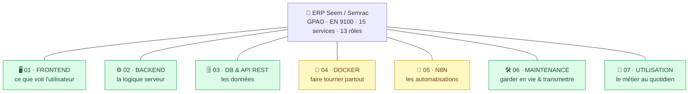

# 🧠 Cerveau de l'application — ERP Seem / Semrac

> **Le wiki central de l'ERP.** Point d'entrée unique pour comprendre *toute* l'application, brique par brique.
> Il est **maintenu à chaque étape** : dès qu'une brique évolue (code, base, Docker, N8N…), sa page ici est mise à jour **dans le même mouvement** (règle n°1 du [`CLAUDE.md`](../CLAUDE.md)).

L'application est la **brique centrale**. Autour, **7 grandes briques** décrivent chacune un domaine complet.

## Les 7 briques

| # | Brique | Rôle en une phrase | État |
|---|---|---|---|
| 01 | [🖥️ Frontend](01-frontend.md) | L'interface : pages rendues côté serveur (TSX Hono), zéro framework client. | ✅ Fait |
| 02 | [⚙️ Backend](02-backend.md) | Le cerveau logique : routage (~290 routes), droits, règles métier. | ✅ Fait |
| 03 | [🗄️ DB & API REST](03-db-et-api-rest.md) | Les données : Postgres via Supabase (PostgREST) + les `/api` de l'app. | ✅ Fait (cloud) |
| 04 | [🐳 Docker](04-docker.md) | Emballer app + base + outils pour tourner **chez toi**, à l'identique. | 🔜 À venir |
| 05 | [🔗 N8N](05-n8n.md) | Les automatisations visuelles (sauvegardes, exports Silae/Sage, alertes). | 🔜 À venir |
| 06 | [🛠️ Maintenance](06-maintenance.md) | Vérifier, déployer, documenter, sauvegarder, transmettre à un externe. | ✅ Fait |
| 07 | [📖 Utilisation](07-utilisation.md) | Comment le métier s'en sert : services, rôles, parcours. | ✅ Fait |

**Légende d'état** : ✅ Fait · 🟡 Partiel · 🔜 À venir (conçu, pas encore construit).

## L'application en un coup d'œil

- **Ce que c'est** : un **ERP / GPAO** (gestion de production assistée par ordinateur) pour Seem/Semrac — usinage & traitement de surface, exigences **EN 9100:2018 / ISO 9001:2015**.
- **Stack** : **Hono** (SSR TSX, zéro framework client) + **Supabase** (Postgres + PostgREST) + **Cloudflare Pages** aujourd'hui → **Docker auto-hébergé** demain.
- **Taille** : ~41 000 lignes · 35 fichiers `src/` · ~290 routes · 15 services · 13 rôles.
- **Connexion** : matricule + PIN (compte de secours `ADMIN` en bêta).

## Où vit quoi (rappel)

| Le wiki (ici) | La doc profonde | Le reste |
|---|---|---|
| `cerveau application/` = **la carte** : comprendre vite, naviguer entre briques. | [`docs/technique/`](../docs/technique/) = **le détail** (archi, tables, API, runbook). [`docs/manuel/`](../docs/manuel/) = utilisateurs. | [`src/`](../src/) = code · [`scripts_import/`](../scripts_import/) = SQL · [`.claude/skills/`](../.claude/skills/) = automatismes. |

Le cerveau ne **duplique pas** la doc profonde : il l'**explique et y renvoie**.

## Comment ce cerveau est maintenu

À chaque étape de travail qui touche l'application :
1. Je mets à jour **la brique concernée** (état, fichiers, nouveautés).
2. Si une brique passe de 🔜 à 🟡/✅, je réécris sa page avec le **réel** (plus le « cible »).
3. J'ajoute une ligne au [journal du cerveau](CHANGELOG.md).

*Dernière mise à jour : 2026-07-31 — module Audits de conformité + préparation audit externe. Création : 2026-07-13 (7 briques).*
