# Dossier PDM — État des données, cartographie fonctionnelle et documentation

**ERP Seem Semrac** · Note de synthèse · 24 août 2026

> **Méthode.** Tous les chiffres de ce document sont **mesurés**, pas estimés. Les volumes de données proviennent d'un comptage exact (`count=exact`) des 101 tables de la base **de production**, le 24/08/2026. La cartographie services/tables est **tracée depuis le code source** (353 routes de `src/index.tsx` → 405 fonctions d'accès de `src/queries.ts` → tables), et non reconstituée de mémoire.

---

## 1. Données manquantes avant mise en production

### 1.1 Vue d'ensemble

| Indicateur | Valeur |
|---|---|
| Tables au schéma | **101** |
| Tables peuplées en production | **68** |
| Tables **vides** (0 ligne) | **32** |
| Table absente du cloud mais présente en local | **1** (`import_staging`) |

Sur les 32 tables vides, **21 se rempliront seules par l'usage** (transactionnel) et **11 doivent être saisies avant démarrage** (référentiel). À ces 11 s'ajoute **1 table critique sous-peuplée** : `nomenclatures`.

### 1.2 Bloquant — à charger avant démarrage (12 jeux de données)

| # | Table | Service | Lignes | Pourquoi c'est bloquant |
|---|---|---|---|---|
| 1 | `nomenclatures` | Bureau d'études | **1** | **Le verrou principal.** Sans nomenclature : pas de gamme, pas de temps, pas de coût de revient — donc **ni prix d'offre, ni BDT, ni planning, ni valorisation**. Toute la chaîne production en dépend. ~318 avaient été importées puis supprimées : le format d'import est connu et rejouable. |
| 2 | `habilitations` | RH / Qualité | 0 | Exigence **EN 9100** : qui a le droit d'opérer sur quel process. Sans, aucune traçabilité de qualification opérateur. |
| 3 | `ecme_verifications` | Qualité | 0 | **265 équipements** de mesure référencés, **aucun historique de vérification** → tout le parc s'affiche « à vérifier » et le statut périodique live est inexploitable. Charger au minimum le dernier PV par équipement. |
| 4 | `plans_preventif` | Maintenance | 0 | Sans gammes préventives, **aucun ordre de maintenance préventif** n'est généré : le module tourne à vide. |
| 5 | `pieces_rechange` | Maintenance | 0 | Pas de stock de pièces → pas de sortie sur OM, pas de coût de maintenance. |
| 6 | `balancelles` | OAS | 0 | Référentiel des supports de traitement de surface. Sans, pas de lancement OAS. |
| 7 | `hse_verifications` | Sécurité | 0 | **VGP** — vérifications générales périodiques, obligation réglementaire. |
| 8 | `hse_atex_zones` | Sécurité | 0 | Zonage ATEX — obligation réglementaire. |
| 9 | `hse_plans_prevention` | Sécurité | 0 | Plans de prévention entreprises extérieures — obligation réglementaire. |
| 10 | `hse_exposition_chimique` | Sécurité | 0 | Fiches d'exposition (SEIRICH) — alors que **86 produits chimiques** sont déjà référencés. |
| 11 | `hse_aspects_impacts` | Environnement | 0 | Analyse environnementale **ISO 14001**. |
| 12 | `hse_parties_interessees` | Environnement | 0 | Parties intéressées **ISO 14001 / 45001**. |

**Lecture** : le verrou nº 1 est à lui seul le chemin critique. Les nº 7 à 12 forment un **bloc réglementaire QHSE** homogène, saisissable en parallèle et indépendamment du reste.

### 1.3 Non bloquant — se remplit par l'usage (21 tables)

Aucune saisie préalable nécessaire : ces tables sont alimentées par les flux applicatifs.

| Nature | Tables |
|---|---|
| Flux production | `bons_sous_traitance` · `commandes_prioritaires` · `demandes_site` · `machine_bdt_historique` · `operateur_bdt_historique` · `mtbf_machines` |
| Flux qualité | `audits` · `controles_cotes` · `etudes_capabilite` · `fai` |
| Flux achats | `demandes_prix_reponses` |
| Flux compta | `factures_client` · `factures_fournisseur` · `ecritures_comptables` |
| Flux stock | `mouvements_stock` — *le stock initial existe déjà (402 lignes)* |
| Flux OAS / HSE | `releves_eau` · `releves_bains` · `hse_mesures_env` · `hse_exercices` |
| Flux RH | `conges` |
| Agrégat | `affaires` — *vue reconstituée par `num_affaire`, volontairement vide* |

### 1.4 Socle déjà en place (à ne pas refaire)

| Domaine | Tables peuplées |
|---|---|
| Commercial | `clients` **455** · `interlocuteurs` **484** · `references_clients` |
| Achats | `fournisseurs` **155** · `sous_traitants` **20** · `fournisseurs_st` 5 · `produits_fournisseurs` **144** · `ref_prix_historique` **110** |
| Atelier | `machines` 15 · `postes` 20 · `process_atelier` 31 · `machines_opex` 5 · `affectation_poste` 7 |
| Stock | `stock` **402** · `produits_perissables` **236** · `mouvements_perissables` **451** |
| Qualité | `ecme` **265** · `non_conformites` **173** · `plans_controle` 19 · `derogations` 13 · `certifications` 24 |
| QHSE | `hse_risques` **172** · `hse_incidents` **184** · `hse_produits_chimiques` **86** · `hse_epi_zone` 32 · `hse_conformite` 22 |
| RH | `salaries` 36 · `competences_operateur` **92** · `operateur_presence` **235** |
| Pilotage | `kpi_objectifs` 16 · `audit_question` 67 · `audit_programme` 25 |

### 1.5 Points d'hygiène à traiter au passage

| Constat | Impact | Action |
|---|---|---|
| `salaries` = **36 actifs** alors que l'effectif déclaré est de **20 collaborateurs** | Effectif faussé dans les calculs RH et les dashboards | Vérifier et archiver les inactifs |
| `import_staging` **absente du cloud**, présente en local (HTTP 404) | Dérive de schéma cloud / local | Trancher : créer en cloud, ou retirer du schéma local |
| `edit_locks` : 1 ligne résiduelle, **seule table sans clé primaire** | Verrou d'édition fantôme possible | Purger ; ajouter une PK si la table doit survivre |
| Tables transactionnelles à 1 ligne (`commandes`, `lots`, `offres`, `demandes_travaux`, `bons_de_livraison`…) | Reliquats de recette | Normal avant démarrage — à purger le jour du go-live |
| **1 seule clé étrangère** déclarée sur 101 tables ; **19 index** non-PK | Intégrité référentielle portée uniquement par le code ; listes lentes à volume | Chantier à part, hors périmètre go-live |

---

## 2. Matrice swimlane — services × fonctions × tables × flux

### 2.1 Principe de lecture

L'ERP compte **15 services** (couloirs), **353 routes** et **101 tables**. Chaque table a un **service propriétaire** — celui qui l'écrit. **15 tables sont écrites par plusieurs services** : ce sont les **points de couture** entre couloirs, et donc les zones de risque fonctionnel.

### 2.2 Le flux principal en swimlane

```mermaid
flowchart LR
  classDef vide fill:#fdecea,stroke:#b23b3b,color:#7a2020,stroke-width:2px
  classDef socle fill:#e8f5ee,stroke:#1e8a54,color:#12613a
  classDef ok fill:#eef2fb,stroke:#22409b,color:#1a2f6e
  classDef couture fill:#fff6e5,stroke:#b4791f,color:#7a5210,stroke-width:2px

  subgraph L1["1 - COMMERCIAL"]
    direction TB
    A1["clients / interlocuteurs<br/>455 / 484"]:::socle
    A2["demandes_travaux"]:::couture
    A3["offres"]:::couture
    A4["commandes"]:::ok
  end

  subgraph L2["2 - BUREAU D ETUDES"]
    direction TB
    B1["nomenclatures<br/>1 ligne - BLOQUANT"]:::vide
    B2["preparations_techniques"]:::ok
  end

  subgraph L3["3 - ACHATS / STOCK"]
    direction TB
    C1["demandes_achat"]:::couture
    C2["bons_de_commande"]:::couture
    C3["stock<br/>402"]:::couture
    C4["mouvements_stock<br/>0"]:::couture
  end

  subgraph L4["4 - PRODUCTION"]
    direction TB
    D4["postes / process<br/>20 / 31"]:::socle
    D1["lots"]:::couture
    D2["bons_de_travail"]:::couture
    D3["bons_sous_traitance<br/>0"]:::couture
  end

  subgraph L5["5 - OAS"]
    direction TB
    E1["balancelles<br/>0 - BLOQUANT"]:::vide
    E2["releves eau / bains<br/>0"]:::ok
  end

  subgraph L6["6 - QUALITE"]
    direction TB
    F4["ecme / verifications<br/>265 / 0 - BLOQUANT"]:::vide
    F1["pv_controle"]:::couture
    F2["non_conformites<br/>173"]:::couture
    F3["quarantaines"]:::couture
  end

  subgraph L7["7 - EXPEDITIONS"]
    direction TB
    G1["bons_de_livraison"]:::couture
    G2["factures_client<br/>0"]:::ok
  end

  subgraph L8["8 - COMPTA"]
    direction TB
    H2["factures_fournisseur<br/>0"]:::ok
    H1["ecritures_comptables<br/>0"]:::ok
  end

  A1 --> A2 --> B1
  B1 --> B2 --> A3 --> A4
  B1 -. besoin matiere .-> C1
  C1 --> C2 --> C3 --> C4
  A4 --> D1 --> D2
  D1 --> D3
  B1 -. gamme et temps .-> D2
  C3 -. sortie matiere .-> D2
  D4 -.- D2
  D2 --> E1 --> E2
  D2 --> F1
  E2 -. bain non conforme .-> F2
  F1 --> F2 --> F3
  F4 -. equipement verifie .-> F1
  F1 -- porte qualite --> G1
  F3 -. blocage .-> G1
  G1 --> G2 --> H1
  C2 --> H2 --> H1
  F2 -. retour client .-> G1
```



**Légende** — vert : socle peuplé · bleu : flux normal · orange : table de couture (plusieurs services écrivains) · rouge : **bloquant go-live**

### 2.3 Matrice détaillée par service

| # | Service (couloir) | Routes | Fonctions principales | Tables en propre (écriture) | Reçoit de | Émet vers |
|---|---|---|---|---|---|---|
| 1 | **Commercial** | 29 | Clients, DT, offres versionnées, commandes, fiche affaire 360 | `clients` · `commandes` · `preparations_techniques` | — *(entrée du flux)* | BE, Production, Compta |
| 2 | **Bureau d'études** | 22 | Analyse DT, nomenclature, gamme, coût de revient, chiffrage | `nomenclatures` ⚠ · `fournitures_nomenclature` | Commercial | Commercial, Production, Achats |
| 3 | **Achats** | 19 | DA → RFQ → BC, prix, fournisseurs et sous-traitants | `fournisseurs` · `sous_traitants` | BE, Production, Stock | Expéditions, Compta, Stock |
| 4 | **Production** | 59 | Lots, BDT/BST, planning par poste, avancement, présence | `postes` · `process_atelier` · `affectation_poste` · `operateur_presence` | Commercial, BE | Qualité, OAS, Expéditions, Stock |
| 5 | **OAS** | 9 | Traitement de surface, bains, relevés eau, balancelles | `balancelles` ⚠ · `releves_eau` · `releves_bains` | Production | Qualité, Environnement |
| 6 | **Qualité** | 37 | PV, NC, dérogations, quarantaine, 8D, ECME, SPC, audits | `ecme` · `ecme_verifications` ⚠ · `derogations` · `plans_controle` · `rapports_8d` · `etudes_capabilite` · `produits_perissables` · `mouvements_perissables` | Production, OAS, Expéditions | Expéditions *(porte qualité)*, Direction |
| 7 | **Sécurité** | 6 | DUER, risques, incidents, EPI, chimie/SEIRICH, VGP | 14 tables `hse_*` *(dont 5 vides ⚠)* | RH, Production | Environnement, Direction |
| 8 | **Environnement** | 4 | Déchets, rejets, ATEX, RSE, ISO 14001 | `hse_diagnostic_iso` · `hse_diagnostic_iso26000` · `hse_aspects_impacts` ⚠ | OAS, Sécurité | Direction |
| 9 | **Expéditions** | 9 | Réceptions, envois, calendrier, BL, OTD figé | `bons_de_livraison` · `factures_client` | Achats, Production, Qualité | Compta |
| 10 | **Stock** | 6 | Niveaux, mouvements, réappro, ABC | *partagé — voir § 2.4* | Achats, Production | Production, Achats |
| 11 | **Maintenance** | 11 | OM curatif/préventif, MTBF/MTTR, pièces | `ordres_maintenance` · `plans_preventif` ⚠ · `pieces_rechange` ⚠ | Production | Production, Compta |
| 12 | **Plans / GED** | 11 | Documents, plans CAO/FAO, maquette bâtiment | `documents` · `plans_batiment` · `plan_marqueurs` | Tous | Tous |
| 13 | **RH** | 21 | Salariés, rôles, congés, absences, habilitations, compétences | `salaries` · `absences` · `conges` · `certifications` · `competences_operateur` · `pointages` | Production | Production, Compta, Sécurité |
| 14 | **Compta** | 6 | Facturation, écritures VTE/ACH, marge brute, EDF | `factures_fournisseur` | Expéditions, Achats, RH | Direction |
| 15 | **Direction** | 6 | Cockpit, validations, jalons, KPI, santé des données | `validations` | Tous | Tous |

⚠ = contient une table bloquante du § 1.2

### 2.4 Points de couture — les 15 tables à plusieurs écrivains

Ce sont **les interfaces réelles entre services**. Toute reprise, migration ou refonte doit préserver ces règles d'écriture, sinon les flux se désynchronisent.

| Table | Lignes | Services écrivains | Nature de la couture |
|---|---|---|---|
| `bons_de_travail` | 4 | BE → Commercial → **Production** → Expéditions → RH | Objet le plus partagé de l'ERP : créé par la cascade, exécuté en production, pointé par RH |
| `non_conformites` | **173** | Production → OAS → **Qualité** → Expéditions | Déclarable depuis 4 points ; porte l'annonce de retour client |
| `pv_controle` | 1 | Production → OAS → **Qualité** → Expéditions | Contrôle produit ; alimente la porte qualité du BL |
| `stock` | **402** | Achats/**Stock** → Production → Expéditions | Réception, sortie matière, expédition |
| `bons_de_commande` | 2 | **Achats** → Expéditions → Production | Émis aux achats, réceptionné en expéditions *(OTD figé sur la 1ʳᵉ date promise)* |
| `lots` | 1 | Commercial → **Production** → Expéditions → Qualité | Conteneur d'affaire ; avancement et soldage |
| `demandes_achat` | 3 | **Achats** → Commercial → Production | DA opérateur, besoin matière BE |
| `offres` | 1 | **Commercial** → BE | Chiffrage BE, négociation commerciale versionnée |
| `demandes_travaux` | 1 | **Commercial** → BE | Entrée du flux, analysée par le BE |
| `bons_sous_traitance` | 0 | BE → Commercial → **Production** | Sous-traitance externe, liée aux BC ST |
| `quarantaines` | 1 | **Qualité** → Expéditions | Blocage produit ; bloque l'émission du BL |
| `mouvements_stock` | 0 | **Stock** → Production → Expéditions | Append-only *(DELETE bloqué par RLS)* |
| `machines` | 15 | **Production** → Maintenance | Référentiel partagé atelier / maintenance |
| `credits` | 1 | **Commercial** → Qualité | Avoirs, dont retours clients |
| `validations` | 3 | **Direction** → Qualité | Circuit de validation générique |

*(le service en gras est le propriétaire fonctionnel)*

### 2.5 Chaîne de valeur bout en bout

```
DT client → analyse BE (nomenclature + gamme + coût) → offre → commande
  → lot → BDT / BST → [OAS] → PV de contrôle → [NC / quarantaine]
  → porte qualité → BL → facture client → écriture VTE

En parallèle :  besoin matière → DA → RFQ → BC → réception (OTD figé)
                → stock → sortie matière sur BDT → écriture ACH

Transverses :   RH (pointage, habilitation) · Maintenance (dispo machine)
                QHSE (conformité) · Plans/GED (documents) · Direction (pilotage)
```

---

## 3. Emplacement des documents sur le poste

**Racine du dépôt : `E:\ERP derniere version\`**

### 3.1 Manuels utilisateur

| Document | Chemin | Contenu |
|---|---|---|
| **Manuels HTML illustrés** *(à privilégier)* | `E:\ERP derniere version\docs\manuel\html\` | **16 manuels**, un par service ; chaque onglet détaillé (à quoi ça sert / ce que vous voyez / pas à pas / règles) + `index.html` de navigation |
| Recueil imprimable unique | `E:\ERP derniere version\docs\print\ManuelUtilisateur.html` | Tous les manuels en un seul fichier — 18 Mo, prêt à imprimer ou exporter en PDF |
| Sources Markdown | `E:\ERP derniere version\docs\manuel\` | 17 fichiers `.md`, dont `00-index.md` et `00-prise-en-main.md` |
| Fiches formulaires | `E:\ERP derniere version\docs\manuel\formulaires\` | 15 fiches — chaque champ de chaque formulaire |
| Parcours guidés | `E:\ERP derniere version\docs\manuel\parcours\` | 15 parcours métier de bout en bout |
| Captures d'écran | `E:\ERP derniere version\docs\assets\` | **177 captures PNG** réelles de l'application |
| **Dans l'application** | Bouton de sidebar entre *Déconnexion* et *Pointage* → `/manuels` | Manuels **filtrés par rôle** : direction et administrateur voient tout, les autres selon les rôles attribués |

### 3.2 Documentation technique de maintenance

*(destinée au prestataire qui reprendra l'ERP)*

| Document | Chemin | Contenu |
|---|---|---|
| **Doc technique complète** | `E:\ERP derniere version\docs\technique\` | 15 fichiers : architecture, base de données, réf. API, runbook d'exploitation, auth/RBAC, conventions de code, sécurité, audit, variables d'environnement, installation Docker |
| Fiches par module | `E:\ERP derniere version\docs\technique\06-modules\` | **16 fiches**, une par service : route, fichier source, RBAC, onglets, API, tables, points d'attention |
| Recueil imprimable | `E:\ERP derniere version\docs\print\DocTechnique.html` | Toute la doc technique en un fichier |
| Ordre de lecture conseillé | `01-architecture.md` → `03-base-de-donnees.md` → `07-api-reference.md` → `02-exploitation-runbook.md` → `12-docker-installation.md` | Parcours de reprise pour un nouveau prestataire |
| **Schémas de base (DDL)** | `E:\ERP derniere version\scripts_import\` | **46 fichiers SQL** — source de vérité du schéma |
| Schéma reproductible | `E:\ERP derniere version\docker\db\seed\schema.sql` | Les 101 tables, rejouable à neuf |
| Journal des modifications | `E:\ERP derniere version\docs\CHANGELOG.md` | Historique complet, le plus récent en haut |

### 3.3 Autres documents

| Document | Chemin |
|---|---|
| Fiches de poste — 12 rôles | `E:\ERP derniere version\docs\fiches-poste\` · recueil : `docs\print\FichesPoste.html` |
| Étude financière — valorisation du temps gagné | `E:\ERP derniere version\docs\etudes\valorisation-temps-gagne.html` |
| Feuille de route 2 mois | `E:\ERP derniere version\docs\ROADMAP-2mois.md` *(+ version infographie HTML)* |
| Reprise Laravel — plan d'exécution | `E:\ERP derniere version\docs\etudes\plan-migration-laravel.html` · classeur : `docs\etudes\SEEM-SEMRAC - Fonctionnalites par service (plan Laravel).xlsx` |
| Ce document | `E:\ERP derniere version\docs\etudes\dossier-pdm-donnees-cartographie.md` |

---

## Synthèse en trois lignes

1. **Données** — le socle référentiel est en place (clients, fournisseurs, stock, atelier, QHSE). Il manque **12 jeux de données**, dont **un seul est sur le chemin critique : les nomenclatures**. Les 11 autres se répartissent entre RH/qualification, maintenance préventive, OAS et le bloc réglementaire QHSE — tous saisissables en parallèle.
2. **Architecture** — 15 services, 101 tables, **15 tables de couture** qui portent l'intégration inter-services ; l'intégrité référentielle repose sur le code applicatif (1 seule clé étrangère déclarée en base).
3. **Documentation** — complète et à jour : 16 manuels utilisateur illustrés (177 captures, lisibles dans l'application et filtrés par rôle) et 31 fichiers de documentation technique de maintenance.
