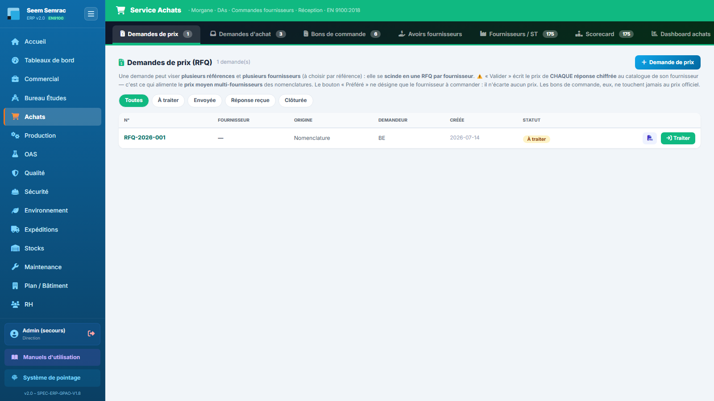
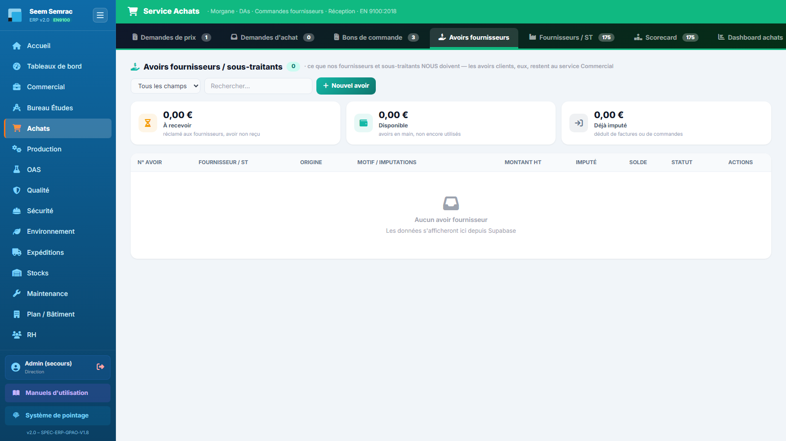
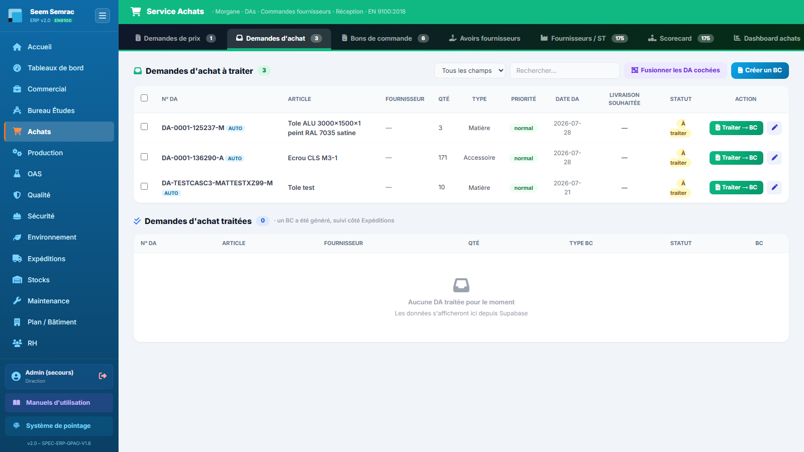

# Fiche de poste — Acheteur(se)

> Rôle ERP : `achats`. Voir aussi le manuel utilisateur (`docs/manuel/`).

## Mission
Consulter les fournisseurs, passer les commandes, tenir le référentiel fournisseurs.

## Vos accès (droits)
| | Services |
|---|---|
| **Écriture** (créer/modifier) | achats, stock |
| **Lecture** | commercial, be, production, expéditions, maintenance |

Vous vous connectez avec votre **matricule + PIN** (voir *Prise en main*). La barre latérale n'affiche que vos services autorisés.

## Vos tâches courantes
### 1. Lancer une demande de prix (RFQ)
1. Achats › **Demandes de prix**, « Nouvelle RFQ ».
2. Fournisseur(s) + articles.
3. Saisir les prix reçus → alimente le catalogue.

### 2. Suivre les avoirs fournisseurs
1. Achats › **Avoirs fournisseurs** : ce que fournisseurs et sous-traitants nous doivent (à ne pas confondre avec les avoirs clients, service Commercial).
2. Un avoir arrive tout seul quand la Qualité renvoie un lot, le met au rebut ou obtient une réfaction ; « Nouvel avoir » pour en saisir un à la main.
3. Quand l'avoir du fournisseur arrive : **Reçu** (son n°, sa date, le montant réellement accordé). Quand on s'en sert : **Imputer** (montant + n° de facture).
4. Un avoir ne se supprime pas : il s'annule, avec un motif, tant qu'il n'a pas servi.

### 3. Transformer une DA en BC
1. Onglet **Demandes d'achat**, sélectionner la DA.
2. Générer le bon de commande fournisseur.

---
> Fiche générée (`scripts_doc/gen_fiches_poste.mjs`). Sécurité & traçabilité : `docs/technique/04-auth-rbac.md`.
