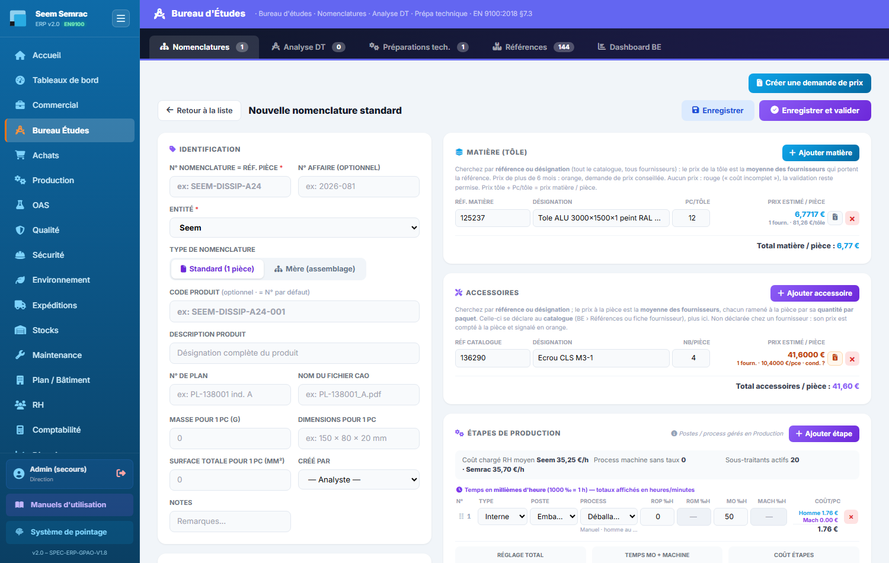
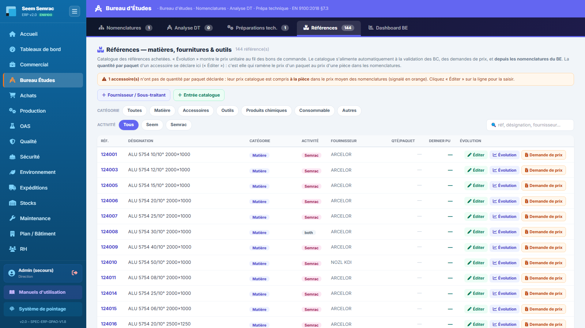
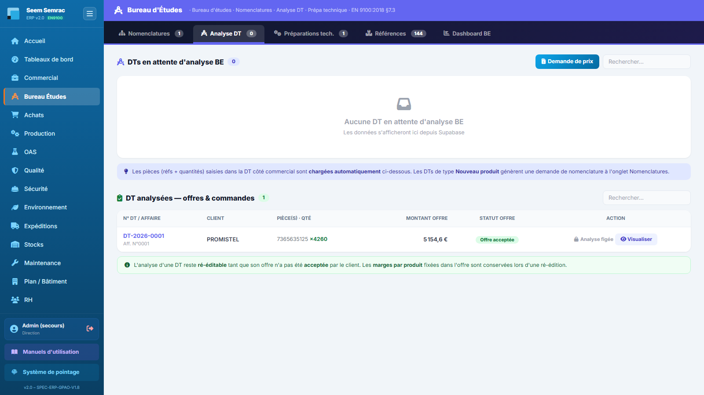

# Fiche de poste — Bureau d'Études (BE)

> Rôle ERP : `bei`. Voir aussi le manuel utilisateur (`docs/manuel/`).

## Mission
Définir techniquement les pièces (nomenclatures, gammes) et préparer la fabrication.

## Vos accès (droits)
| | Services |
|---|---|
| **Écriture** (créer/modifier) | be, achats |
| **Lecture** | commercial, production, oas, qualité, sécurité, stock, maintenance |

Vous vous connectez avec votre **matricule + PIN** (voir *Prise en main*). La barre latérale n'affiche que vos services autorisés.

## Vos tâches courantes
### 1. Créer une nomenclature
1. BE › **Nomenclatures**, « Nouvelle ».
2. Matière et accessoires : cherchez par **référence ou désignation** dans tout le catalogue (**pas de fournisseur à choisir**) + masse (g). Le « Prix estimé / pièce » est la **moyenne des fournisseurs** qui portent la référence ; badge « n fourn. · min–max », clic = détail. Orange = un prix a plus de 6 mois (demande de prix conseillée, bouton disponible à tout moment) ; rouge = aucun prix (« coût incomplet », la pièce reste validable).
   - Accessoires : saisissez **Nb/pièce** ; la **quantité par paquet** se déclare **au catalogue** (tâche 2) — sans elle, le prix du paquet est compté à la pièce (« cond. ? » en orange).
   - ⚠ Une **même référence ne peut figurer qu'une fois** par nomenclature, matière et accessoires confondus.
3. Étapes (glisser-déposer) : type, poste, process, puis les temps en ‰h — ROP (réglage homme), RGM (réglage machine : homme + machine), MO (homme / pièce), Mach (machine / pièce). Heure homme = coût chargé RH moyen du site ; heure machine = taux du process (saisi en Production).
4. Prix de revient calculé → Enregistrer (indice A/B/C).

### 2. Déclarer la quantité par paquet d'un accessoire
1. BE › **Références** : le bandeau orange compte les accessoires sans quantité par paquet ; colonne **Qté/paquet** (« non déclarée » en orange).
2. « **Éditer** » sur la ligne → **Quantité par paquet** (nombre de pièces du paquet auquel se rapporte le prix) → Enregistrer. Une case laissée vide ne change rien. Même champ côté Achats (fiche fournisseur › Références fournies) : c'est le même catalogue.
3. Au catalogue, le prix d'un accessoire est celui du **paquet**, celui d'une matière celui d'**une tôle** ; le prix à la pièce est calculé. Exemple : 10 € le paquet de 100 chez A et 6 € le paquet de 50 chez B → 0,10 € et 0,12 € la pièce → **0,11 € la pièce** en moyenne.

### 3. Analyser une DT
1. Onglet **Analyse DT**, sélectionner la DT.
2. Générer le dossier technique → BDT.

---
> Fiche générée (`scripts_doc/gen_fiches_poste.mjs`). Sécurité & traçabilité : `docs/technique/04-auth-rbac.md`.
