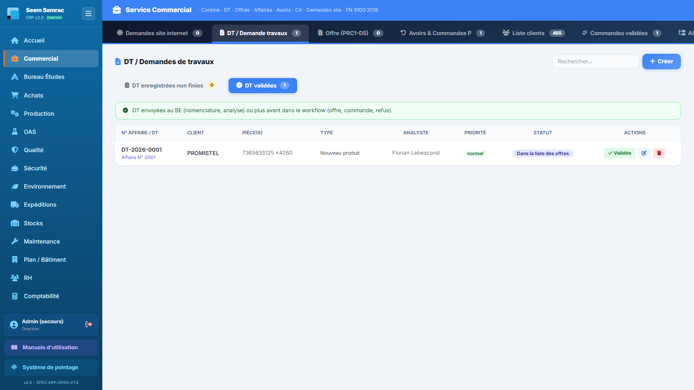
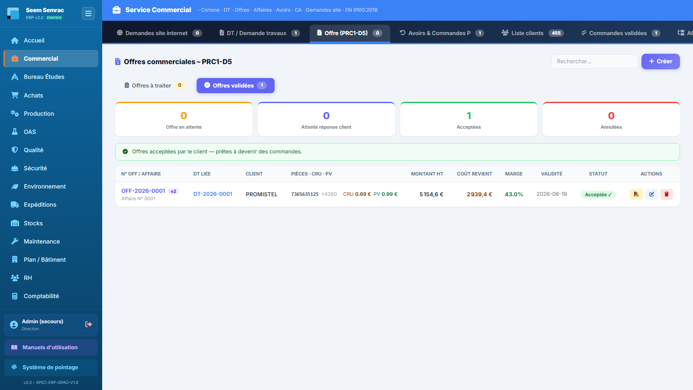
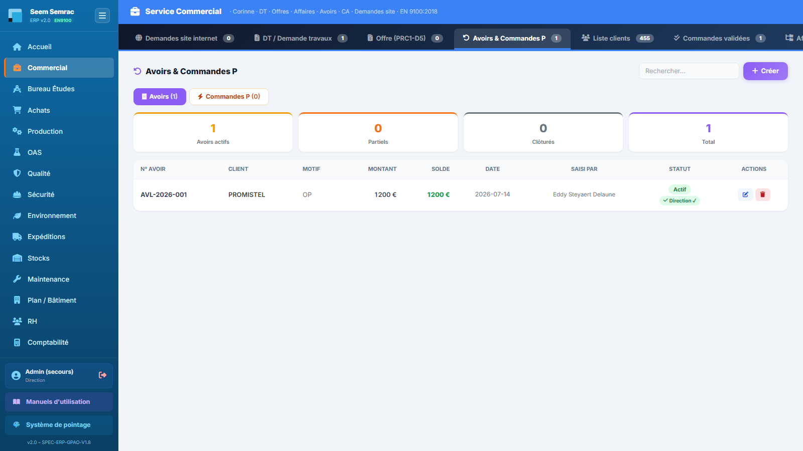

# Fiche de poste — Commercial / Chargé(e) d'affaires

> Rôle ERP : `commercial`. Voir aussi le manuel utilisateur (`docs/manuel/`).

## Mission
Gérer la relation client, de la demande à la commande, et les avoirs/relances.

## Vos accès (droits)
| | Services |
|---|---|
| **Écriture** (créer/modifier) | commercial |
| **Lecture** | be, production, qualité, expéditions, stock |

Vous vous connectez avec votre **matricule + PIN** (voir *Prise en main*). La barre latérale n'affiche que vos services autorisés.

## Vos tâches courantes
### 1. Créer une demande de travaux (DT)
1. Commercial › **DT**, « Nouvelle DT ».
2. Client + activité (Seem/Semrac) + produits (réf, plan, quantité).
3. Enregistrer → n° d'affaire attribué.

### 2. Établir une offre
1. Onglet **Offre**, partir d'une DT.
2. Vérifier prix de revient + marge, envoyer.

### 3. Suivre avoirs & commandes prioritaires
1. Onglet **Avoirs & Commandes P**.
2. Sous-onglet **Commandes P** → « Lancer la production » pour une relance.

---
> Fiche générée (`scripts_doc/gen_fiches_poste.mjs`). Sécurité & traçabilité : `docs/technique/04-auth-rbac.md`.
