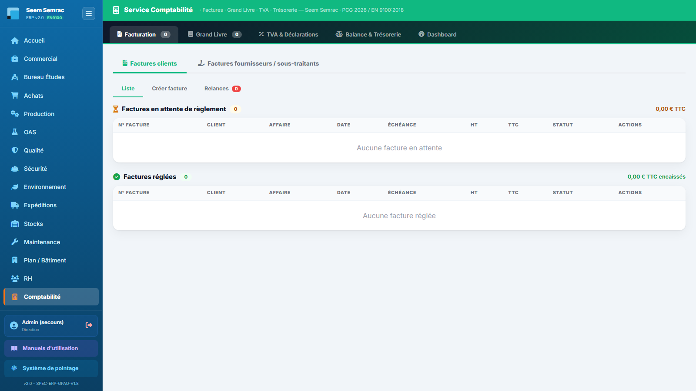

# Fiche de poste — Comptable

> Rôle ERP : `comptable`. Voir aussi le manuel utilisateur (`docs/manuel/`).

## Mission
Tenir la comptabilité (facturation, grand livre, TVA, trésorerie).

## Vos accès (droits)
| | Services |
|---|---|
| **Écriture** (créer/modifier) | compta |
| **Lecture** | commercial, achats, expéditions, stock, rh |

Vous vous connectez avec votre **matricule + PIN** (voir *Prise en main*). La barre latérale n'affiche que vos services autorisés.

## Vos tâches courantes
### 1. Vérifier la facturation
1. Compta › **Facturation** : factures générées à l'expédition.

### 2. Exporter le FEC
1. Onglet **Grand Livre** → export FEC (réservé compta/direction).

---
> Fiche générée (`scripts_doc/gen_fiches_poste.mjs`). Sécurité & traçabilité : `docs/technique/04-auth-rbac.md`.
