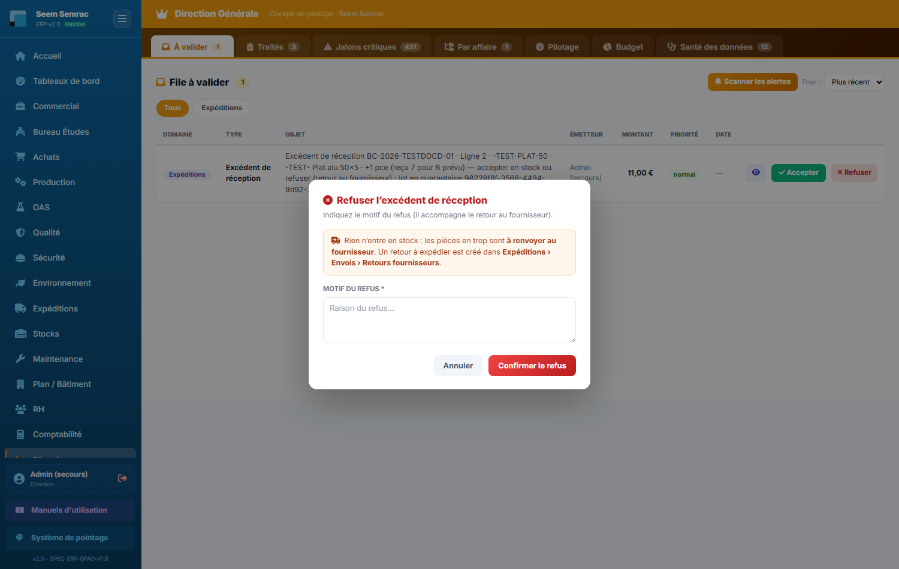

# Fiche de poste — Direction

> Rôle ERP : `direction`. Voir aussi le manuel utilisateur (`docs/manuel/`).

## Mission
Piloter l'entreprise : validations, jalons, KPIs, budget.

## Vos accès (droits)
| | Services |
|---|---|
| **Écriture** (créer/modifier) | TOUS |
| **Lecture** | TOUS |

Vous vous connectez avec votre **matricule + PIN** (voir *Prise en main*). La barre latérale n'affiche que vos services autorisés.

## Vos tâches courantes
### 1. Valider les jalons
1. Direction › **À valider**.
2. Valider / Refuser chaque élément (réservé Direction).

### 2. Décider d'un excédent de réception
1. Direction › **À valider**, ligne Expéditions « Excédent de réception » (+N reçu au-delà du prévu).
2. **Accepter** : l'excédent part dans Stock › Mise en stock. **Refuser** (motif obligatoire) : rien en stock, retour à expédier aux Expéditions.
3. Ligne aussi en quarantaine : accepter seulement après la décision de la Qualité.

### 3. Lancer le scan d'alertes
1. Bouton **Scanner les alertes** → retards/impayés/NC/ruptures en file de validation.

---
> Fiche générée (`scripts_doc/gen_fiches_poste.mjs`). Sécurité & traçabilité : `docs/technique/04-auth-rbac.md`.
