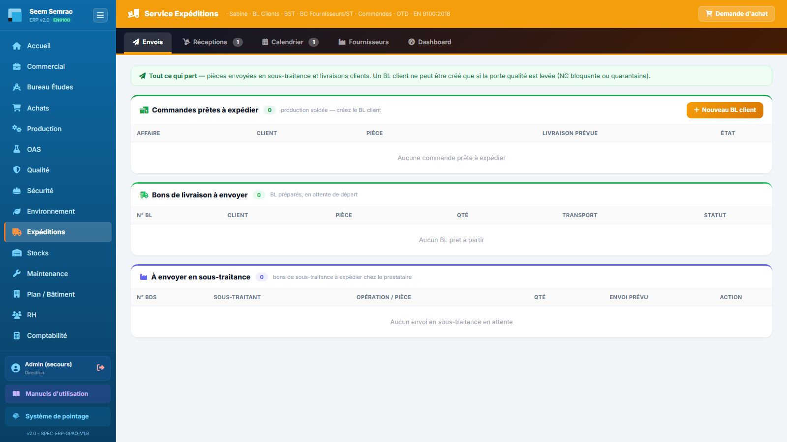

# Fiche de poste — Logistique (expéditions & stock)

> Rôle ERP : `logistique`. Voir aussi le manuel utilisateur (`docs/manuel/`).

## Mission
Livrer les commandes et tenir les stocks.

## Vos accès (droits)
| | Services |
|---|---|
| **Écriture** (créer/modifier) | expéditions, stock |
| **Lecture** | commercial, achats, production |

Vous vous connectez avec votre **matricule + PIN** (voir *Prise en main*). La barre latérale n'affiche que vos services autorisés.

## Vos tâches courantes
### 1. Créer un bon de livraison
1. Expéditions › **Bons de Livraison**, sélectionner la commande.
2. Quantités expédiées (BL partiel possible).
3. ⚠ Bloqué si quarantaine/NC : voir Qualité. Validation → facture.

### 2. Expédier un retour fournisseur
1. Expéditions › **Envois**, carte **Retours fournisseurs** : les lots que la Qualité a décidé de renvoyer.
2. Préparer le colis, puis **Expédié** ; la référence du bon de retour ou le n° de suivi est facultative.
3. La ligne quitte alors la liste ; un second clic est refusé.

### 3. Suivre les alertes de stock
1. Stock › **Alertes et Réappro.** : articles sous le seuil.

---
> Fiche générée (`scripts_doc/gen_fiches_poste.mjs`). Sécurité & traçabilité : `docs/technique/04-auth-rbac.md`.
