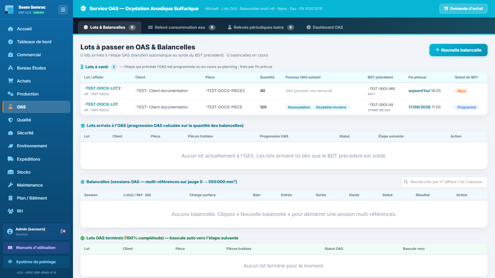

# Fiche de poste — Opérateur OAS (traitement de surface)

> Rôle ERP : `oas`. Voir aussi le manuel utilisateur (`docs/manuel/`).

## Mission
Conduire les traitements de surface et tracer les relevés.

## Vos accès (droits)
| | Services |
|---|---|
| **Écriture** (créer/modifier) | oas |
| **Lecture** | be, production, qualité, sécurité, stock, maintenance |

Vous vous connectez avec votre **matricule + PIN** (voir *Prise en main*). La barre latérale n'affiche que vos services autorisés.

## Vos tâches courantes
### 1. Saisir un relevé de bain
1. OAS › **Relevés périodiques bains**.
2. Sélectionner le bain, saisir les valeurs.
3. Hors tolérance → une NC est créée automatiquement.

### 2. Voir venir les lots (« Lots à venir »)
1. Onglet **Lots & Balancelles** → tableau **Lots à venir** : lots dont le BDT qui précède l’OAS est programmé ou reçu au planning de production.
2. Colonnes : process OAS suivant, BDT précédent, **fin prévue** (heures travaillées de la cadence usine), statut ; tri par fin prévue.
3. Quand ce BDT est soldé, le lot passe dans « Lots arrivés à l’OAS ».

### 3. Suivre les lots en balancelle
1. Onglet **Lots & Balancelles**.

---
> Fiche générée (`scripts_doc/gen_fiches_poste.mjs`). Sécurité & traçabilité : `docs/technique/04-auth-rbac.md`.
