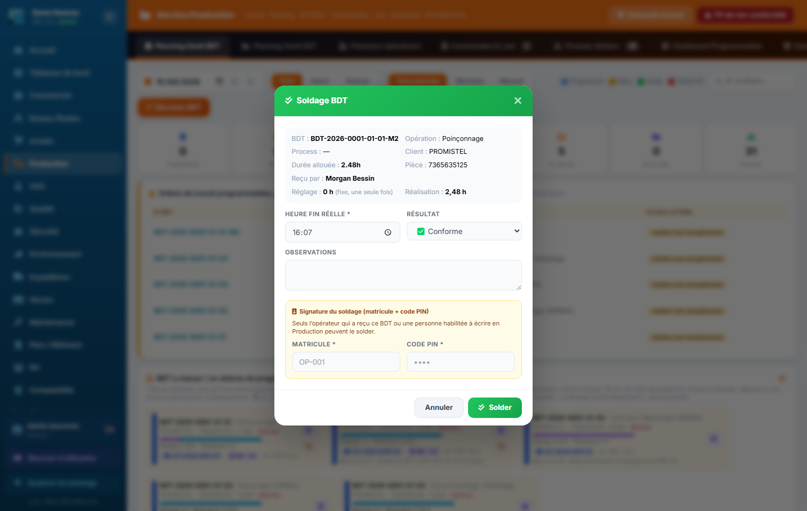
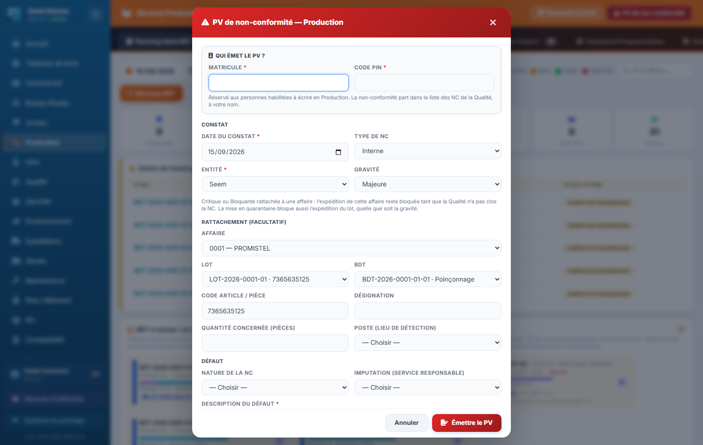

# Fiche de poste — Opérateur atelier

> Rôle ERP : `operateur`. Voir aussi le manuel utilisateur (`docs/manuel/`).

## Mission
Réaliser les opérations de fabrication et tracer son travail (pointage + soldage BDT au PIN).

## Vos accès (droits)
| | Services |
|---|---|
| **Écriture** (créer/modifier) | _aucun_ (lecture seule) |
| **Lecture** | production, oas, qualité, expéditions |

Vous vous connectez avec votre **matricule + PIN** (voir *Prise en main*). La barre latérale n'affiche que vos services autorisés.

## Vos tâches courantes
### 1. Pointer (borne atelier)
1. Sur la **borne partagée** : saisir matricule + PIN.
2. Pointer l'entrée / la sortie.

### 2. Prendre et solder un BDT
1. Repérer son BDT sur le planning.
2. Au démarrage : double-clic sur la barre → **Reçu** avec **son** matricule + PIN (c'est vous qui réalisez le bon).
3. À la fin : **Solder** → heure de fin + **son PIN** (signature). Vous ne pouvez solder que le BDT que **vous** avez reçu ; sinon un chef d'atelier (écriture Production) le solde. Un résultat « Non-conformité » crée une NC.

### 3. Signaler une non-conformité ou un besoin d'achat
1. En fin d'opération : résultat **Non-conformité** au soldage (NC créée pour la Qualité).
2. En dehors d'un soldage : prévenir le chef d'atelier, qui émet un **PV de non-conformité** ou une **demande d'achat** depuis le bandeau de la Production — ces deux boutons sont réservés à l'écriture Production (le rôle opérateur n'y a pas accès).
3. Décrire le défaut, la pièce, le lot.

---
> Fiche générée (`scripts_doc/gen_fiches_poste.mjs`). Sécurité & traçabilité : `docs/technique/04-auth-rbac.md`.
