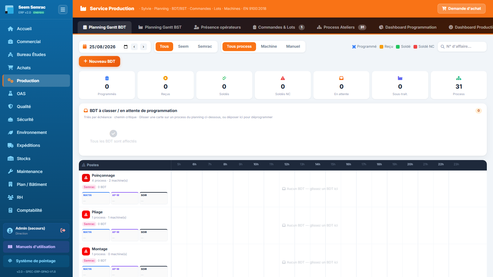

# Fiche de poste — Opérateur atelier

> Rôle ERP : `operateur`. Voir aussi le manuel utilisateur (`docs/manuel/`).

## Mission
Réaliser les opérations de fabrication et tracer son travail (pointage + soldage BDT au PIN).

## Vos accès (droits)
| | Services |
|---|---|
| **Écriture** (créer/modifier) | _aucun_ (lecture seule) |
| **Lecture** | production, oas, qualité, expéditions |

Vous vous connectez avec votre **matricule + PIN** (voir *Prise en main*). La barre latérale n'affiche que vos services autorisés.

## Vos tâches courantes
### 1. Pointer (borne atelier)
1. Sur la **borne partagée** : saisir matricule + PIN.
2. Pointer l'entrée / la sortie.

### 2. Prendre et solder un BDT
1. Repérer son BDT sur le planning.
2. Au démarrage : passer le BDT en **Reçu**.
3. À la fin : **Solder** → temps réel + **son PIN** (signature). Un écart peut déclencher une NC.

### 3. Signaler une non-conformité
1. Prévenir la Qualité (ou depuis l'écran production).
2. Décrire le défaut, la pièce, le lot.

---
> Fiche générée (`scripts_doc/gen_fiches_poste.mjs`). Sécurité & traçabilité : `docs/technique/04-auth-rbac.md`.
