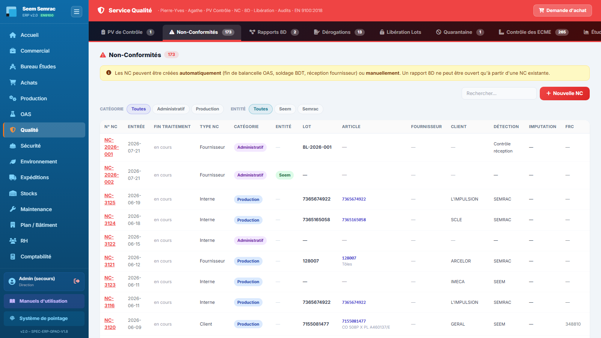
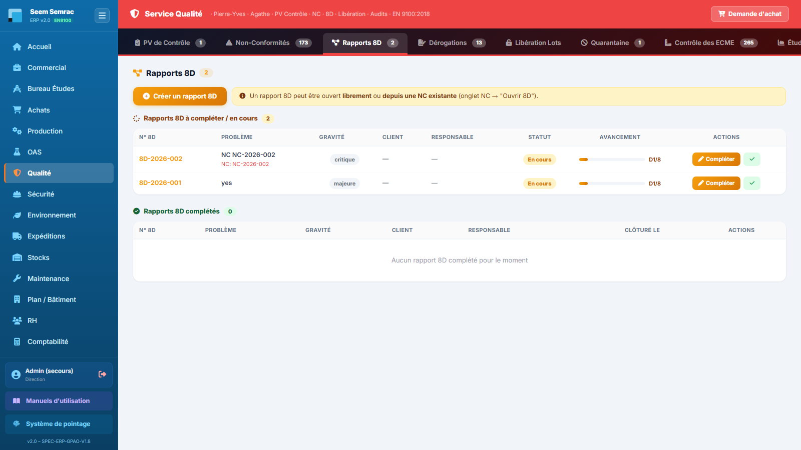

# Fiche de poste — Qualiticien(ne)

> Rôle ERP : `qualite`. Voir aussi le manuel utilisateur (`docs/manuel/`).

## Mission
Assurer la conformité produit et la traçabilité (NC, 8D, libération, retours clients).

## Vos accès (droits)
| | Services |
|---|---|
| **Écriture** (créer/modifier) | qualité, sécurité |
| **Lecture** | be, production, oas, expéditions, stock, maintenance |

Vous vous connectez avec votre **matricule + PIN** (voir *Prise en main*). La barre latérale n'affiche que vos services autorisés.

## Vos tâches courantes
### 1. Déclarer une non-conformité
1. Qualité › **Non-Conformités**, « Nouvelle NC ».
2. Type, détecteur, gravité, lot/réf, catégorie, entité.
3. Une NC bloquante bloque les BL du lot.

### 2. Traiter un retour client
1. Sur une NC **client**, cliquer **Retour**.
2. Facture/affaire, lot, nb pièces, prix de vente / coût de revient.
3. Choisir : Refuser · Avoir · Commande prioritaire.

### 3. Ouvrir un 8D
1. Onglet **Rapports 8D**, dérouler D1→D8.

---
> Fiche générée (`scripts_doc/gen_fiches_poste.mjs`). Sécurité & traçabilité : `docs/technique/04-auth-rbac.md`.
