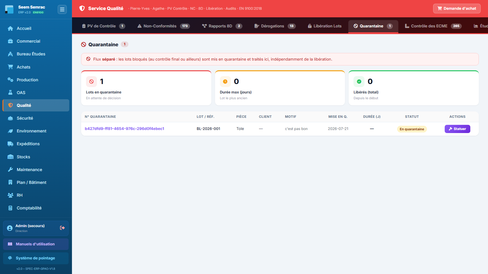
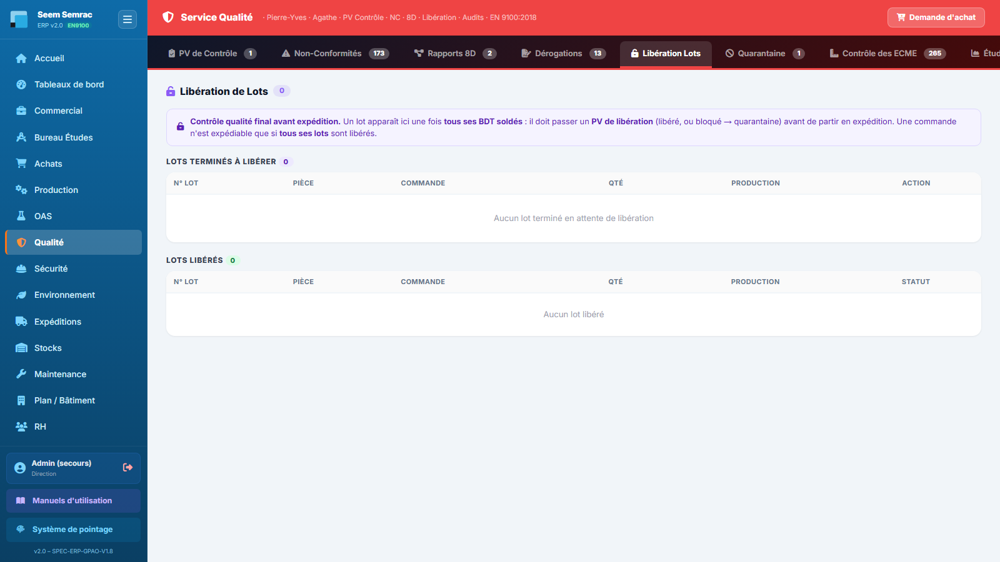

# Fiche de poste — Qualiticien(ne)

> Rôle ERP : `qualite`. Voir aussi le manuel utilisateur (`docs/manuel/`).

## Mission
Assurer la conformité produit et la traçabilité (NC, 8D, libération, retours clients).

## Vos accès (droits)
| | Services |
|---|---|
| **Écriture** (créer/modifier) | qualité, sécurité |
| **Lecture** | be, production, oas, expéditions, stock, maintenance |

Vous vous connectez avec votre **matricule + PIN** (voir *Prise en main*). La barre latérale n'affiche que vos services autorisés.

## Vos tâches courantes
### 1. Déclarer une non-conformité
1. Qualité › **Non-Conformités**, « Nouvelle NC » (réservée à l'écriture Qualité depuis le 15/09/2026).
2. Type, détecteur, gravité, lot/réf, catégorie, entité.
3. Une NC bloquante bloque les BL du lot ; une NC « Soldé » est close.
4. Les PV de non-conformité de l'atelier arrivent seuls dans la liste (catégorie Production, statut Ouvert, détecteur = émetteur). ⚠ Ré-enregistrer une telle NC remplace le détecteur et le statut « quarantaine » : le nom de l'émetteur reste dans la description.

### 2. Traiter un retour client
1. Sur une NC **client**, cliquer **Retour**.
2. Facture/affaire, lot, nb pièces, prix de vente / coût de revient.
3. Choisir : Refuser · Avoir · Commande prioritaire.

### 3. Décider d'un lot reçu non conforme
1. Qualité › **Quarantaine** : une ligne de réception avec observation (ou toute la réception si le certificat matière manque) porte le bouton rouge **Décider** (les lots de production gardent « Statuer »). Le PV crée **une NC fournisseur par ligne à problème** (quantitative, qualitative ou les deux, détecteur « Réception ») ; un simple écart de quantité n'a pas de quarantaine.
2. Trois choix : **renvoyer** tout le lot au fournisseur · **dérogation** (accepté en l'état, réfaction possible) · **entrée partielle** (la part acceptée est gardée, le reste repart ou part au rebut). Ce qui est accepté part dans **Stock › Rangement / Mise en stock** : le stock est crédité au rangement.
3. Lot sur **plusieurs articles** : remplir « Part acceptée par ligne du bon de commande » (pré-rempli en dérogation, obligatoire en entrée partielle).
4. Renvoi et entrée partielle : choisir **avoir** (il part aux Achats) ou **remplacement** (le fournisseur relivre).
5. Le **motif est obligatoire** et la décision ne se prend qu'une fois. Matière renvoyée sans remplacement = il faut repasser commande.

### 4. Ouvrir un 8D
1. Onglet **Rapports 8D**, dérouler D1→D8.

### 5. Libérer un lot (pièce mère comprise)
1. Qualité › **Libération Lots** → « PV de libération » sur le lot terminé : **Libérer** (il devient expédiable) ou **Bloquer** (quarantaine).
2. **Pièce mère** : seul le **lot de la mère** apparaît, quand **tout son arbre** (sous-lots et sous-sous-lots) est soldé. Un sous-lot ne se libère pas seul (refusé) ; il peut être mis en quarantaine, ce qui bloque l'expédition de l'affaire.

### 6. PV de réception fournisseur : qui le signe
1. Le PV d'une livraison fournisseur se fait aux **Expéditions** (Réceptions › « PV à faire »), par un contrôleur choisi dans la liste des salariés ayant l'**écriture sur les Expéditions**.
2. ⚠ Depuis le 14/09/2026, le rôle Qualité (lecture seule sur Expéditions) ne le signe plus. Si c'est votre travail : faire cocher « Écrire » sur les Expéditions dans votre fiche (RH › Employés) **en gardant cochés Qualité, Sécurité…**, sinon vous les perdez.

---
> Fiche générée (`scripts_doc/gen_fiches_poste.mjs`). Sécurité & traçabilité : `docs/technique/04-auth-rbac.md`.
