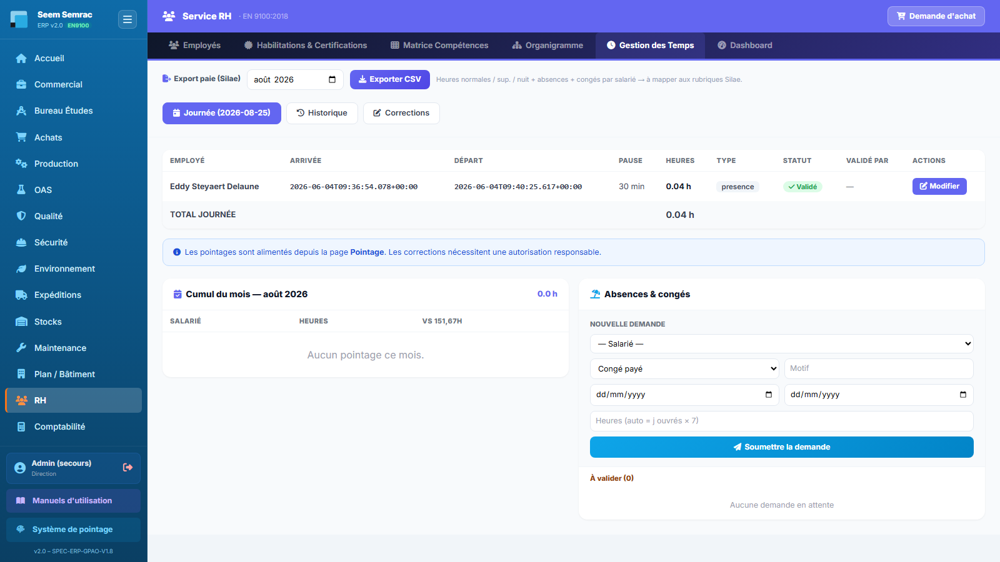

# Fiche de poste — Ressources Humaines

> Rôle ERP : `rh`. Voir aussi le manuel utilisateur (`docs/manuel/`).

## Mission
Gérer le personnel, les accès (matricule+PIN), les habilitations et les temps.

## Vos accès (droits)
| | Services |
|---|---|
| **Écriture** (créer/modifier) | rh |
| **Lecture** | production, sécurité, compta |

Vous vous connectez avec votre **matricule + PIN** (voir *Prise en main*). La barre latérale n'affiche que vos services autorisés.

## Vos tâches courantes
### 1. Provisionner un salarié
1. RH › **Employés**, « Nouveau salarié ».
2. Matricule + rôle(s) (définit les droits) + PIN.
3. Le salarié peut se connecter et pointer.

### 2. Suivre les habilitations
1. Onglet **Habilitations & Certifications** (partagé avec la Qualité).

### 3. Lire les temps reconstitués depuis la présence
1. Onglet **Gestion des Temps** : sans pointage, arrivée, départ et heures viennent de la **présence** saisie en Production, avec les horaires de la **cadence usine** du site ce jour-là.
2. Heures = amplitude − pause (celle de la Journée, sinon 30 min au-delà de 6 h) ; « Validé par » indique la cadence utilisée.
3. Les modèles d’horaires ne sont pas historisés : exporter la paie avant qu’un modèle soit modifié.

---
> Fiche générée (`scripts_doc/gen_fiches_poste.mjs`). Sécurité & traçabilité : `docs/technique/04-auth-rbac.md`.
