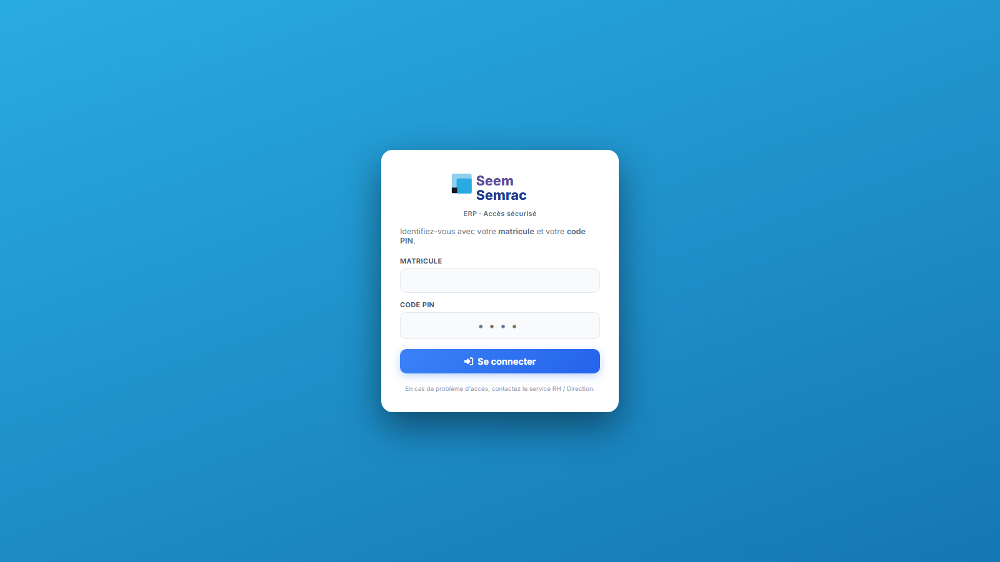
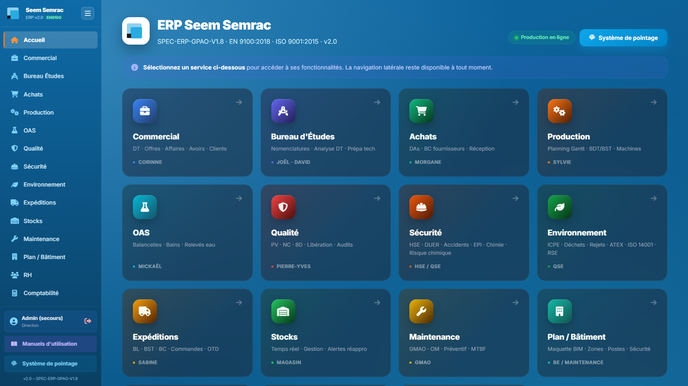

# Prise en main

## Se connecter

1. Ouvrir l'adresse de l'ERP → la page de connexion s'affiche.
2. Saisir votre **matricule** (fourni par les RH) puis votre **code PIN** (4 chiffres).
3. Cliquer **Se connecter**. Vous arrivez sur l'accueil.

> En cas de verrouillage, un **compte de secours** existe (voir le responsable). Le pointage atelier se fait sur une **borne partagée** (matricule + PIN), sans se connecter au reste de l'ERP.

## L'accueil

L'accueil présente une **tuile par service**. La **barre latérale** (à gauche) permet de naviguer à tout moment ; elle n'affiche que les services auxquels votre rôle donne accès.

## Repères communs
- **Onglets** : chaque service est découpé en onglets (en haut de la page).
- **Replier le menu** : le bouton à **trois petites barres horizontales**, en haut de la barre latérale, la range pour laisser toute la largeur de l ecran au contenu. Un bouton identique apparait alors en haut a gauche pour la reafficher. Votre choix est **memorise** d un ecran a l autre et d une session a l autre.
- **Notifications** : les actions confirment par un bandeau en haut à droite.
- **Droits** : selon votre rôle, certaines actions sont en lecture seule. Voir votre **fiche de poste** (`docs/fiches-poste/`).
- **Enregistrer** : sauf mention « auto », une modification n'est prise en compte qu'après avoir cliqué **Enregistrer** / **Valider**.
