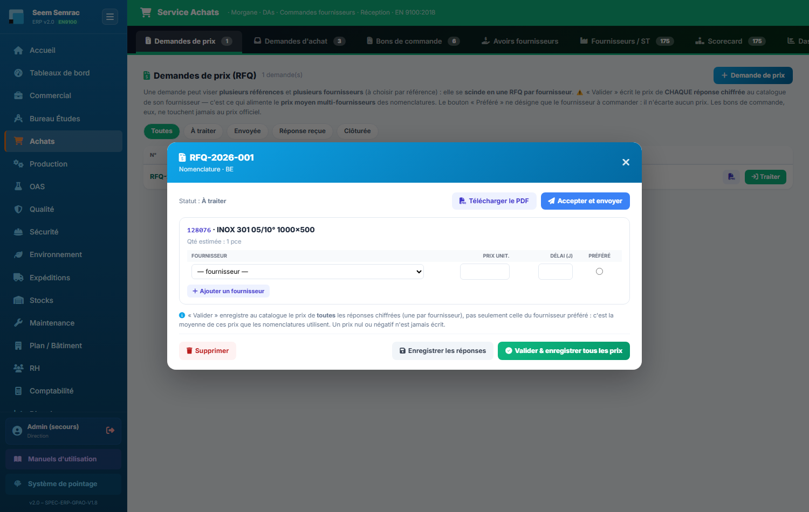
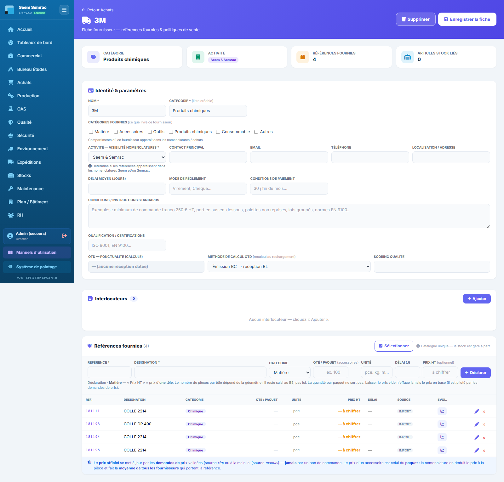
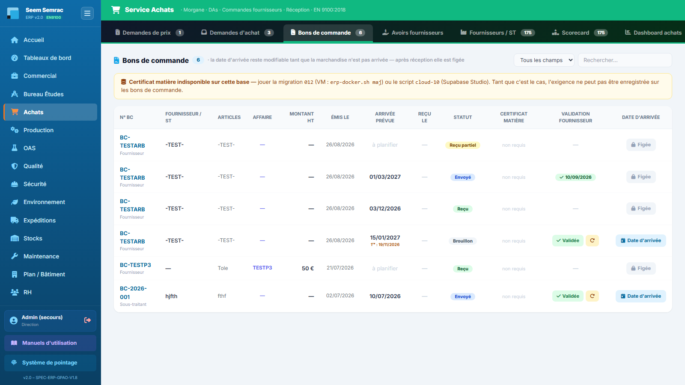

# Achats

**Pour qui :** Acheteur(se)

Consultations fournisseurs (RFQ), demandes d'achat, bons de commande, évaluation fournisseurs.

## Les onglets
- **Demandes de prix** — RFQ : source de vérité des prix → alimente le catalogue. **Tous** les prix chiffrés y sont enregistrés, pas seulement celui du fournisseur retenu : c'est ce qui donne au BE un **prix moyen** par référence.
- **Demandes d'achat** — DA à transformer en BC. Celles de l'atelier (bouton « Demande d'achat » de la Production, réservé à l'écriture Production) arrivent au nom « Prénom Nom (Production) », avec la référence dans l'article (« (réf. …) ») et l'unité dans la quantité (« 12,5 kg ») ; une DA « Machine » envoie son prix sur l'OPEX de la machine à la réception.
- **Bons de commande** — Tous les BC émis, la date d'arrivée annoncée par le fournisseur et l'exigence de **certificat matière** (colonne « Certificat matière ») ; les **BC de reliquat** nés d'un PV de réception portent la pastille « Reliquat de BC-… · date à valider ».
- **Avoirs fournisseurs** — Registre de ce que nos **fournisseurs et sous-traitants nous doivent**. À ne pas confondre avec les avoirs **clients**, qui restent au service Commercial.
- **Fournisseurs / ST** — Référentiel fournisseurs et sous-traitants. La fiche d'un fournisseur porte **un seul** tableau de références, « **Références fournies** » (référence, désignation, catégorie, **quantité par paquet**, unité, prix, délai) — l'ancien bloc « Catalogue produits » faisait doublon et a été retiré.
- **Scorecard** — Évaluation (qualité, délai) fournisseur/ST.
- **Dashboard achats** — Indicateurs achats.

## Procédures
### Émettre une demande de prix, saisir les réponses, valider **tous** les prix
1. Onglet **Demandes de prix**, « Nouvelle RFQ ». Choisir le(s) **fournisseur(s)** et les **articles**. (Une demande peut aussi arriver du BE, depuis une ligne de nomenclature : elle propose alors d'office les fournisseurs qui portent déjà la référence.)
2. **Traiter** la demande : une ligne de réponse par fournisseur. Pour une ligne d'**accessoire**, une colonne **« Qté / paquet »** (encadrée d'orange) s'ajoute à côté du **prix du paquet** : saisissez le nombre de **pièces** contenues dans le paquet auquel se rapporte ce prix. En dessous, l'ERP affiche en direct « = 0,1040 €/pièce » ou, si la case est vide, « **conditionnement non déclaré** ».
3. Cocher **« Préféré »** sur le fournisseur à commander. ⚠ Ce bouton **n'écarte aucun prix** : il ne sert qu'à indiquer chez qui acheter.
4. **« Valider & enregistrer tous les prix »** : chaque réponse chiffrée est écrite **sur la ligne catalogue de SON fournisseur** (prix, date, source « rfq », et la quantité par paquet si elle est saisie). La demande est clôturée. Le BC, lui, n'écrit jamais le prix.

*La capture montre une demande portant sur une tôle : la colonne « Qté / paquet » n'apparaît que pour une ligne d'accessoire.*

> **Pourquoi tous les prix ?** Le BE ne choisit plus de fournisseur sur une nomenclature : le prix d'une référence y est la **moyenne** de tous les fournisseurs qui la portent. Si vous n'enregistrez qu'un prix, la « moyenne » n'a qu'un fournisseur.
> **Exemple** : une vis à **10 € le paquet de 100** chez A et à **6 € le paquet de 50** chez B. L'ERP ramène chaque offre à la pièce (0,10 € et 0,12 €) puis en fait la moyenne : **0,11 € la pièce**. C'est pourquoi la **quantité par paquet** de chaque réponse compte autant que le prix : sans elle, 10 € serait compris comme le prix d'une seule vis.
> **Si des accessoires chiffrés n'ont pas de quantité par paquet**, l'ERP vous prévient avant d'écrire : leurs prix seront comptés **à la pièce**. En cas d'échec partiel, la demande **reste ouverte** et le détail s'affiche ligne par ligne dans la fenêtre.

### Déclarer une référence et sa quantité par paquet (fiche fournisseur)
1. Onglet **Fournisseurs / ST** → bouton **« Fiche »** du fournisseur → bloc **« Références fournies »**.
2. Remplir la barre de saisie : **Référence**, **Désignation**, Catégorie, **Qté / paquet** (accessoires), Unité, Délai, Prix HT — *matière : prix d'**UNE TÔLE** · accessoire : prix du **PAQUET***. Puis **« Déclarer »**.
3. **Modifier** une ligne : bouton « Modifier » → le **même** formulaire se pré-remplit ; « Annuler » revient en création. Une case laissée **vide ne change rien** (le prix en base n'est jamais effacé).
4. Un accessoire sans quantité par paquet porte le badge orange **« non déclaré »** ; un prix d'accessoire chiffré affiche `≈ 0,1040 €/pièce` sous le prix du paquet.

> Déclarer une référence **déjà présente chez ce fournisseur** ne crée pas de doublon : l'ERP le dit et bascule le formulaire en **modification** de la ligne existante, sans perdre ce que vous veniez de taper. La **même référence chez plusieurs fournisseurs** reste normale — c'est elle qui fait la moyenne.
> C'est le **même catalogue** que BE › Références : une quantité déclarée ici est immédiatement utilisée par les nomenclatures.
> Si la base n'est pas encore à jour, l'ERP répond « *Référence enregistrée, sauf la quantité par paquet…* » : la référence est bien enregistrée, prévenez l'administrateur (script `cloud-13`).

### Exiger un certificat matière sur un bon de commande
1. **À la création** : dans « Traiter → BC » (depuis une DA) ou « Créer un BC », cocher **« Certificat matière requis »** (case violette, jamais cochée d'avance) quand le fournisseur doit joindre un certificat matière à la livraison.
2. **Après coup** : onglet **Bons de commande**, colonne **« Certificat matière »**, bouton **« Exiger »** (ou **« Retirer »**), puis confirmer. Si le BC est déjà parti, **rééditer son PDF** et le renvoyer au fournisseur : la mention « Certificat matière exigé : il doit accompagner la livraison… » y est imprimée.
3. À la réception, le contrôleur des Expéditions **confirme le certificat** au PV : sans lui, le PV ne peut pas être conforme et la non-conformité le mentionne.

> L'exigence se **verrouille** (cadenas « PV conforme ») dès qu'un PV de réception conforme est signé pour ce BC. Changer l'exigence pendant qu'un contrôleur a sa page ouverte fait refuser son PV (il doit recharger). Sans la mise à jour de la base (migration 012 / script `cloud-10`), un bandeau le signale et l'exigence n'est pas enregistrée.
> La **quantité** du BC direct est un **nombre** : c'est elle qui donne le reste à recevoir à la réception.

### Valider la date d'un bon de commande de reliquat
1. Au **PV de réception** (Expéditions), une ligne reçue en moins avec **« Reliquat »** coché crée un BC **`<n° du BC>-R1`** : même fournisseur, affaire, DA, certificat matière ; lignes restantes avec leur prix unitaire ; **montant 0 €** (porté par le BC d'origine) ; **sans date d'arrivée**.
2. Onglet **Bons de commande** : repérer la pastille ambre **« Reliquat de BC-… · date à valider »** (il compte aussi dans « sans date d'arrivée »).
3. Bouton **« Date d'arrivée »** : saisir la date annoncée par le fournisseur. Notification « Reliquat : date validée, il rejoint le calendrier des Expéditions » ; la pastille devient bleue « Reliquat de BC-… ».

> Tant que la date n'est pas validée, le reliquat **n'apparaît pas au Calendrier** des Expéditions. Une validation fournisseur cochée avant ne fige pas sa date. Le taux de service fournisseur ne compte pas deux fois le manque.

### Suivre un avoir fournisseur
1. Onglet **Avoirs fournisseurs**. Trois compteurs en haut : **À recevoir**, **Disponible**, **Déjà imputé**. Puis le tableau **« Ce que chacun nous doit »** par fournisseur, puis la liste des avoirs (recherche par n° d’avoir, fournisseur, statut, origine).
2. Un avoir **arrive tout seul** quand la Qualité décide un renvoi, un rebut ou une réfaction sur un lot reçu non conforme. **« Nouvel avoir »** permet d’en saisir un à la main : type (fournisseur / sous-traitant), tiers, bon de commande (facultatif), montant HT, motif, et s’il est déjà reçu le **n° de l’avoir du fournisseur** + la **date**.
3. Bouton **« Reçu »** quand l’avoir du fournisseur arrive : son n°, sa date, et le **montant réellement accordé** — qui peut différer du montant réclamé. L’avoir passe de **À recevoir** à **Disponible**.
4. Bouton **« Imputer »** pour l’utiliser : le montant et **sur quoi** (n° de facture fournisseur, de bon de commande…) + une note. L’avoir passe en **Partiellement utilisé**, puis **Soldé**. Chaque imputation reste visible sous le motif.

> Un avoir **ne se supprime jamais** : il **s’annule** avec un motif obligatoire, et seulement tant qu’aucune partie n’en a été utilisée.
> Si la base n’a pas encore la mise à jour (migration 008 / script cloud-6), un **bandeau orange** le signale et la Qualité ne peut pas décider sur un lot reçu non conforme.

---
> Détails techniques : `docs/technique/06-modules/achats.md`. Droits d'accès : `docs/fiches-poste/`.
