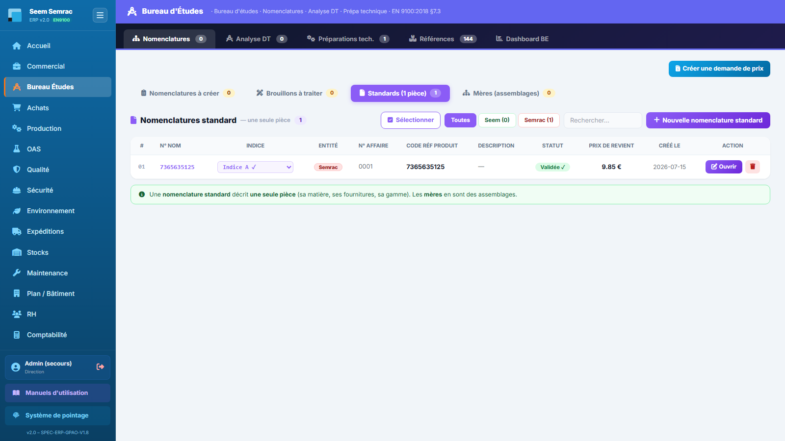

# Bureau d'Études

**Pour qui :** Technicien(ne) BE

Définition technique des pièces : nomenclatures (matières + gamme d'opérations), analyse des DT, références.

## Les onglets
- **Nomenclatures** — BOM : composants matière (masse en g), gamme d'opérations (temps en millièmes d'heure), prix de revient calculé.
- **Analyse DT** — Transforme une DT en dossier technique.
- **Préparations tech.** — Fichiers plan / programme CN par étape.
- **Références** — Catalogue des références et prix.
- **Dashboard BE** — Indicateurs BE.

## Procédures
### Créer une nomenclature
1. Onglet **Nomenclatures**, « Nouvelle nomenclature ».
2. Renseigner la **matière** (référence → prix auto si < 3 mois, sinon RFQ) et la **masse** (g).
3. Ajouter les **étapes** (glisser-déposer) : opération, machine, temps MO/machine, réglage (coût fixe/lot).
4. Le **prix de revient unitaire** se calcule automatiquement. Enregistrer (indice A/B/C).

---
> Détails techniques : `docs/technique/06-modules/be.md`. Droits d'accès : `docs/fiches-poste/`.
