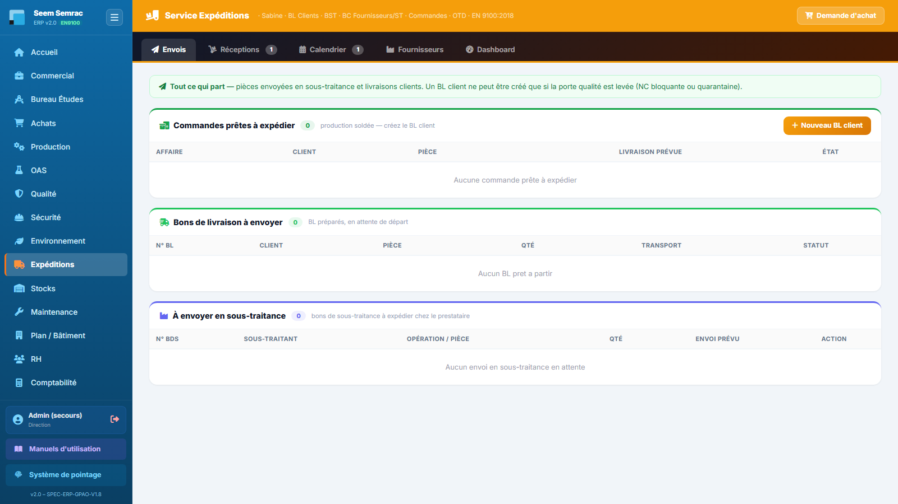

# Expéditions

**Pour qui :** Agent d'expédition

Porte d'entrée et de sortie des marchandises, organisée par **sens du flux** : ce qui arrive, ce qui part, puis une vue calendrier. S'y ajoutent le référentiel fournisseurs (avec l'historique BC / BL) et les indicateurs.

## Les onglets
- **Réceptions** — Tout ce qui arrive : commandes fournisseurs et sous-traitants à réceptionner, retours de sous-traitance, **retours clients** attendus, BC en attente de validation fournisseur, puis les arrivées déjà enregistrées.
- **Envois** — Tout ce qui part : commandes prêtes à expédier (lot libéré), BL à envoyer, pièces à confier en sous-traitance.
- **Calendrier** — Frise unique **arrivées + départs**, puis le bloc **« Aujourd'hui »** listant ce qui doit entrer et sortir dans la journée, retards compris.
- **Fournisseurs** — Référentiel (consulter, ajouter, supprimer) et, par fournisseur, ses **bons de commande envoyés** et les **bons de livraison reçus** (avec transporteur et date).
- **Dashboard** — Volumes, OTD client et fournisseur, en-cours.

## Procédures

### Enregistrer une réception fournisseur
1. Onglet **Réceptions**, bloc « À réceptionner » : cliquer le bouton d'action de la ligne.
2. Saisir la **quantité reçue** (inférieure à la commande = réception partielle, le BC reste ouvert pour le solde).
3. Renseigner le **transporteur** et sa référence.
4. Valider : un BL de réception est créé et rattaché au BC, la date d'arrivée réelle est posée.

> **OTD figé** — la date d'arrivée prévue est modifiable, mais l'ERP **gèle la première date promise** : c'est elle qui sert au calcul de l'OTD fournisseur. Un décalage de date ne rachète pas la ponctualité.

### Réceptionner un retour client
1. Le retour doit d'abord être **annoncé en Qualité** sur la non-conformité client (case « Retour de marchandise prévu » + n° de commande + quantité + date).
2. Il apparaît dans **Réceptions › Retours clients attendus** → « Enregistrer l'arrivée ».
3. Le n° de commande est prérempli depuis la NC ; valider crée le BL d'entrée et passe la NC en « retour reçu ».

### Créer un bon de livraison client
1. Onglet **Envois**, bloc « Commandes prêtes à expédier ».
2. Choisir les **lots libérés** et les quantités (partiel possible).
3. Renseigner le transporteur et le prix de transport.
4. Valider : BL créé, stock décrémenté, facture client et écriture de vente préparées.

> **Porte qualité** — le BL est **refusé** si le lot porte une NC ouverte ou est en quarantaine. Faire lever le blocage par la Qualité.

### Consulter l'historique d'un fournisseur
1. Onglet **Fournisseurs** : rechercher par nom, puis cliquer le fournisseur.
2. Le détail affiche ses **bons de commande envoyés** (n°, date, montant, réception, affaire) et ses **bons de livraison reçus** (n°, date, **transporteur**, BC lié, affaire).
3. **Cliquer une ligne** ouvre la **fiche de l'affaire** correspondante.
4. Les compteurs de la liste (`N BC` / `N BL`) repèrent les fournisseurs à relancer : beaucoup de BC, peu de BL.

### Ajouter ou supprimer un fournisseur
- **« Nouveau fournisseur »** : seul le **nom** est obligatoire ; le fournisseur devient aussitôt sélectionnable dans les RFQ, BC et le catalogue.
- **« Supprimer »** : demande confirmation. Les **BC déjà émis ne sont pas supprimés** — l'historique reste intact.
- Le bouton **« Fiche complète »** ouvre la fiche 360 côté Achats (scorecard OTD, catalogue, prix, qualification).

---
> Détails techniques : `docs/technique/06-modules/expeditions.md`. Droits d'accès : `docs/fiches-poste/`.
