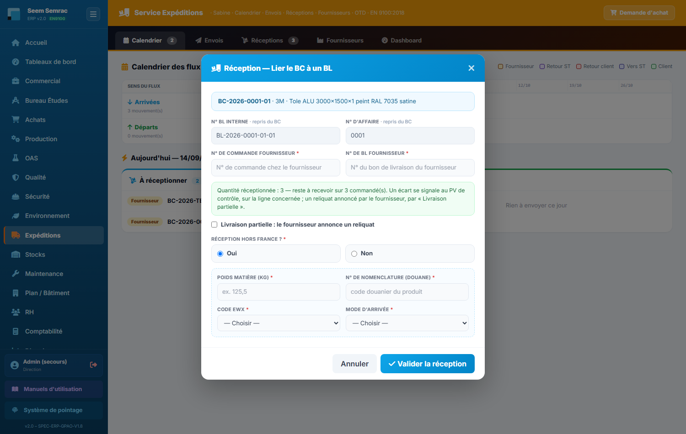
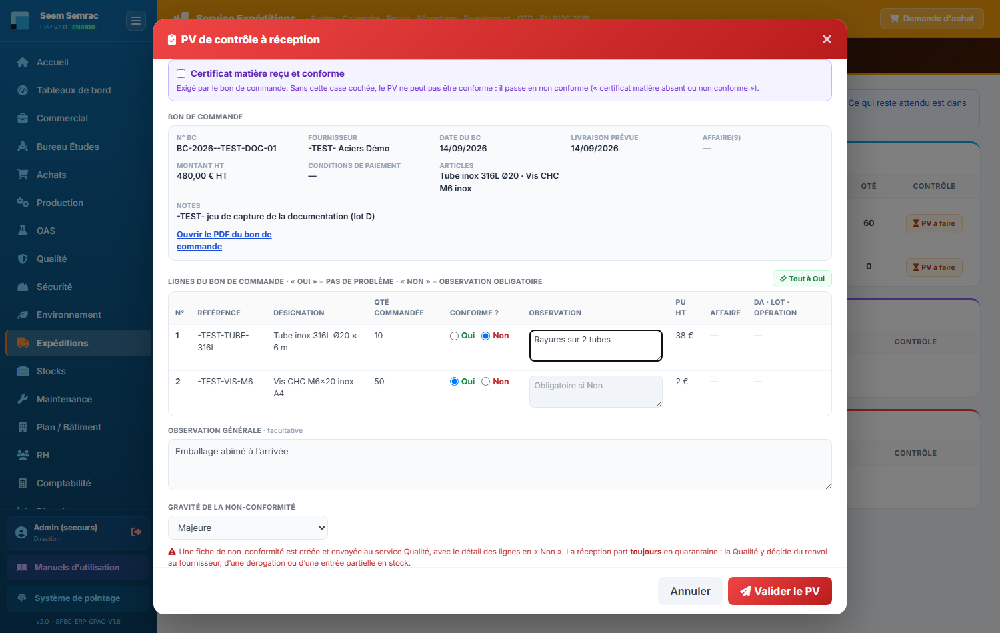

# Expéditions

**Pour qui :** Agent d'expédition

Porte d'entrée et de sortie des marchandises, organisée par **sens du flux** : ce qui arrive, ce qui part, puis une vue calendrier. S'y ajoutent le référentiel fournisseurs (avec l'historique BC / BL) et les indicateurs.

## Les onglets
- **Réceptions** — Ce qui est arrivé : réceptions fournisseurs (avec leurs références fournisseur, le bloc hors France et le lien « Corriger »), retours de sous-traitance, **retours clients** ; c'est ici qu'on fait le **PV de contrôle** (« PV à faire »).
- **Envois** — Tout ce qui part : commandes prêtes à expédier (lot libéré), BL à envoyer, pièces à confier en sous-traitance, et les **retours fournisseurs** décidés par la Qualité.
- **Calendrier** — Frise unique **arrivées + départs**, puis le bloc **« Aujourd'hui »** listant ce qui doit entrer et sortir dans la journée, retards compris ; bouton **« Traiter »** pour réceptionner une commande.
- **Fournisseurs** — Référentiel (consulter, ajouter, supprimer) et, par fournisseur, ses **bons de commande envoyés** et les **bons de livraison reçus** (avec transporteur ou N° de BL fournisseur, et date).
- **Dashboard** — Volumes, OTD client et fournisseur, en-cours.

## Procédures

### Enregistrer une réception fournisseur
> Réception, correction et PV de contrôle sont réservés aux personnes ayant l'**écriture sur les Expéditions** (Direction, rôle Logistique, ou case « Écrire » des Expéditions cochée sur la fiche salarié). ⚠ Depuis le 14/09/2026, la Qualité ne signe plus les PV de réception sans cette case.

1. Onglet **Calendrier**, bloc « à réceptionner aujourd'hui » : cliquer **« Traiter »** sur la ligne du bon de commande. N° BL interne et N° d'affaire sont repris du BC.
2. Saisir le **N° de commande fournisseur** et le **N° de BL fournisseur** (obligatoires).
3. Lire le bandeau : la quantité enregistrée est le **reste à recevoir** du BC — **aucune quantité à saisir**. Exceptions : case **« Livraison partielle »** (le fournisseur annonce un reliquat : saisir la quantité livrée, le BC reste ouvert) et BC **sans quantité exploitable** (saisir la quantité lue sur le BL fournisseur).
4. Répondre à **« Réception hors France ? »** (obligatoire). Si **Oui** : **poids matière (kg)**, **N° de nomenclature (douane)**, **code EWX** (1 ou 2), **mode d'arrivée** (Routier, Maritime, Aérien, Ferroviaire, Messagerie / express).
5. **« Valider la réception »** : un BL de réception est créé et rattaché au BC, la date d'arrivée réelle est posée ; la réception apparaît dans l'onglet **Réceptions** avec « PV à faire ». Une faute de frappe se rectifie ensuite par le lien **« Corriger »** (ni la quantité ni le stock ne changent).

### Faire le PV de contrôle
1. Onglet **Réceptions**, bouton **« PV à faire »** sur la réception (grisé avec un cadenas sans écriture Expéditions).
2. Choisir **Conforme** ou **Non conforme** (rien n'est coché d'avance) et le **contrôleur** dans la liste (salariés actifs ayant l'écriture sur les Expéditions).
3. Si le BC exige un **certificat matière** : cocher « Certificat matière reçu et conforme » s'il est là. **Sans cette case, pas de PV conforme** : le PV bascule en non conforme.
4. **Conforme** : valider — le contenu entre en stock (ligne par ligne sur son article pour un BC à plusieurs articles, si la réception couvre toute la commande).
5. **Non conforme** : la fenêtre affiche l'en-tête du BC et **toutes ses lignes** ; répondre **Oui / Non** sur chaque ligne (« Tout à Oui » pour les lignes sans écart), **observation obligatoire** sur chaque Non, **observation générale** facultative, gravité. Valider : une **NC « réception fournisseur »** part en Qualité avec une ligne par écart, et le lot part **toujours en quarantaine** — rien n'entre en stock, la Qualité décide de la suite.

> Sous un PV non conforme, la ligne dit ce que la Qualité en a fait : **« renvoyé au fournisseur · à expédier / expédié »**, **« dérogation fournisseur · entré en stock »**, **« entrée partielle 6/10 »** — ou **« en quarantaine — décision Qualité attendue »** tant que rien n'est décidé.

> **OTD figé** — la date d'arrivée prévue est modifiable, mais l'ERP **gèle la première date promise** : c'est elle qui sert au calcul de l'OTD fournisseur. Un décalage de date ne rachète pas la ponctualité.

### Réceptionner un retour client
1. Le retour doit d'abord être **annoncé en Qualité** sur la non-conformité client (case « Retour de marchandise prévu » + n° de commande + quantité + date).
2. Il apparaît dans **Réceptions › Retours clients attendus** → « Enregistrer l'arrivée ».
3. Le n° de commande est prérempli depuis la NC ; valider crée le BL d'entrée et passe la NC en « retour reçu ».

### Créer un bon de livraison client
1. Onglet **Envois**, bloc « Commandes prêtes à expédier ».
2. Choisir les **lots libérés** et les quantités (partiel possible).
3. Renseigner le transporteur et le prix de transport.
4. Valider : BL créé, stock décrémenté, facture client et écriture de vente préparées.

> **Porte qualité** — le BL est **refusé** si le lot porte une NC ouverte ou est en quarantaine. Faire lever le blocage par la Qualité.

### Expédier un retour fournisseur
1. Onglet **Envois**, carte **« Retours fournisseurs »** : y figurent les lots que la Qualité a décidé de **renvoyer** — BL / lot, fournisseur, pièce, **quantité à renvoyer**, avoir ou remplacement attendu, date de décision.
2. Préparer le colis, puis cliquer **« Expédié »**.
3. Renseigner, si vous l'avez, la **référence du bon de retour** ou le **n° de suivi** (facultatif), puis valider.
4. La ligne quitte la liste ; la date et la personne sont enregistrées. Un second clic est refusé.

### Consulter l'historique d'un fournisseur
1. Onglet **Fournisseurs** : rechercher par nom, puis cliquer le fournisseur.
2. Le détail affiche ses **bons de commande envoyés** (n°, date, montant, réception, affaire) et ses **bons de livraison reçus** (n°, date, **transporteur** — à défaut, depuis le 14/09/2026, le **N° de BL fournisseur** —, BC lié, affaire).
3. **Cliquer une ligne** ouvre la **fiche de l'affaire** correspondante.
4. Les compteurs de la liste (`N BC` / `N BL`) repèrent les fournisseurs à relancer : beaucoup de BC, peu de BL.

### Ajouter ou supprimer un fournisseur
- **« Nouveau fournisseur »** : seul le **nom** est obligatoire ; le fournisseur devient aussitôt sélectionnable dans les RFQ, BC et le catalogue.
- **« Supprimer »** : demande confirmation. Les **BC déjà émis ne sont pas supprimés** — l'historique reste intact.
- Le bouton **« Fiche complète »** ouvre la fiche 360 côté Achats (scorecard OTD, catalogue, prix, qualification).

---
> Détails techniques : `docs/technique/06-modules/expeditions.md`. Droits d'accès : `docs/fiches-poste/`.
