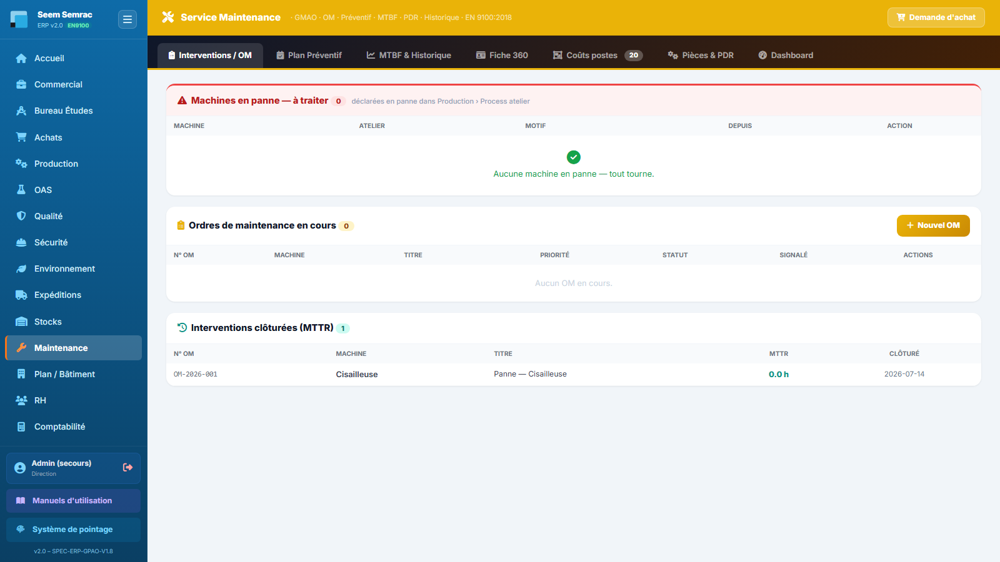

# Maintenance

**Pour qui :** Technicien(ne) maintenance

GMAO : ordres de maintenance, préventif, MTBF, fiche machine 360, pièces détachées.

## Les onglets
- **Interventions / OM** — Ordres de maintenance curatifs.
- **Plan Préventif** — Gammes préventives → génèrent des OM.
- **MTBF & Historique** — Fiabilité.
- **Fiche 360** — TCO, heures, disponibilité/TRS d'une machine.
- **Pièces & PDR** — Stock de pièces détachées.
- **Dashboard** — Indicateurs maintenance.

## Procédures
### Déclarer une panne machine
1. Onglet **Interventions**, « Nouvel OM » (ou depuis la fiche machine).
2. La machine passe en **arrêt** (visible en rouge au planning et sur le plan bâtiment).
3. À la clôture de l'OM, la machine repasse **opérationnelle**.

---
> Détails techniques : `docs/technique/06-modules/maintenance.md`. Droits d'accès : `docs/fiches-poste/`.
