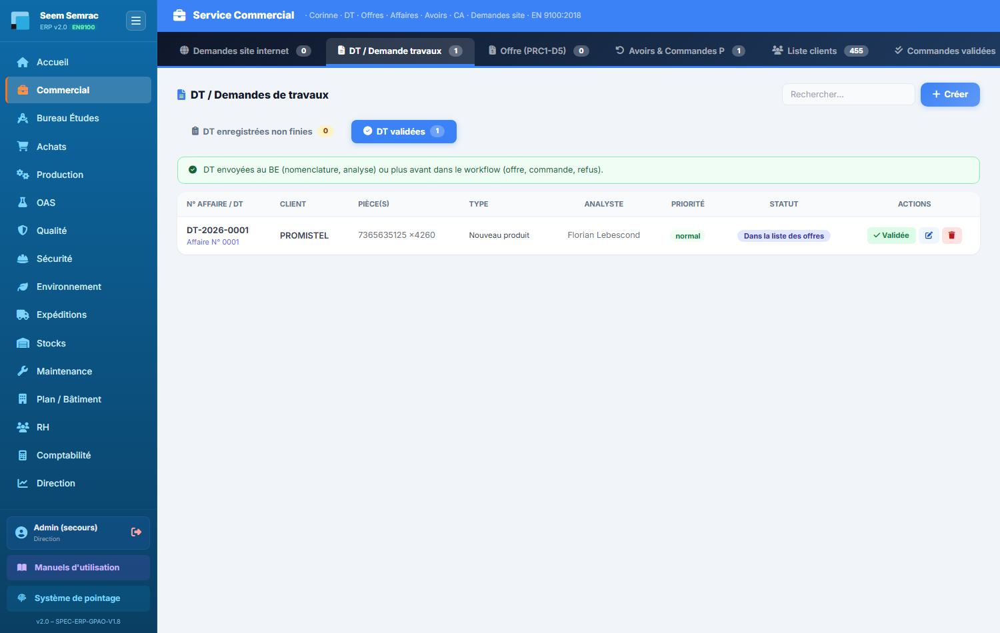
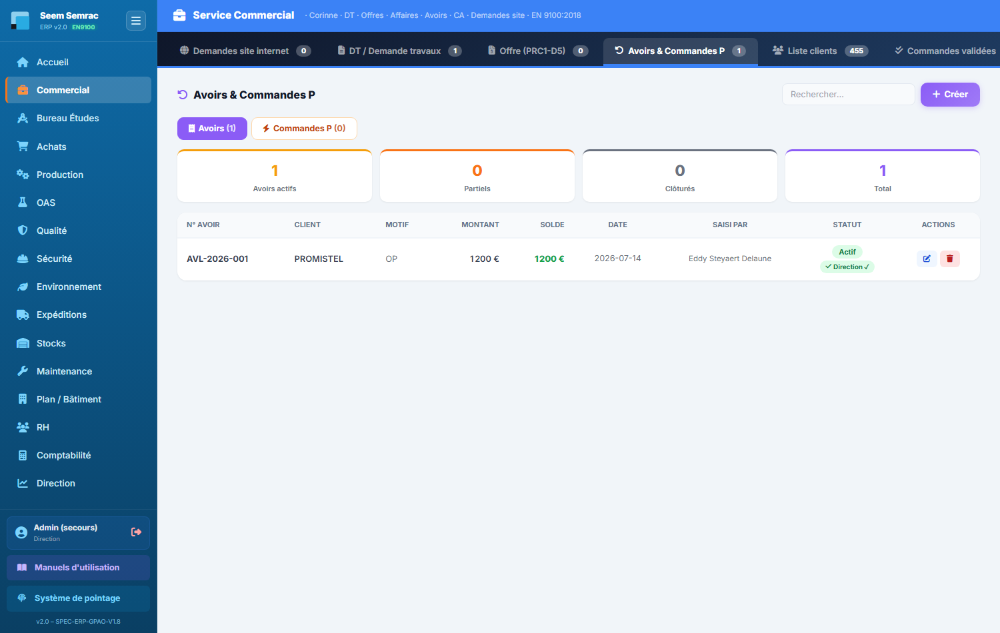

# 01 · Commercial — parcours guidé

> Comment ça marche **étape par étape** : ce qui arrive **avant**, ce que **vous remplissez ici** (et pourquoi), et **où ça part ensuite**. Écrit pour un nouvel utilisateur.

## En bref — le rôle du service dans la chaîne

Le service Commercial est la **porte d'entrée des affaires**. Tout commence ici : une demande arrive (par téléphone, par e-mail ou depuis le formulaire du site internet), et c'est vous qui la transformez en une **Demande de Travaux (DT)**. Cette DT reçoit un **numéro d'affaire** unique qui va suivre la pièce d'un bout à l'autre de l'ERP.

Ensuite, la chaîne se déroule : le Bureau d'Études chiffre le prix de revient, vous établissez une **offre** (un devis) à partir de ce chiffrage, vous l'envoyez au client. Quand il l'accepte, l'offre devient une **commande ferme** qui part vers la Production. Vous gérez aussi les **avoirs** (crédits accordés au client) et les **commandes prioritaires** issues des retours qualité.

En résumé : vous recevez les demandes, vous chiffrez, vous transformez en commande, et vous transmettez à la Production. Le numéro d'affaire créé ici (DT → Offre → Commande) reste le **même** tout au long du parcours.

## Étape 1 — Créer une Demande de Travaux (DT)

**⬅️ Avant :** Un client vous contacte pour un nouveau produit, une mise à jour de prix ou une modification d'une pièce existante. La demande peut aussi arriver toute seule dans l'onglet « Demandes site internet » (formulaire de contact du site web).

**📝 Ici, vous :** enregistrez la demande du client pour la transmettre au Bureau d'Études.

Sur cet écran, vous renseignez :
- **Client** — tapez le nom pour retrouver le client existant ; s'il n'existe pas, un bouton permet de le créer sur place sans quitter la saisie.
- **N° DT (auto)** — le numéro d'affaire attribué automatiquement ; c'est lui qui suivra la pièce partout, laissez-le tel quel.
- **Activité** — choisissez le site concerné, **SEEM** (aluminium) ou **SEMRAC** (tôlerie) : il oriente le travail vers le bon atelier.
- **Type de DT** — précisez la nature de la demande (nouveau produit, mise à jour prix, mise à jour produit, produit à jour) pour que le BE sache quoi faire.
- **Produit(s) concerné(s)** — dans le bloc juste en dessous, décrivez chaque pièce : référence interne, quantité (au moins 1), plan joint (.pdf, .step), et les exigences normatives à respecter (EN 9100, REACH…).

⚠️ Sans **Activité** ni **Type de DT**, la création est refusée. Utilisez « Produit supplémentaire » pour ajouter plusieurs pièces à la même DT.

**➡️ Ensuite :** la DT est enregistrée avec son **numéro d'affaire**. Elle passe au **Bureau d'Études**, qui étudie la faisabilité et calcule le prix de revient. Si vous ne pouvez pas honorer la demande, l'action « Refuser » (avec un motif) la clôture.

> 📋 Le détail de **chaque case** : [guide des formulaires](../formulaires/commercial.md).

## Étape 2 — Établir une offre commerciale (le devis)

**⬅️ Avant :** Le Bureau d'Études a chiffré le prix de revient de la ou des pièces de la DT. La DT est passée au statut « dans offres ».

**📝 Ici, vous :** établissez le devis à envoyer au client, à partir de la DT chiffrée.

Sur cet écran, vous renseignez :
- **Origine de l'offre** — choisissez « Depuis une DT » (le cas normal, qui reprend le chiffrage) ou « Offre directe » pour partir d'un nouveau numéro.
- **N° DT associé** — sélectionnez la DT qui sert de base à l'offre (mode « Depuis une DT »).
- **PRU HT** et **Coeff.** — le prix de revient unitaire et le coefficient appliqué ; leur produit donne le prix de vente, et la **Marge %** se calcule toute seule.
- **Qté**, **Frais transport**, **Délai de livraison estimé** — les conditions annoncées au client.
- **Date validité offre** — jusqu'à quand le devis reste valable.

💡 « Ajouter un produit » permet de chiffrer plusieurs pièces dans la même offre. « Enregistrer brouillon » garde l'offre sans l'envoyer. Le **numéro de l'offre est le même que celui de la DT** (un seul N° d'affaire).

**➡️ Ensuite :** l'offre part au client. S'il veut discuter, l'action « Négocier » la rouvre. S'il l'accepte, vous passez à la rentrée de commande (Étape 3).

> 📋 Le détail de **chaque case** : [guide des formulaires](../formulaires/commercial.md).

## Étape 3 — Rentrer la commande (offre acceptée)

**⬅️ Avant :** Le client a accepté votre offre, souvent en renvoyant un bon de commande (BC).

**📝 Ici, vous :** transformez l'offre acceptée en **commande ferme**.

Sur cet écran, vous renseignez :
- **Offre acceptée** — l'offre validée qui donne naissance à la commande.
- **Date de livraison confirmée** — la date retenue avec le client, celle qui pilotera le planning.
- **N° BC client** — le numéro du bon de commande envoyé par le client, pour tracer l'accord.
- **Statut initial** / **Commentaires** — l'état de départ (À programmer, Attente matière…) et les conditions particulières (ex. livraison en deux lots).

💡 Les informations de la DT et de l'offre sont **déjà pré-remplies** : vérifiez-les avant de valider.

**➡️ Ensuite :** la commande apparaît dans l'onglet **« Commandes validées »**. Elle est transmise à la **Production** pour être programmée au planning. Le numéro d'affaire est toujours le même que celui de la DT et de l'offre.

> 📋 Le détail de **chaque case** : [guide des formulaires](../formulaires/commercial.md).

## Étape 4 — Créer un avoir client

**⬅️ Avant :** Il faut accorder un crédit à un client — une avance (matière, outil, consignation) ou une réclamation à traiter.

**📝 Ici, vous :** créez un avoir (crédit) au bénéfice du client.

Sur cet écran, vous renseignez :
- **Client** — le bénéficiaire de l'avoir.
- **Type d'avoir** — « Avance » ou « Réclamation ». Une **réclamation est transmise au Service Qualité** pour analyse.
- **Montant (€)** et **Date de l'avoir** — le crédit accordé et sa date d'émission.
- **Motif / Description** — l'explication de l'avoir, obligatoire, pour tracer la raison.

**➡️ Ensuite :** l'avoir (numéro **AV-AAAA-XX**) apparaît dans l'onglet **« Avoirs & Commandes P »**. S'il s'agit d'une réclamation, le dossier part à la Qualité.

> 📋 Le détail de **chaque case** : [guide des formulaires](../formulaires/commercial.md).

## Étape 5 — Suivre les avoirs et lancer les commandes prioritaires

**⬅️ Avant :** Un retour client a été traité depuis **Qualité › Non-Conformités** (bouton « Retour »). Cela a généré un **avoir** (au prix de vente) et une **commande prioritaire** (au coût de revient) pour refaire la pièce.

**📝 Ici, vous :** consultez les avoirs et **lancez la production** des commandes prioritaires.

Sur cet écran, vous retrouvez :
- **Sous-onglet Avoirs** — la liste des avoirs **AV-AAAA-XX** émis (avances et réclamations).
- **Sous-onglet Commandes P** — les commandes prioritaires **CMDP-AAAA-XX** issues des retours clients, en attente de relance en production.
- **Bouton « Lancer la production »** — sur une commande P, il crée la commande, le lot **LOTP** et les **BDT prioritaires**.

**➡️ Ensuite :** après « Lancer la production », la commande prioritaire part au **planning de Production**, où ses ordres apparaissent **encadrés en rouge** pour signaler leur priorité. La pièce est refaite en urgence pour le client.

> 📋 Le détail de **chaque case** : [guide des formulaires](../formulaires/commercial.md).
