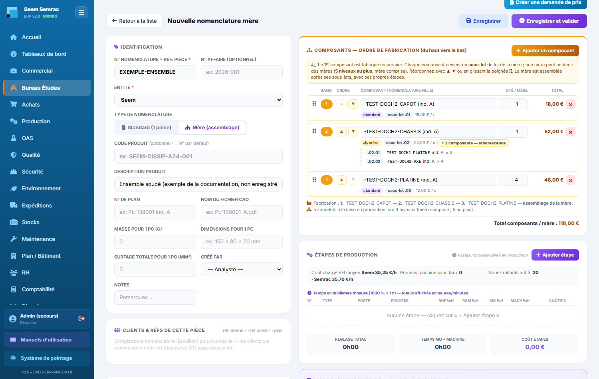
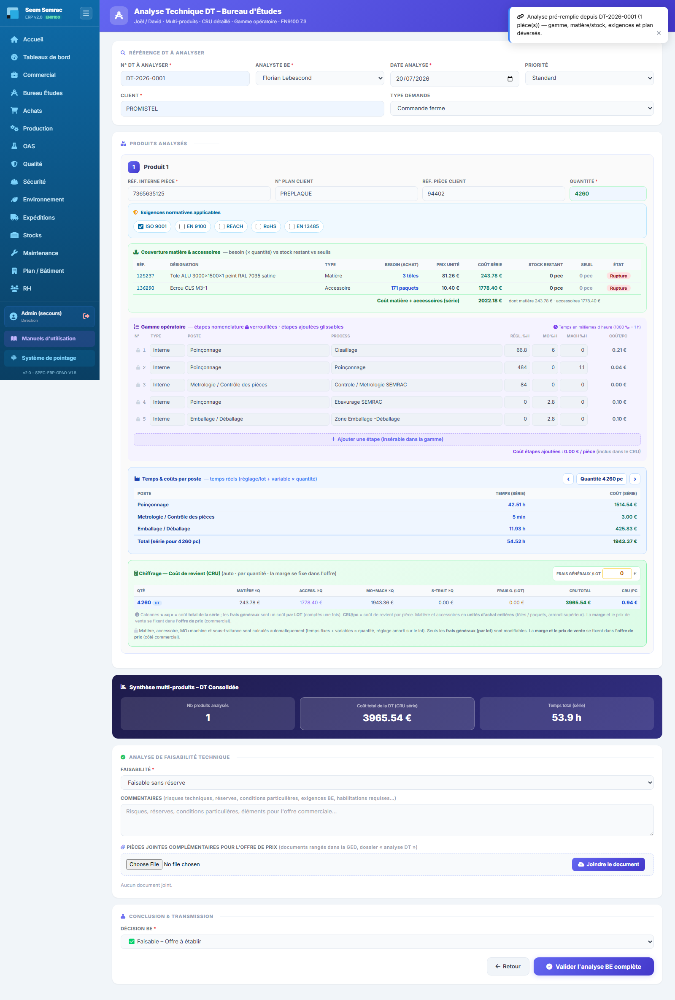

# 02 · Bureau d Études — parcours guidé

> Comment ça marche **étape par étape** : ce qui arrive **avant**, ce que **vous remplissez ici** (et pourquoi), et **où ça part ensuite**. Écrit pour un nouvel utilisateur.

## En bref — le rôle du service dans la chaîne

Le Bureau d'Études est le service qui **transforme une intention commerciale en dossier de fabrication**. En entrée, il reçoit une pièce à définir : soit un plan client rattaché à une affaire, soit une demande de travaux (DT) transmise par le Commercial. Le BE décrit alors chaque pièce dans une **nomenclature** : sa matière, ses fournitures, et la **gamme d'opérations** (usinage, pliage, sous-traitance…) avec les temps. À partir de ces nomenclatures, le prix de revient se calcule tout seul. En sortie, le BE **valide les nomenclatures** et **lance la fabrication** depuis l'analyse de la DT : cela crée les bons de travail (BDT/BDS) qui partent en Production, et les demandes de prix (RFQ) qui partent aux Achats.

## Étape 1 — Ouvrir le service et repérer la pièce à définir
**⬅️ Avant :** Le Commercial a reçu une commande ou un plan client. Une pièce doit être définie techniquement, ou une nomenclature existante doit être mise à jour.
**📝 Ici, vous :** ouvrez le service Bureau d'Études et choisissez l'onglet de travail (« Nomenclatures » pour définir une pièce, « Analyse DT » pour chiffrer et lancer).

Sur cet écran, vous repérez :
- **Les onglets** — « Nomenclatures » (définir les pièces), « Analyse DT » (chiffrer puis lancer la fabrication), « Préparations tech. » (fichiers plan/programme CN), « Références » (catalogue et prix), « Dashboard BE ».
- **La liste des nomenclatures** — les pièces déjà définies ; le bouton « Ouvrir » reprend une pièce, « Nouvelle nomenclature standard » ou « Nouvelle mère » en crée une.
- **Le bouton « Standard / Mère »** — bascule l'affichage entre les pièces simples (une seule pièce) et les assemblages (des standards et, depuis le 18/09/2026, d'autres mères : « n composants dont m mère(s) »).

**➡️ Ensuite :** vous entrez dans l'éditeur de nomenclature pour décrire la pièce (étape 2).

## Étape 2 — Créer la nomenclature de la pièce
**⬅️ Avant :** Vous savez quelle pièce définir (son plan, son affaire). Vous cliquez « Nouvelle nomenclature standard » (une pièce) ou « Nouvelle mère » (un assemblage).
**📝 Ici, vous :** décrivez la pièce de A à Z — identité, matière, accessoires, puis la gamme de fabrication — pour que son prix de revient se calcule.

> Sur cette capture (18/09/2026, base à jour), l'écrou `136290` a sa **quantité par paquet déclarée** au catalogue (100 pièces) : son prix de paquet (10,40 €) est ramené à **0,1040 € la pièce**, soit 0,42 € pour 4 écrous. Si la quantité par paquet n'est pas déclarée, la mention orange « cond. ? » apparaît et le prix du paquet est compté **à la pièce** (100 fois trop cher ici). Chaque ligne porte son bouton **« Demande de prix »**. Les lignes et temps de l'exemple sont posés à l'écran pour la capture : rien n'est enregistré.

Sur cet écran, vous renseignez :
- **N° Nomenclature (= réf. pièce)** — le numéro qui identifie la pièce ; obligatoire, c'est la clé du dossier. *(ex. SEEM-DISSIP-A24)*
- **Entité** — l'usine concernée, Seem ou Semrac ; obligatoire, car les postes et process de la gamme en dépendent (les matières et accessoires, eux, sont cherchés dans tout le catalogue).
- **N° Affaire** — le numéro de commande client, si la pièce est liée à une affaire précise ; laissez vide pour une pièce « libre ».
- **N° de plan / Masse / Dimensions / Surface** — les caractéristiques physiques ; la surface sert au calcul de charge des balancelles de traitement de surface (OAS).
- **Matière (tôle)** — la référence de tôle, cherchée **par référence ou par désignation** dans tout le catalogue (**sans choisir de fournisseur**). Le « Prix estimé / pièce » est la **moyenne du prix d'une tôle chez tous les fournisseurs** qui portent la référence, divisée par « Pc/tôle ». Un prix de plus de 6 mois reste affiché **en orange** (jamais remis à 0) ; sans aucun prix, la case passe au rouge « coût incomplet » — la pièce reste enregistrable. Le bouton **« Demande de prix »** (libellé, colonne du même nom) est disponible **à tout moment** sur chaque ligne : bleu si le prix est récent, orange si la demande est conseillée, ambre « En attente / vérifier » quand elle est partie.
- **Accessoires** — les fournitures achetées (visserie, joints…) : référence (ou désignation) et **Nb/pièce**. La **quantité par paquet ne se saisit plus ici** : elle est déclarée **au catalogue**, fournisseur par fournisseur (onglet Références, ou fiche fournisseur côté Achats), ce qui permet de ramener chaque offre au prix **d'une pièce** avant d'en faire la moyenne.
- ⚠ **Une même référence ne peut figurer qu'une fois** dans une nomenclature, matière et accessoires confondus.
- **Étapes de production (gamme)** — la suite des opérations, réordonnables en les glissant : type (Interne / Sous-traité), process (avec sa machine), temps de réglage/MO/machine en millièmes d'heure (1000 = 1 h), ou prix par pièce du sous-traitant. Pour un assemblage « mère », l'encadré « Composants — ordre de fabrication », en haut de la colonne de droite, liste plutôt les composants (standards **ou mères**) et leurs quantités — voir ci-dessous.

**Cas d'un assemblage (nomenclature mère)** — l'ordre des composants est l'**ordre de fabrication, du haut vers le bas** : le 1ᵉʳ est fabriqué en premier, puis le suivant…, puis la mère est assemblée. Vous le réglez avec les boutons **▲ ▼**, la **poignée** (glisser-déposer) ou les flèches du clavier ; chaque ligne affiche son **rang** et le **n° de sous-lot** qu'elle aura en production (`.01`, `.02`…). Une mère peut contenir d'autres mères (5 niveaux au plus) ; l'ERP refuse qu'une mère se contienne elle-même. À la commande, chaque composant deviendra un **sous-lot** du lot de la mère (et les composants d'une sous-mère, des **sous-sous-lots**).

**➡️ Ensuite :** le **prix de revient unitaire** se calcule automatiquement. Vous enregistrez (indice A/B/C) ; une révision créée par « Incrémenter l'indice » naît **En cours** et se valide ensuite. Une fois enregistrée, vous pouvez rouvrir la pièce pour **joindre les documents (GED)** — plan client, plan CAO, programmes FAO par étape machine. La nomenclature **validée** devient la source du chiffrage de l'Analyse DT (étape 3). À partir de sa validation, **chaque modification** est tracée dans le **journal EN 9100** (carte tout en bas du formulaire, **sur toute la largeur** : qui, quand, avant → après).

> 📋 Le détail de **chaque case** : [guide des formulaires](../formulaires/be.md).

## Étape 3 — Analyser la DT et lancer la fabrication
**⬅️ Avant :** Les pièces concernées ont une nomenclature validée. Une demande de travaux (DT) attend d'être chiffrée dans l'onglet « Analyse DT ».
**📝 Ici, vous :** vérifiez le chiffrage calculé automatiquement, puis lancez la production ou demandez les prix manquants.

Le bouton **« Analyser »** ouvre le formulaire complet, pré-rempli depuis la DT et les nomenclatures. Le chiffrage y est **entièrement automatique** :

> ⚠ capture à rafraîchir (lot H1, 17/09/2026) : elle date d'avant le prix moyen — le besoin d'un accessoire y est encore compté en **paquets** ; il l'est désormais en **pièces**. À refaire une fois le script `cloud-13` joué sur la base en ligne (sans lui, le prix de l'écrou `136290` y apparaîtrait compté à la pièce, 100 fois trop cher).

Sur cet écran, vous lisez et agissez (aucun prix à saisir) :
- **Le chiffrage est calculé tout seul** — **matière**, **accessoire** (ligne à part), **main d'œuvre + machine** et **sous-traitance**, depuis les nomenclatures validées. **Vous ne pouvez pas les modifier** ; seuls les **frais généraux (par lot)** se saisissent. La **marge et le prix de vente** ne sont **pas** ici : ils se fixent dans l'**offre de prix** (côté Commercial).
- **Détail matière & accessoires par référence** — pour chaque matière/accessoire : le **besoin** (matière : en **tôles**, arrondi au-dessus ; accessoire : en **pièces** — le passage en paquets se fait au bon de commande, par les Achats, qui connaissent alors le fournisseur), le **prix unité** (ou « à chiffrer » s'il manque), le **coût pour la série**, et l'état du stock ; une **ligne de total** donne le coût matière + accessoires.
- **Temps & coûts par poste** — sous la gamme, un tableau regroupe les opérations **par poste de l'atelier** et affiche, pour la quantité choisie, le **temps** et le **coût** réels de la série. Les deux **flèches ‹ ›** font **défiler les quantités** demandées : vous voyez alors les temps et coûts de chaque poste pour chacune (la quantité en cours est indiquée).
- **Un coût par quantité** — si la DT demande plusieurs quantités (champ « Quantités à chiffrer »), le tableau affiche **une ligne par quantité** (coût de revient total et par pièce) ; le coût par pièce **baisse quand la quantité augmente** (le réglage est amorti sur le lot). La quantité de la DT est marquée « DT ».
- **Bouton « Demander les prix manquants »** — ouvre une demande de prix (RFQ) pré-remplie si un prix fait défaut.

**➡️ Ensuite :** vous **validez l'analyse** (elle bascule la DT en offre côté Commercial, qui y ajoutera la marge). « Demander les prix manquants » envoie la **RFQ aux Achats** ; le prix reviendra ensuite tout seul dans la nomenclature. Si le chiffrage est incomplet, complétez d'abord les prix. Les **bons de travail (BDT/BDS)** ne sont **pas** créés ici : ils le sont **à la validation de la commande**, puis visibles en Production. ⚠ Pour une **pièce mère**, un bandeau orange rappelle que le coût affiché ne compte que les étapes propres de la mère : ses sous-ensembles seront fabriqués en **sous-lots** mais ne sont **pas chiffrés** ici — tenez-en compte dans le prix de l'offre tant que le chiffrage complet d'une mère n'existe pas.

> 📋 Le détail de **chaque case** : [guide des formulaires](../formulaires/be.md).
