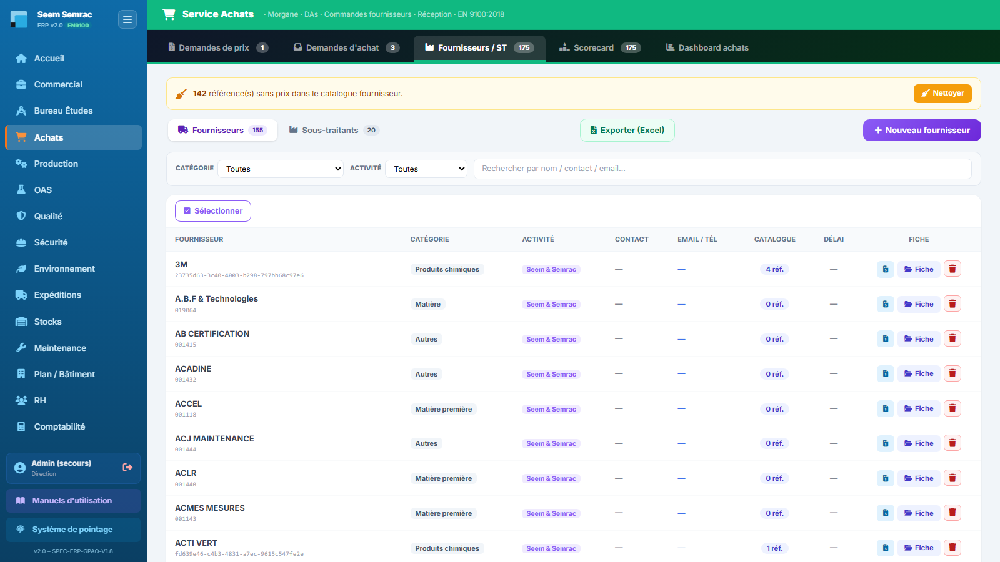
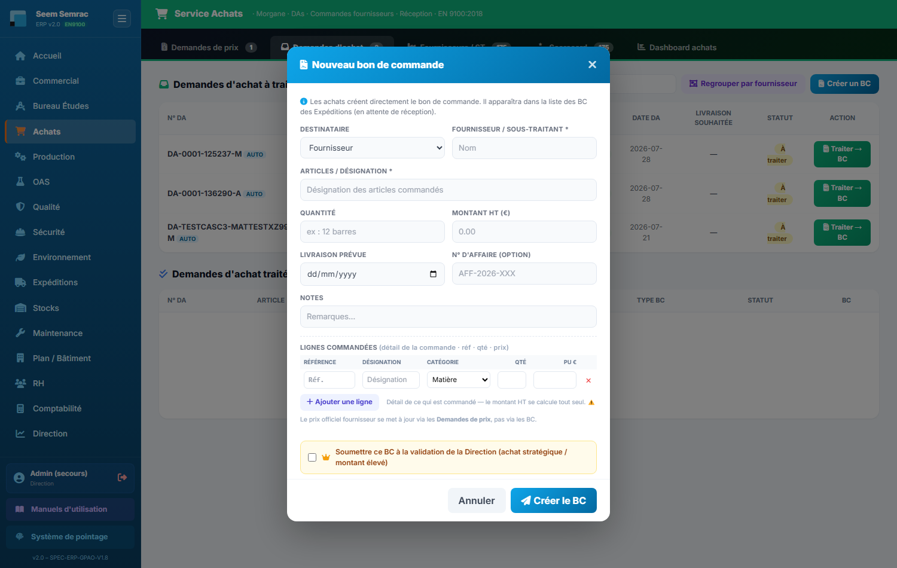

# 03 · Achats — parcours guidé

> Comment ça marche **étape par étape** : ce qui arrive **avant**, ce que **vous remplissez ici** (et pourquoi), et **où ça part ensuite**. Écrit pour un nouvel utilisateur.

## En bref — le rôle du service dans la chaîne

Le service Achats est le point de passage entre un **besoin** (une pièce, une matière, une prestation manquante) et une **commande réelle** passée à une entreprise extérieure. En entrée, il reçoit des **demandes d'achat (DA)** venues de la production, du stock ou du bureau d'études. En sortie, il produit des **bons de commande (BC)** qui partent vers les Expéditions (réception de la marchandise), et il tient à jour le **référentiel fournisseurs / sous-traitants** avec leurs **prix officiels**.

Un principe clé traverse tout le service : **le prix officiel d'un fournisseur ne se fixe que par une demande de prix (RFQ) validée**, jamais par un bon de commande. Le BC dépense ; la RFQ tarife. Garder les deux séparés, c'est garder des prix fiables dans les nomenclatures du bureau d'études.

## Étape 1 — Enregistrer un fournisseur ou un sous-traitant

**⬅️ Avant :** Un nouveau partenaire apparaît — un fabricant de matière, un fournisseur de visserie, ou un sous-traitant qui fait un traitement de surface. Avant de pouvoir lui commander quoi que ce soit, il doit exister dans le référentiel.

**📝 Ici, vous :** créez la fiche de l'entreprise (raison sociale, familles fournies ou prestations réalisées).

Sur cet écran, vous renseignez :
- **Raison sociale** — le nom officiel de l'entreprise ; sans lui, la création est refusée.
- **Familles de fourniture** (fournisseur) / **Prestations de sous-traitance** (ST) — ce que l'entreprise sait faire ; ces étiquettes servent ensuite à la retrouver au moment de commander.
- **Délai moyen (j)** — le nombre de jours habituels entre commande et livraison, utile pour anticiper les réceptions.
- **Certifications / Conditions de paiement** — les repères qualité et commerciaux du partenaire.

Depuis la fiche détaillée, vous pouvez aussi remplir le **catalogue produits** (références et politique de prix) et, pour un sous-traitant, les **opérations sous-traitées** (forfait minimum + prix à la pièce). Ces informations alimentent directement les nomenclatures du bureau d'études.

**➡️ Ensuite :** le fournisseur / sous-traitant devient sélectionnable partout où l'on commande (RFQ, DA, BC). Ses références et prix nourrissent les nomenclatures du BE.

> 📋 Le détail de **chaque case** : [guide des formulaires](../formulaires/achats.md).

## Étape 2 — Demander un prix (RFQ)

**⬅️ Avant :** Vous avez un fournisseur au référentiel et un besoin dont vous ne connaissez pas encore le prix, ou dont le prix est à réactualiser. Avant d'engager une dépense, on consulte le marché.

**📝 Ici, vous :** créez une consultation, saisissez les prix reçus des fournisseurs, et **retenez** l'offre choisie.

Sur cet écran, vous renseignez :
- **Fournisseur (par ligne de réponse)** — le fournisseur qui a répondu ; « Ajouter un fournisseur » crée une ligne de plus pour comparer plusieurs offres sur la même référence.
- **Prix unit.** — le prix unitaire HT proposé ; c'est lui qui deviendra le prix officiel s'il est retenu.
- **Délai (j)** — le délai de livraison annoncé, pour départager les offres.
- **Retenu** — la case à cocher sur l'offre choisie (une seule par ligne).

**➡️ Ensuite :** « Valider & mettre à jour les prix » (qui exige au moins une offre retenue avec un prix) **clôture la RFQ** et inscrit le prix retenu comme **prix officiel du fournisseur**. Ce prix remonte alors dans le catalogue et les nomenclatures.

> 📋 Le détail de **chaque case** : [guide des formulaires](../formulaires/achats.md).

## Étape 3 — Traiter une demande d'achat → Bon de commande

**⬅️ Avant :** Une **demande d'achat (DA)** est arrivée — la production, le stock ou le BE signale un manque à réapprovisionner. Elle attend d'être transformée en commande réelle.

**📝 Ici, vous :** ouvrez la DA et la convertissez en bon de commande vers le bon fournisseur ou sous-traitant.

Sur cet écran, vous renseignez :
- **Type de commande** — BC Fournisseur (une fourniture) ou BC Sous-Traitant (une prestation à façon).
- **Fournisseur / ST** — l'entreprise destinataire ; obligatoire, la validation refuse un destinataire vide.
- **Articles / Prestation** — la désignation de ce qui est commandé, pré-remplie depuis la DA.
- **Montant HT / Livraison prévue** — le total à engager et la date attendue de la marchandise.
- **N° d'affaire (optionnel)** — le rattachement à une commande client précise, si concerné.

Le bouton **« Enregistrer (brouillon) »** met la DA de côté sans créer le BC : vous la reprendrez plus tard.

**➡️ Ensuite :** « Soumettre → créer BC » crée le bon de commande, qui **part côté Expéditions** pour être reçu à la livraison. La DA est ainsi soldée.

> 📋 Le détail de **chaque case** : [guide des formulaires](../formulaires/achats.md).

## Étape 4 — Créer un bon de commande directement

**⬅️ Avant :** Un achat simple ou urgent ne justifie pas de passer par une demande d'achat formelle. Vous voulez commander tout de suite.

**📝 Ici, vous :** saisissez le bon de commande de A à Z, ligne par ligne si besoin.

Sur cet écran, vous renseignez :
- **Destinataire** — Fournisseur ou Sous-traitant, selon la nature de la commande.
- **Fournisseur / sous-traitant** — l'entreprise destinataire ; obligatoire.
- **Articles / désignation** — ce qui est commandé ; se remplit tout seul si vous détaillez les lignes.
- **Lignes détaillées (Réf. / Désignation / Catégorie / Qté / PU)** — le détail article par article ; le **Montant HT se recalcule automatiquement** (Qté × PU additionnés). Une ligne **sans référence est ignorée**.
- **Soumettre ce BC à la validation de la Direction** — à cocher pour un achat stratégique ou un gros montant : la Direction devra valider avant l'engagement.

**⚠️ À retenir :** le prix officiel d'un fournisseur ne se met **jamais** à jour par ce bon de commande — seulement par une RFQ validée (étape 2).

**➡️ Ensuite :** le BC est créé et **part côté Expéditions** pour réception. S'il a été soumis à validation, il attend d'abord le feu vert de la Direction.

> 📋 Le détail de **chaque case** : [guide des formulaires](../formulaires/achats.md).
