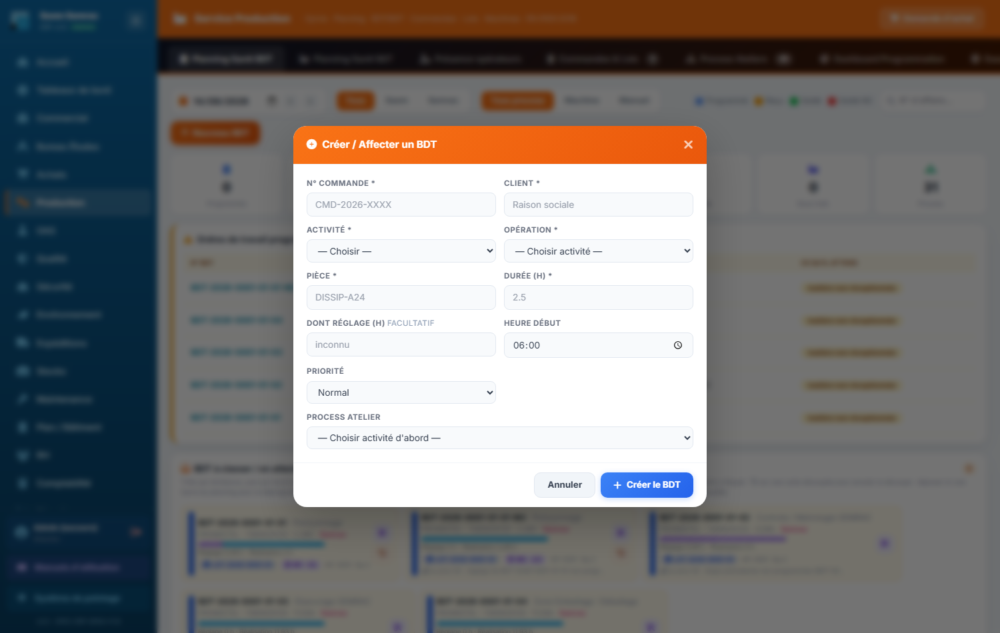
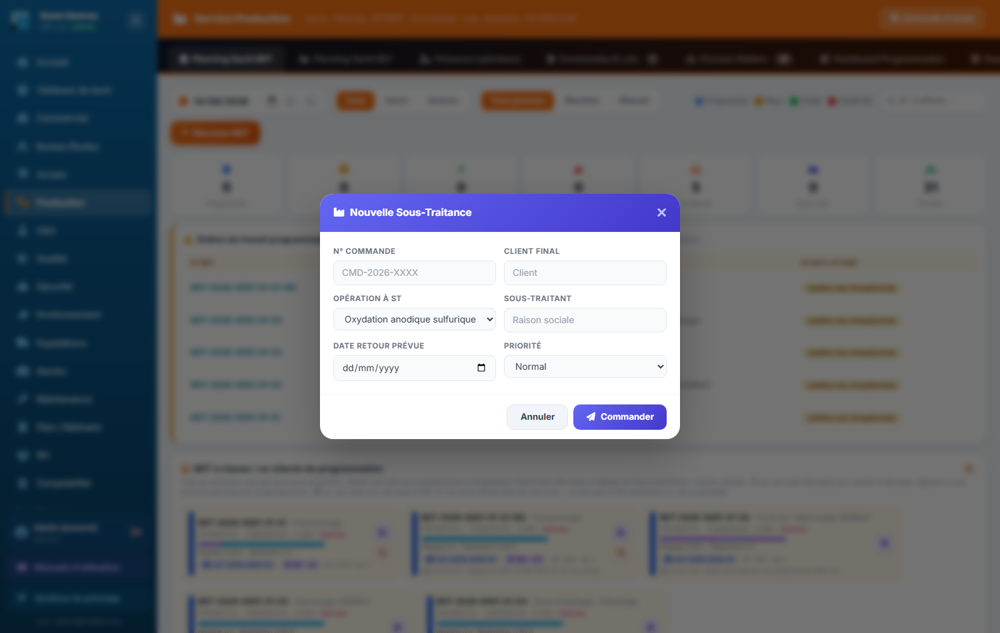

# 04 · Production — parcours guidé

> Comment ça marche **étape par étape** : ce qui arrive **avant**, ce que **vous remplissez ici** (et pourquoi), et **où ça part ensuite**. Écrit pour un nouvel utilisateur.

## En bref — le rôle du service dans la chaîne

La Production reçoit les **commandes** acceptées côté Commercial. Chaque commande est découpée en **lots**, et chaque lot en **BDT** (bons de travail) : une opération précise (tronçonnage, pliage, usinage…) à faire sur une pièce. Le service **planifie** ces BDT sur le planning Gantt, les **affecte** aux opérateurs ou aux postes atelier, suit leur **démarrage** et leur **clôture**, enregistre la **matière consommée**, et envoie certaines opérations en **sous-traitance** chez un prestataire extérieur.

En sortie, la Production alimente : la **Qualité** (une non-conformité déclarée en fin d'opération, ou un **PV de non-conformité** émis depuis le bandeau, crée une fiche NC), les **Achats** (demandes d'achat de l'atelier), le **Stock** (les sorties matière décrémentent le stock), et le **coût de revient** de la commande (temps réel × coût chargé de l'opérateur, + taux horaire machine du process pour un BDT machine, + matière). Quand tous les BDT d'une commande sont soldés, l'affaire peut avancer vers l'expédition et la facturation.

## Étape 1 — Créer et affecter un BDT (bon de travail)
**⬅️ Avant :** Une commande client a été acceptée (Commercial) et découpée en lots. Il reste à programmer les opérations une par une.
**📝 Ici, vous :** créez un bon de travail — une opération à faire sur une pièce — et l'attribuez à un opérateur ou à un poste atelier.

Sur cet écran, vous renseignez :
- **N° Commande** — la commande client à laquelle rattacher ce travail : c'est le lien qui permet de retrouver le coût et l'avancement de l'affaire.
- **Client** — le nom de l'entreprise cliente, pour repérer le travail sur le planning.
- **Activité (Seem / Semrac)** — le site/atelier qui fabrique. À remplir **en premier** : ce choix filtre ensuite les opérations et les opérateurs proposés.
- **Opération** — le type de travail (pliage, usinage, soudure…). La liste ne se remplit **qu'après** avoir choisi l'activité.
- **Pièce / Référence** — la référence de la pièce à fabriquer.
- **Durée estimée (h)** — le temps prévu pour l'opération : il dessine la barre sur le Gantt et sert de repère face au temps réel.
- **dont réglage (h)** *(facultatif)* — la part de la durée consacrée au réglage, faite une seule fois : elle apparaît hachurée en tête de la barre, reste sur le morceau 1 si le BDT est découpé, et l'étape suivante du lot ne pourra démarrer qu'après elle (chemin critique). Vide = réglage inconnu.
- **Priorité** — Normal / Urgent / Critique. « Critique » affiche le BDT **en rouge** sur le planning.
- **Type** — Interne (opérateur) ou Sous-traitance. « Sous-traitance » fait apparaître des cases supplémentaires (sous-traitant, délai retour).
- **Opérateur assigné** — la personne ou le poste qui fera le travail. La liste ne se remplit **qu'après** avoir choisi l'opération.

**➡️ Ensuite :** le BDT apparaît sur le **planning Gantt**, au statut « Programmé ». Vous pouvez le **glisser** sur la ligne d'un poste au bon créneau. Le planning suit la **cadence usine** du jour : les heures **hachurées** (aucune équipe du site ne travaille) refusent le dépôt. Si l'étape précédente du lot est déjà posée, il ne peut pas commencer avant la fin de son réglage, compté en heures travaillées : posé trop tôt le même jour, il est **calé** automatiquement ; un jour plus tôt, il est **refusé**. Deux BDT du **même process** ne se chevauchent pas sur un poste. Si vous **déplacez** ensuite une étape et que les suivantes deviennent incohérentes, une fenêtre propose de les **remettre en goulotte** (en tête, badge « Remis en goulotte ») avant d'enregistrer. Le BDT qui précède un passage à l'OAS porte le badge **« → OAS : … »**. Il attend maintenant d'être démarré par l'opérateur.

> 📋 Le détail de **chaque case** : [guide des formulaires](../formulaires/production.md).

## Étape 2 — Réceptionner le BDT (démarrage de l'opération)
**⬅️ Avant :** Le BDT est programmé sur le planning. L'opérateur arrive à son poste et commence réellement le travail.
**📝 Ici, vous :** faites passer le BDT de « Programmé » à « Reçu / En cours » ; l'heure de début est enregistrée automatiquement. Sur le planning, **double-cliquez sur la barre** du BDT, puis saisissez votre matricule et votre code PIN.

Depuis le planning, clic droit sur la barre du BDT → « Passer à Reçu ». Une petite fenêtre de signature s'ouvre :
- **Matricule** — le matricule de la personne qui prend le travail : un **opérateur**, ou une personne qui **écrit en Production** (chef d'atelier). C'est la preuve de **qui** a démarré.
- **Code PIN** — son code secret, qui confirme son identité.

**➡️ Ensuite :** le BDT passe au statut « Reçu / En cours » et l'**heure de début** est figée. C'est elle qui servira à calculer le temps réellement passé au moment du soldage. La personne qui a reçu le bon en devient la **réalisatrice** (« Reçu par ») : c'est son coût horaire qui valorise le temps, et c'est elle — ou une personne qui écrit en Production — qui pourra le solder.

> 📋 Le détail de **chaque case** : [guide des formulaires](../formulaires/production.md).

## Étape 3 — Déclarer la sortie matière
**⬅️ Avant :** L'opération est en cours. L'opérateur prélève de la matière, des fournitures ou un consommable machine pour fabriquer.
**📝 Ici, vous :** enregistrez ce qui est sorti du stock pour ce lot, afin de suivre la consommation et le coût.

Sur le planning, double-clic sur la barre du BDT **reçu** → fenêtre « Déclaration de sortie matière ». Vous renseignez :
- **Type de sortie** — Matière, Fourniture ou Consommable machine. « Consommable machine » fait apparaître le choix de la machine.
- **Article (stock)** — l'article précis prélevé du stock.
- **Quantité** — la quantité sortie (les décimales sont autorisées). **Toujours obligatoire.**
- **Machine concernée (OPEX)** — obligatoire pour un consommable machine : elle reçoit le coût de la consommation.
- **Observations** — motif de la sortie ou numéro de lot matière, pour la traçabilité.

**➡️ Ensuite :** le **stock est décrémenté** et le coût de la matière/consommable est rattaché au lot (et à la machine pour un consommable). Ces montants alimentent le **coût de revient** de la commande.

> 📋 Le détail de **chaque case** : [guide des formulaires](../formulaires/production.md).

## Étape 4 — Solder le BDT (clôture de l'opération)
**⬅️ Avant :** L'opération est terminée. Le BDT est au statut « Reçu » et son heure de début est connue.
**📝 Ici, vous :** clôturez le BDT ; le temps réellement passé est calculé automatiquement.

Sur le planning, clic droit sur la barre → « Solder le BDT ». Vous renseignez :
- **Heure de fin réelle** — pré-remplie à l'heure actuelle. Combinée à l'heure de début, elle donne le **temps réel** sans calcul de votre part.
- **Résultat** — Conforme / Reprise partielle / Non-conformité. « Non-conformité » crée **automatiquement une fiche NC** envoyée à la Qualité.
- **Quantité produite** — le nombre de pièces réellement fabriquées.
- **Observations / incidents** — anomalies, casses d'outils, écarts constatés.
- **Matricule + Code PIN** — la signature de la personne qui solde : elle trace **qui** a clôturé. Seuls **l'opérateur qui a reçu ce BDT** (nommé en « Reçu par ») ou **une personne habilitée à écrire en Production** peuvent solder ; tout autre matricule est refusé avec ce message.

**➡️ Ensuite :** le BDT passe à « Soldé », le temps réel est comparé à l'estimé (l'écart nourrit les indicateurs). Si vous avez choisi « Non-conformité », une **fiche NC part vers la Qualité**. Quand tous les BDT d'une commande sont soldés, l'affaire peut avancer vers l'**expédition** et la **facturation**. La **matrice de compétences** ne bloque plus le soldage : si l'opérateur n'a pas de niveau pour ce process, le soldage passe et une notification orange invite à la mettre à jour (RH › Compétences).

> 📋 Le détail de **chaque case** : [guide des formulaires](../formulaires/production.md).

## Étape 5 — Envoyer une opération en sous-traitance
**⬅️ Avant :** Une opération (traitement de surface, peinture, zingage…) ne se fait pas en interne : il faut la confier à un prestataire extérieur.
**📝 Ici, vous :** créez une commande de sous-traitance pour envoyer les pièces chez le prestataire.

Depuis le panneau « Sous-traitance en cours » → « Nouvelle ST ». Vous renseignez :
- **N° Commande (ERP)** — la commande client concernée, pour garder le lien avec l'affaire.
- **Client final** — le client final de la pièce.
- **Opération à sous-traiter** — le traitement à faire réaliser dehors (zingage, sérigraphie, traitement thermique…). Choisissez-en un dans la liste plutôt que de le retaper.
- **Sous-traitant** — l'entreprise prestataire qui réalisera l'opération.
- **Date retour prévue** — la date à laquelle les pièces doivent revenir : elle cadence le suivi.
- **Priorité** — Normal / Urgent / Critique.

**➡️ Ensuite :** la sous-traitance apparaît sur le **planning Gantt BST** (vue de 21 jours). Au retour des pièces, la production reprend son cours. Pour un bon rattaché à un lot précis, on utilise « Nouveau BST » depuis le Gantt sous-traitance (lot lié, quantité, dates d'envoi et durée).

> 📋 Le détail de **chaque case** : [guide des formulaires](../formulaires/production.md).

## Étape 6 — Programmer la présence des opérateurs
**⬅️ Avant :** Pour affecter des BDT, il faut savoir **qui** est présent et sur quel créneau (matin, journée, après-midi, soirée).
**📝 Ici, vous :** définissez d'un coup les créneaux de plusieurs opérateurs sur toute une semaine. Les **horaires** de chaque créneau ne sont pas fixes : ils suivent la **cadence usine** (Bas, Moyen ou Haut) du site de l'opérateur, jour par jour — réglée dans Process Ateliers › **Cadence usine** (écriture Production).

Onglet Présence opérateurs → « Programmer la semaine ». Vous renseignez :
- **Shift à appliquer** — Matin, Journée, Après-midi, Soirée, Absent, ou Effacer (vide réellement les cases). Les jours où ce créneau est **fermé** dans la cadence du site sont sautés, et le message le dit.
- **Jours concernés** — Lun → Ven (5 jours ouvrés) ou Lun → Dim (7 jours).
- **Opérateurs cibles** — une case par opérateur ; des boutons permettent de tout cocher/décocher ou de sélectionner par site (Seem / Semrac).

**➡️ Ensuite :** les créneaux de présence s'affichent sur le **planning Gantt**. Les opérateurs disponibles deviennent des lignes cibles pour glisser les BDT. Les jours déjà marqués en absence RH ne sont **pas** modifiés, même si l'opérateur est coché. Case par case, le menu affiche les horaires du jour et **grise** un créneau fermé (« fermé · cadence Moyen »). Ces horaires servent aussi à la RH (Gestion des temps).

**Changer la cadence d'un site** : Process Ateliers → « Cadence usine » → « Changer la cadence » → date « À partir du » (demain par défaut), niveau, motif. Aujourd'hui ou une date passée demandent une confirmation (les heures déjà travaillées sont recalculées).

> 📋 Le détail de **chaque case** : [guide des formulaires](../formulaires/production.md).

## Étape 7 — Demander un achat ou signaler une non-conformité depuis l'atelier
**⬅️ Avant :** À l'atelier, il manque une matière, un accessoire ou une fourniture pour une machine ; ou un défaut est constaté sur des pièces, rattaché ou non à une affaire.
**📝 Ici, vous :** (personne ayant l'**écriture sur la Production**, par exemple le chef d'atelier) utilisez les deux boutons du bandeau du service, en haut à droite, depuis n'importe quel onglet — chacun signé par **matricule + code PIN** :
- **« Demande d'achat »** — le formulaire complet s'ouvre dès le clic : nature (Matière / Accessoire / Machine (OPEX) avec la machine concernée), article, référence, quantité et unité, affaire, poste, priorité, livraison souhaitée, fournisseur suggéré.
- **« PV de non-conformité »** (rouge) — constat (date, type, entité, gravité), rattachement facultatif (affaire, puis lot et BDT de cette affaire, code pièce, quantité, poste de détection), défaut (nature, imputation, description, cause, action immédiate, traitement proposé) et case « Mettre en quarantaine ».

**➡️ Ensuite :** la demande d'achat arrive dans **Achats › Demandes d'achat** (« Prénom Nom (Production) », à traiter) ; l'acheteur en fait un bon de commande. Le PV devient une non-conformité **NC-2026-…** dans **Qualité › Non-Conformités** (catégorie Production, statut Ouvert, à votre nom). Une gravité Critique ou Bloquante rattachée à une affaire **bloque son expédition** ; une quarantaine bloque l'expédition du lot. Un matricule sans écriture Production est refusé — un opérateur fait saisir sa demande par son chef.

> 📋 Le détail de **chaque case** : [guide des formulaires](../formulaires/production.md).

---

> ℹ️ Autres formulaires de configuration du service (référentiels) : création/modification de **process ateliers** et de **machines**, duplication de BDT. Ils préparent le planning mais ne font pas partie du flux quotidien de fabrication — voir le [guide des formulaires](../formulaires/production.md).
