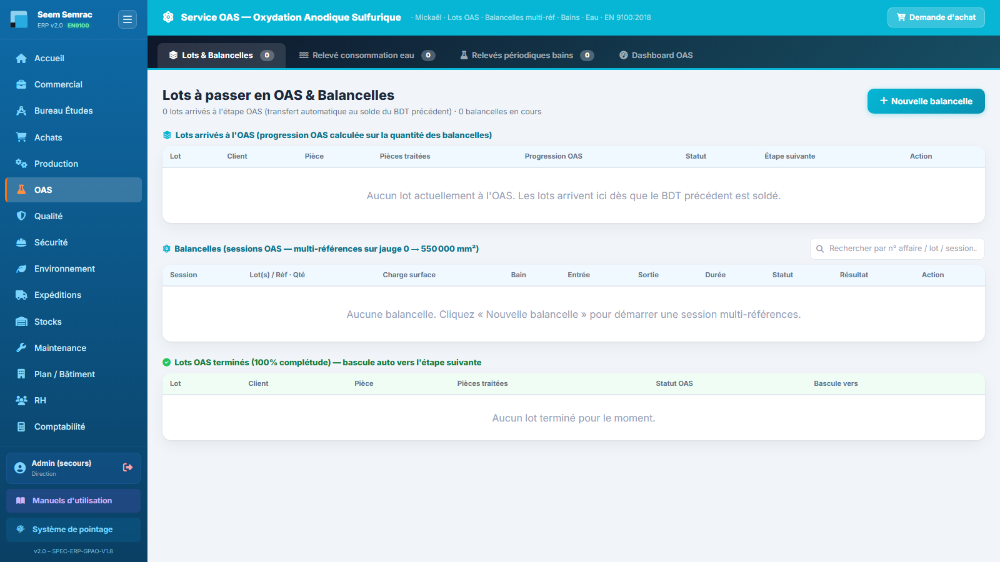
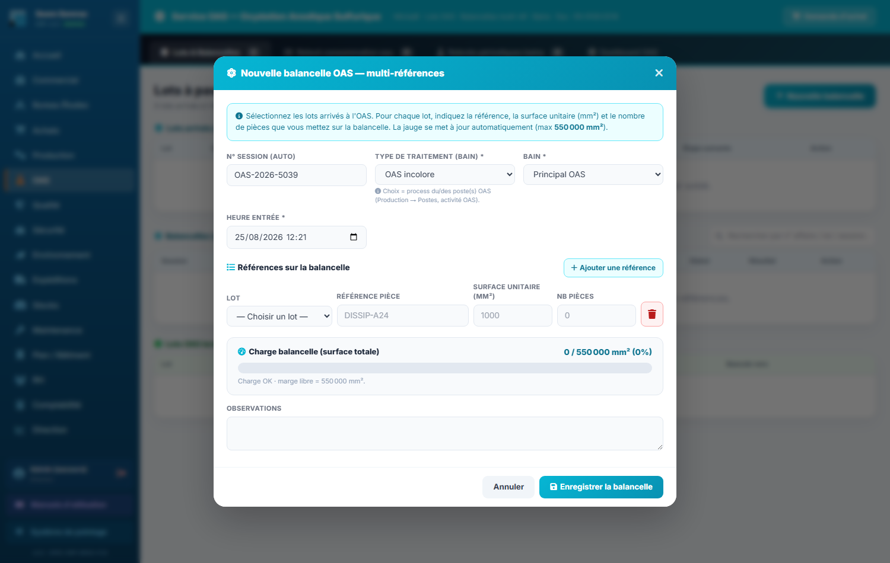
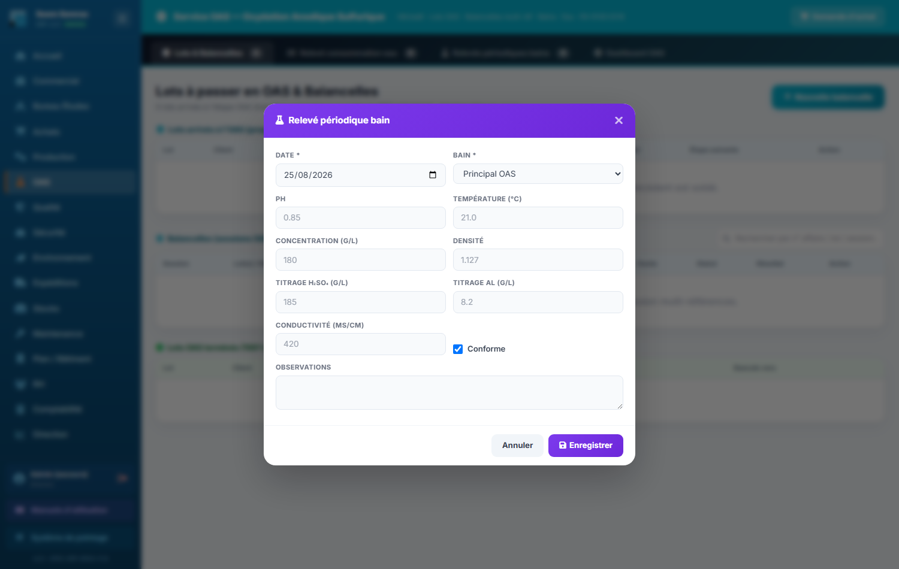
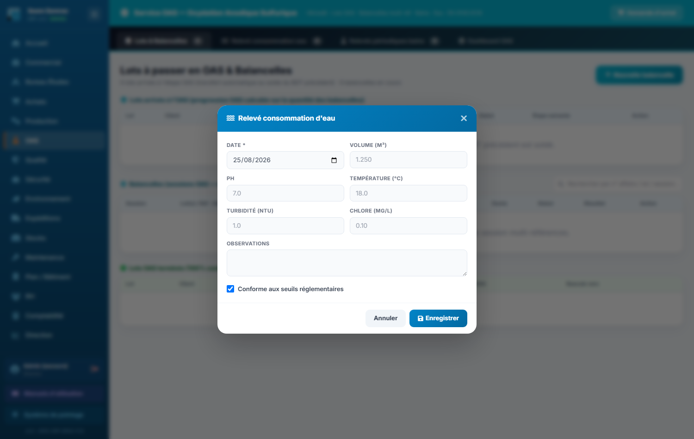

# 05 · OAS (traitement de surface) — parcours guidé

> Comment ça marche **étape par étape** : ce qui arrive **avant**, ce que **vous remplissez ici** (et pourquoi), et **où ça part ensuite**. Écrit pour un nouvel utilisateur.

## En bref — le rôle du service dans la chaîne

Le service **OAS** (Oxydation Anodique Sulfurique) est une **étape de traitement de surface** dans le parcours d'une pièce. Les lots ne naissent pas ici : ils arrivent de la **production**, quand une gamme prévoit un passage à l'OAS (traitement incolore, noir ou désoxydation).

Ici, l'opérateur fait trois choses : il **charge les pièces sur des balancelles** et les plonge dans les bains, il **clôture chaque balancelle avec un autocontrôle qualité** à la sortie, et il **surveille l'environnement de travail** (relevés d'eau et relevés de bains).

Ce que le service produit repart ensuite vers deux directions :
- **Vers la Qualité** — chaque balancelle clôturée crée un **PV d'autocontrôle** ; un résultat non conforme (ou un bain hors seuil) **ouvre une non-conformité** et **bloque le lot**.
- **Vers le lot / la production** — un lot conforme est **libéré** et poursuit sa gamme (étape suivante).

L'écran d'accueil du service, avec ses onglets Lots & Balancelles, Relevés eau, Relevés bains et Dashboard :

## Étape 1 — Charger une balancelle et la plonger dans le bain

**⬅️ Avant :** Un lot est arrivé à l'OAS depuis la production (sa gamme prévoit un traitement de surface). Vous avez devant vous les pièces à traiter et une fiche de lot qui indique le type de traitement attendu.

**📝 Ici, vous :** créez une **nouvelle balancelle**, y posez une ou plusieurs références de pièces, et enregistrez sa mise au bain.

Sur cet écran, vous renseignez :
- **N° Session** — généré tout seul, non modifiable : c'est l'identifiant de votre session de traitement.
- **Type de traitement** — incolore, noire ou désoxydation ; choisissez celui prévu sur la fiche du lot, car il détermine le procédé appliqué.
- **Bain** — dans quel bain la balancelle plonge (en général « Principal OAS »).
- **Heure entrée** — le moment de la mise au bain ; pré-rempli à l'heure actuelle, c'est le point de départ du temps de traitement.
- **Lot** — le lot d'où viennent les pièces ; la liste ne montre que les lots arrivés à l'OAS et le reste à traiter, ce qui vous évite de charger un mauvais lot.
- **Surface unitaire (mm²)** et **Nb pièces** — la surface d'une pièce et combien vous en posez ; ces deux valeurs alimentent la **jauge de charge** de la balancelle.

💡 Vous pouvez ajouter plusieurs références sur la même balancelle (« Ajouter une référence »). La jauge se recalcule seule. **Ne dépassez pas 550 000 mm²** : si elle passe au rouge, l'enregistrement est refusé.

**➡️ Ensuite :** La balancelle apparaît « en cours » dans le tableau des balancelles, avec son heure d'entrée. Elle reste à surveiller jusqu'à la sortie du bain, où vous la clôturerez (étape 2).

> 📋 Le détail de **chaque case** : [guide des formulaires](../formulaires/oas.md).

## Étape 2 — Clôturer la balancelle avec l'autocontrôle qualité

**⬅️ Avant :** Le temps de traitement est écoulé, vous sortez la balancelle du bain. Les pièces sont traitées et prêtes à être contrôlées.

**📝 Ici, vous :** clôturez la balancelle en enregistrant les mesures de fin et votre **verdict d'autocontrôle** sur les pièces.

*(Formulaire « Clore + autocontrôle », depuis le tableau des balancelles — voir la vue d'ensemble du service ci-dessus.)*

Sur cet écran, vous renseignez :
- **Épaisseur anodique (µm)**, **pH final**, **Température finale**, **Cp / Cpk** — les mesures de fin de traitement : elles prouvent que la couche obtenue est conforme et régulière.
- **Heure de sortie** — le moment où vous sortez la balancelle (obligatoire) ; ferme le temps de traitement.
- **Aspect visuel** — l'œil sur les pièces : « Uniforme » = bon ; les autres choix (voile, tache, coulure, brûlure) signalent un défaut.
- **Résultat autocontrôle** — votre verdict : **Conforme — libéré** ou **Non conforme — bloqué**. C'est le champ décisif du flux.
- **Matricule** et **Code PIN** — votre signature : sans eux, la clôture est refusée. Ils tracent qui a validé le contrôle.

**➡️ Ensuite :** À la validation, un **PV d'autocontrôle** est créé automatiquement côté **Qualité** (vous n'avez rien à faire de plus). Si vous choisissez **Conforme**, le lot est **libéré** et poursuit sa gamme. Si vous choisissez **Non conforme**, le lot est **bloqué** et une **non-conformité part vers la Qualité**.

> 📋 Le détail de **chaque case** : [guide des formulaires](../formulaires/oas.md).

## Étape 3 — Saisir un relevé de bain

**⬅️ Avant :** Les bains doivent rester dans leurs seuils chimiques pour que le traitement soit fiable. À intervalle régulier, vous mesurez la chimie d'un bain.

**📝 Ici, vous :** enregistrez les mesures d'un bain pour tracer sa conformité dans le temps.

Sur cet écran, vous renseignez :
- **Date** et **Bain** — quand et quel bain (obligatoires) : identifient le relevé.
- **pH**, **Température**, **Concentration**, **Densité**, **Titrage H₂SO₄**, **Titrage Al**, **Conductivité** — les paramètres chimiques mesurés ; ils décrivent l'état du bain et permettent de décider s'il faut le corriger (ajout d'acide, etc.).
- **Conforme** — cochée par défaut ; décochez-la si un paramètre sort des seuils. C'est ce qui déclenche l'alerte.

**➡️ Ensuite :** Si vous **décochez « Conforme »**, une **non-conformité est ouverte automatiquement côté Qualité** et une notification vous le confirme. Sinon, le relevé alimente simplement l'historique de suivi du bain (et le Dashboard OAS).

> 📋 Le détail de **chaque case** : [guide des formulaires](../formulaires/oas.md).

## Étape 4 — Saisir un relevé de consommation d'eau

**⬅️ Avant :** Le service consomme de l'eau (rinçages, procédé). Pour le suivi environnemental (HSE), vous relevez périodiquement le volume et la qualité de l'eau.

**📝 Ici, vous :** enregistrez un relevé d'eau du service.

Sur cet écran, vous renseignez :
- **Date** — le jour du relevé (seul champ obligatoire), pré-rempli au jour même.
- **Volume (m³)** — l'eau consommée : c'est l'indicateur environnemental principal.
- **pH**, **Température**, **Turbidité (NTU)**, **Chlore (mg/L)** — la qualité de l'eau ; renseignez ce que vous pouvez pour un suivi utile.
- **Conforme aux seuils réglementaires** — cochée par défaut ; décochez si un paramètre dépasse les seuils autorisés.

**➡️ Ensuite :** Un relevé d'eau peut créer automatiquement une ou plusieurs **mesures environnementales (HSE)** ; une notification vous le confirme. Ces données remontent au suivi environnemental et au **Dashboard OAS**.

> 📋 Le détail de **chaque case** : [guide des formulaires](../formulaires/oas.md).

## Étape 5 — Demander un achat pour le service

**⬅️ Avant :** Il vous manque un consommable ou un produit chimique pour faire tourner l'OAS (produit de bain, EPI, etc.).

**📝 Ici, vous :** ouvrez une **demande d'achat** depuis le service, pour signaler le besoin.

*(Formulaire partagé « Demande d'achat », commun à tous les services.)*

Ce formulaire est **identique dans tous les services** de l'ERP : il ne fait pas partie du cœur métier OAS, mais permet de déclencher un approvisionnement sans quitter votre écran. Le détail des cases est décrit dans le module Achats.

**➡️ Ensuite :** La demande part vers le service **Achats** (Demandes d'achat), qui prend le relais pour la commande fournisseur.

> 📋 Le détail de **chaque case** : [guide des formulaires — Demandes d'achat](../formulaires/oas.md).
