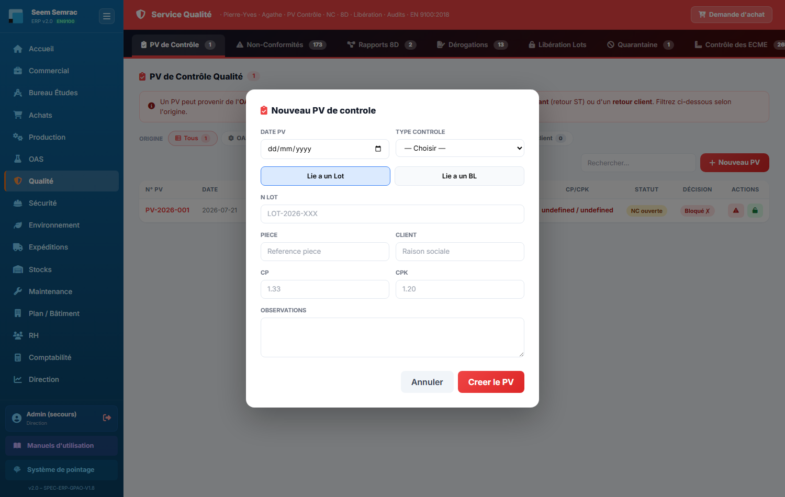
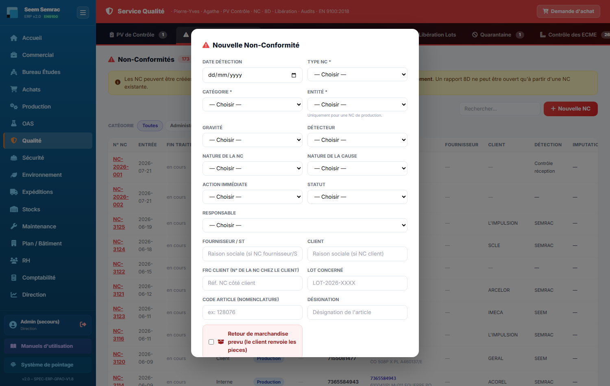
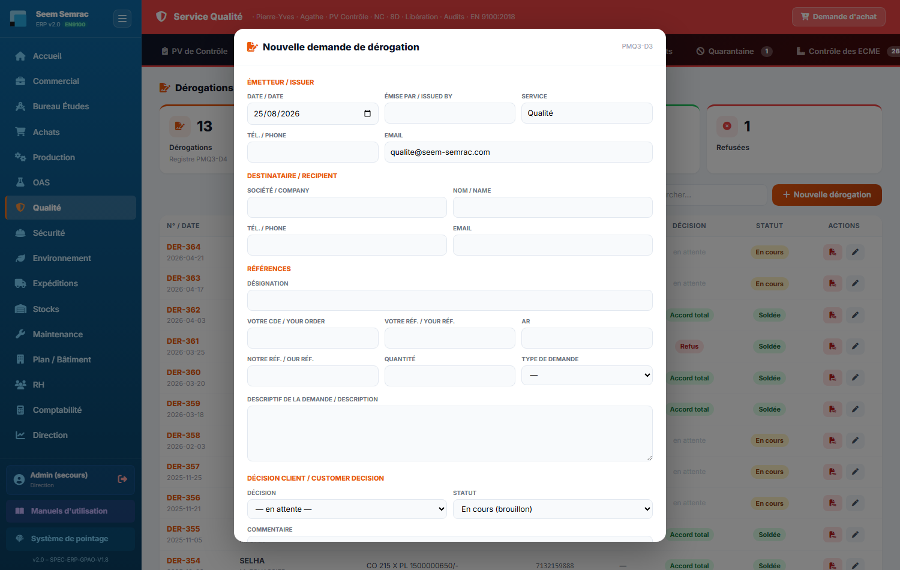
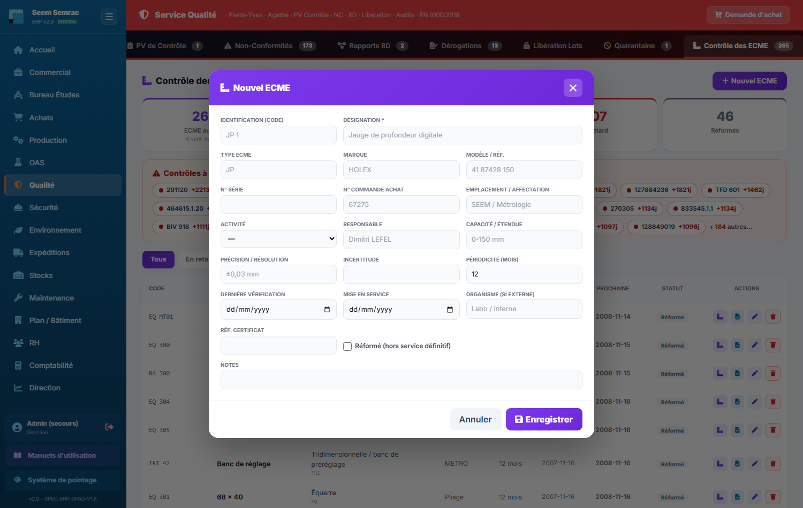
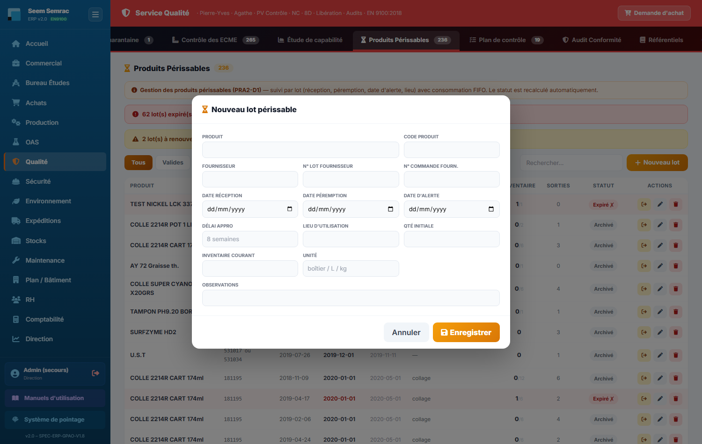

# 06 · Qualité — parcours guidé

> Comment ça marche **étape par étape** : ce qui arrive **avant**, ce que **vous remplissez ici** (et pourquoi), et **où ça part ensuite**. Écrit pour un nouvel utilisateur.

## En bref — le rôle du service dans la chaîne
Le service **Qualité** est le gardien de la conformité. En **entrée**, il reçoit des signaux qui viennent de partout : un opérateur ou un contrôleur repère un défaut en fabrication, la réception constate un souci fournisseur, un client renvoie des pièces, ou un lot revient d'un contrôle final. En **sortie**, il produit les preuves et les décisions : procès-verbaux de contrôle, non-conformités (NC), rapports 8D, dérogations, libérations de lots. Ses décisions **rejaillissent sur toute la chaîne** : une NC critique **bloque les bons de livraison** du lot concerné (porte qualité), un retour client part vers le **Commercial** (avoir ou commande prioritaire), une dérogation obtient l'accord client pour livrer malgré un écart, et la libération d'un lot en quarantaine **autorise ou non l'expédition**. C'est aussi ici qu'on entretient les outils du contrôle : ECME (instruments étalonnés), plans de contrôle, études de capabilité et produits périssables.

## Étape 1 — Enregistrer un PV de contrôle
**⬅️ Avant :** un lot vient d'être fabriqué, une livraison est arrivée, ou une réception fournisseur est à valider. Quelqu'un a fait le contrôle sur pièces.
**📝 Ici, vous :** consignez le résultat du contrôle qualité dans un procès-verbal, rattaché à un lot ou à un bon de livraison.

Sur cet écran, vous renseignez :
- **Type contrôle** — à quel moment le contrôle a eu lieu (autocontrôle, intermédiaire, final, réception fournisseur) : ça situe le PV dans le déroulé de fabrication.
- **Lié à un Lot / Lié à un BL** — le choix qui rattache le PV à sa source : un lot de production ou un bon de livraison.
- **N° Lot / N° BL** — la référence précise contrôlée, pour retrouver le PV plus tard.
- **Pièce** et **Client** — ce qu'on a contrôlé et pour qui.
- **Cp / Cpk** — les indices de capabilité si on veut chiffrer la régularité du procédé.
- **Observations** — le verdict en clair (conforme, RAS, ou ce qui cloche).

**➡️ Ensuite :** le PV est archivé et sert de preuve de contrôle. Si le contrôle révèle un défaut, on enchaîne sur une **non-conformité** (étape 2). Un PV conforme accompagne le lot vers l'expédition.

> 📋 Le détail de **chaque case** : [guide des formulaires](../formulaires/qualite.md).

## Étape 2 — Déclarer une non-conformité (NC)
**⬅️ Avant :** un problème qualité vient d'être repéré — pièce défectueuse, erreur de procédé, souci fournisseur à la réception, ou réclamation client. Souvent c'est un PV de contrôle (étape 1) qui l'a mis en évidence.
**📝 Ici, vous :** ouvrez une fiche de non-conformité pour tracer le problème et déclencher son traitement.

Sur cet écran, vous renseignez :
- **Type NC** — l'origine du problème (Interne, Fournisseur, Client, Procédé) : c'est ce qui oriente la suite. Une **NC Client** débloque le bouton « Retour » (étape 3).
- **Catégorie** (obligatoire) — « Administratif » pour un souci de paperasse, « Opération » pour un défaut de fabrication.
- **Entité** (obligatoire) — le site concerné (Seem ou Semrac).
- **Gravité** — le niveau de sévérité. « Critique » ou « Bloquante » déclenche une priorité urgente et **bloque les BL** du lot.
- **Détecteur** — qui a repéré le problème (opérateur, contrôleur, client, auditeur, réception).
- **LOT / BDT / BL concerné** — la référence touchée : c'est ce lien qui active la porte qualité en aval.
- **Description de la NC** — le problème avec vos mots (quoi, où, combien de pièces).
- **Soumettre à la validation de la Direction** — à cocher si la Direction doit trancher.

**➡️ Ensuite :** la NC est créée et suivie. Si elle est **critique/bloquante**, elle **bloque les bons de livraison** du lot concerné (le lot ne peut plus partir tant que ce n'est pas levé). Depuis la liste, vous pouvez ouvrir un **rapport 8D** (résolution structurée), créer une **dérogation** liée (étape 5), et, si c'est une NC client, **traiter le retour** (étape 3).

> 📋 Le détail de **chaque case** : [guide des formulaires](../formulaires/qualite.md).

## Étape 3 — Traiter un retour client
**⬅️ Avant :** une **NC de type client** existe (étape 2), et le client a renvoyé des pièces non conformes. Il faut décider quoi faire.
**📝 Ici, vous :** choisissez le sort du retour — refuser, faire un avoir, ou relancer une fabrication prioritaire — depuis le bouton « Retour » sur la ligne de NC client.

Sur cet écran, vous renseignez :
- **N° de facture** — la facture d'origine des pièces retournées.
- **N° d'affaire** — sert à **numéroter automatiquement** l'avoir et la commande prioritaire.
- **Lot(s) concerné(s)** — les lots des pièces retournées.
- **Pièces NC** (obligatoire) — le nombre de pièces renvoyées ; base de tous les calculs.
- **Prix de vente unit.** — le prix d'une pièce ; il **calcule le montant de l'avoir**.
- **Coût de revient unit.** — le coût de fabrication d'une pièce ; il **estime le coût d'une relance** (se remplit tout seul depuis la nomenclature si laissé vide).

**➡️ Ensuite :** trois issues en bas de l'écran. **Refuser le retour** clôt le sujet. **Faire un avoir** génère un avoir (AV-AAAA-XX au prix de vente) qui part dans **Commercial › Avoirs**. **Commande prioritaire** crée une commande P (CMDP-AAAA-XX au coût de revient) qui part dans **Commercial › Commandes P** et peut être lancée en production prioritaire.

> 📋 Le détail de **chaque case** : [guide des formulaires](../formulaires/qualite.md).

## Étape 4 — Libérer (ou rejeter) un lot en quarantaine
**⬅️ Avant :** un lot a été mis **en quarantaine** — typiquement parce qu'une NC bloquante l'a immobilisé (étape 2). Il attend une décision qualité avant de pouvoir partir.
**📝 Ici, vous :** décidez du sort du lot dans l'onglet « Libération Lots » — le libérer pour expédition, ou le rejeter.

Sur cet écran :
- **Libérer** — débloque le lot : il peut repartir vers l'expédition. Une confirmation est demandée.
- **Rejeter (croix rouge)** — écarte le lot. Confirmation demandée aussi.

Il n'y a pas de formulaire à remplir : c'est une décision par bouton, avec confirmation avant validation.

**➡️ Ensuite :** un lot **libéré** lève la porte qualité et redevient expédiable (le **BL** peut être émis en Expédition). Un lot **rejeté** reste bloqué et suit le circuit rebut/retouche.

> 📋 Le détail de **chaque case** : [guide des formulaires](../formulaires/qualite.md).

## Étape 5 — Demander une dérogation
**⬅️ Avant :** une NC existe (étape 2) et le lot présente un écart, mais on aimerait quand même le livrer. Il faut l'accord du client.
**📝 Ici, vous :** rédigez une demande de dérogation (formulaire PMQ3-D3) à envoyer au client. Lancée depuis l'onglet « Dérogations » ou directement depuis une NC.

Sur cet écran, vous renseignez :
- **Émise par / Service / Email** — l'émetteur côté qualité (souvent pré-remplis).
- **Société / Nom / Email (destinataire)** — le client à qui on demande l'accord.
- **Désignation** — la pièce concernée (il faut **au moins la société OU la désignation**).
- **Votre Cde / Votre Réf. / Notre Réf.** — les références de rattachement (côté client et côté nous, souvent le lot).
- **Quantité** et **Type de demande** (AC, AE, AR) — le volume et la nature de la dérogation.
- **Descriptif de la demande** — l'écart précis pour lequel on demande l'autorisation.
- **Décision** et **Statut** — se mettent à jour quand le client répond (accord total, accord limité, refus) et suivent l'avancement.

**➡️ Ensuite :** le bouton « Exporter PDF » génère le formulaire imprimable à envoyer au client. Une fois la **décision** du client saisie (accord), le lot peut être livré malgré l'écart ; en cas de **refus**, on repart sur retouche/rebut. Ouverte depuis une NC, la dérogation **pré-remplit** client, désignation, référence et description.

> 📋 Le détail de **chaque case** : [guide des formulaires](../formulaires/qualite.md).

## Étape 6 — Tenir le parc d'instruments (ECME)
**⬅️ Avant :** les contrôles des étapes 1 et 2 supposent des instruments fiables et étalonnés. Un nouvel instrument arrive, ou un étalonnage vient d'être fait.
**📝 Ici, vous :** enregistrez ou mettez à jour un équipement de contrôle, de mesure et d'essai (ECME) dans l'onglet « Contrôle des ECME ».

Sur cet écran, vous renseignez :
- **Désignation** (obligatoire) — le nom de l'instrument.
- **Code / Type / Marque / N° série** — pour identifier et classer l'instrument.
- **Périodicité (mois)** et **Dernier étalonnage** — le cœur du suivi : ils déterminent **quand l'instrument sera à ré-étalonner**.
- **Organisme / Incertitude / Réf. certificat** — les preuves de l'étalonnage.
- **Étendue mesure / Résolution** — les caractéristiques métrologiques.
- **Activité / Localisation** — le site et l'endroit où l'instrument est utilisé.

**➡️ Ensuite :** l'ECME devient sélectionnable dans les **plans de contrôle** (comme instrument de mesure d'une ligne) et le système signale les instruments dont l'étalonnage arrive à échéance. Un instrument périmé ne doit plus servir aux contrôles.

> 📋 Le détail de **chaque case** : [guide des formulaires](../formulaires/qualite.md).

## Étape 7 — Suivre un produit périssable
**⬅️ Avant :** un produit à durée de vie limitée (colle, résine, consommable daté) vient d'être reçu, souvent après une commande d'achat.
**📝 Ici, vous :** enregistrez le lot périssable avec sa péremption, dans l'onglet « Produits Périssables ».

Sur cet écran, vous renseignez :
- **Produit** (obligatoire) — le nom du produit.
- **Fournisseur / N° lot fournisseur / N° commande fourn.** — la traçabilité de réception.
- **Date réception / Date péremption / Date d'alerte** — les dates clés : elles pilotent le statut et **l'avertissement de renouvellement**.
- **Qté initiale / Inventaire courant / Unité** — le suivi de stock du lot.
- **Lieu d'utilisation / Délai appro** — où c'est stocké et le délai pour recommander.

**➡️ Ensuite :** le **statut** (Valide / À renouveler / Expiré) se recalcule tout seul à partir des dates, et le système prévient avant la péremption. À chaque consommation, une **Sortie de stock** décrémente le lot en **FIFO** (on entame les lots les plus anciens d'abord).

> 📋 Le détail de **chaque case** : [guide des formulaires](../formulaires/qualite.md).
