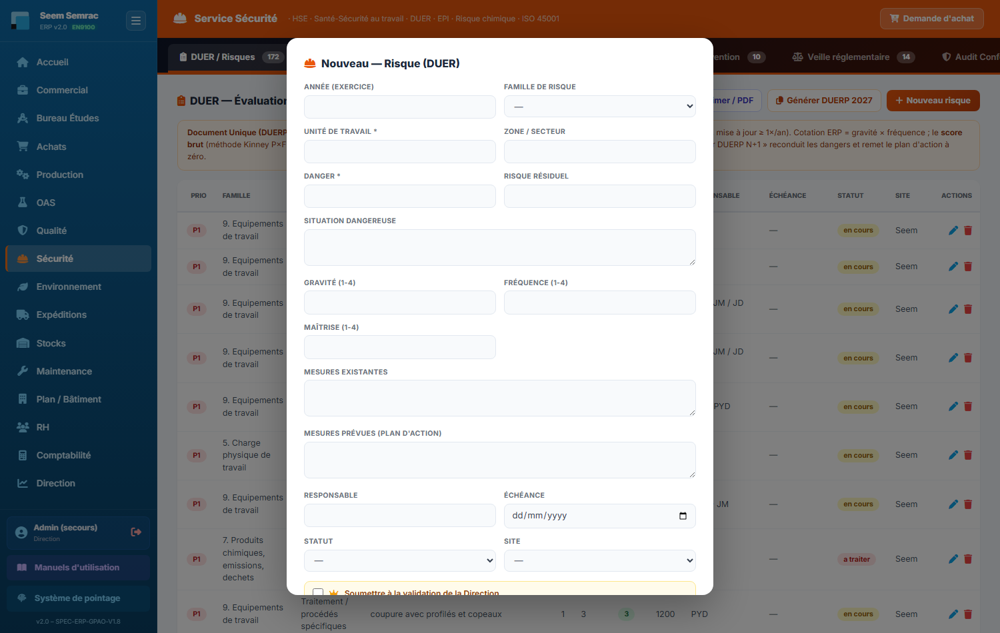
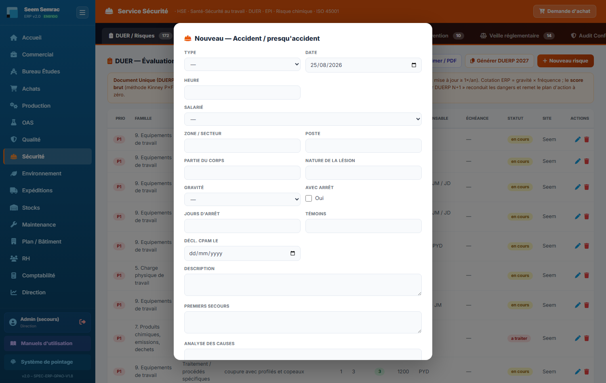
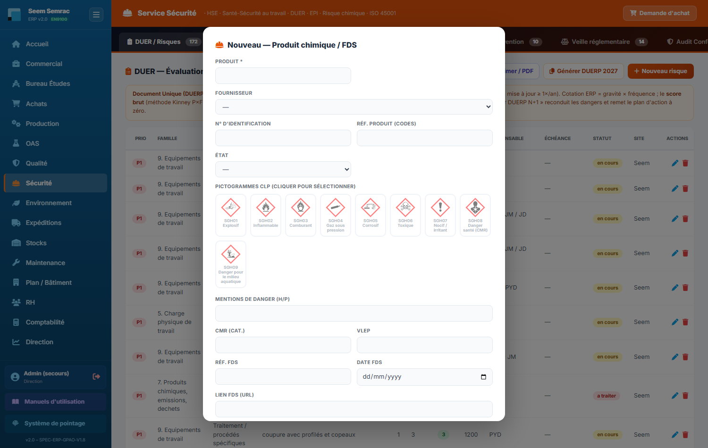
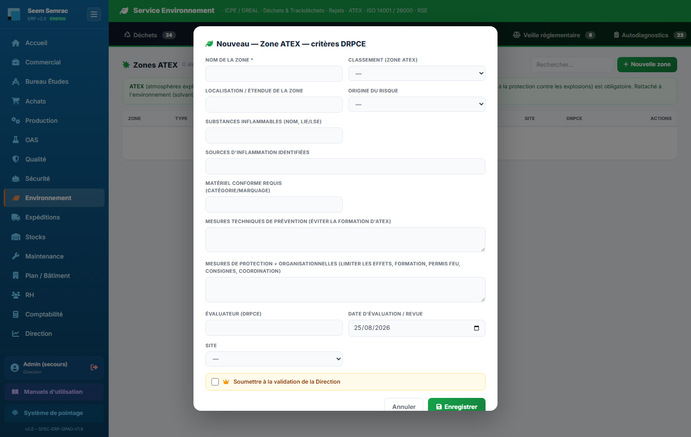
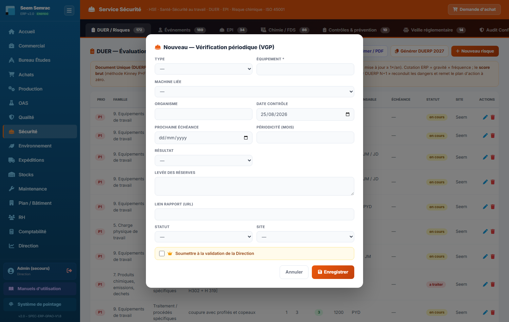
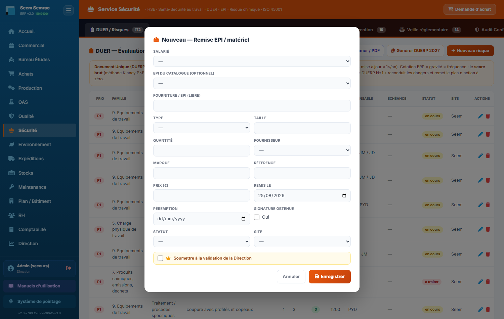
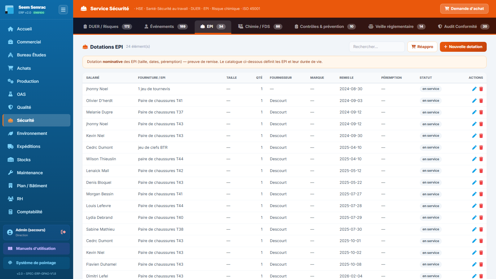

# 07 · Sécurité (HSE/RSE) — parcours guidé

> Comment ça marche **étape par étape** : ce qui arrive **avant**, ce que **vous remplissez ici** (et pourquoi), et **où ça part ensuite**. Écrit pour un nouvel utilisateur.

## En bref — le rôle du service dans la chaîne

Le service Sécurité est le poste de pilotage Hygiène-Sécurité-Environnement de l'entreprise. En **entrée**, il reçoit des signaux du terrain : un danger repéré sur un poste, un accident ou un presqu'accident déclaré par un salarié, un produit chimique livré par un fournisseur, un équipement à contrôler, une zone à risque. Le service **produit** des documents réglementaires vivants : le DUERP (document unique), le registre des accidents, le registre chimique avec ses FDS, les zones ATEX, le suivi des vérifications périodiques (VGP), les dotations EPI. Il **transmet** ensuite : un danger coté devient un plan d'action (PAPRIPACT), un accident déclenche une action corrective et parfois un Flash Sécurité diffusé à tous, une échéance dépassée (VGP, formation, conformité) remonte en alerte au tableau de bord et au cockpit Direction.

L'écran s'organise en onglets — **DUER / Risques**, **Événements**, **EPI**, **Chimie / FDS**, **Environnement**, **Contrôles & prévention**, **Conformité**, **Référentiels**, **Tableau de bord** — que l'on parcourt à peu près dans l'ordre du flux ci-dessous.

## Étape 1 — Recenser un risque au DUER

**⬅️ Avant :** Quelqu'un a repéré un danger sur un poste — un bruit, une machine, un produit, une manutention. C'est le point de départ du Document Unique : tout danger de travail doit y être inscrit.

**📝 Ici, vous :** ouvrez l'onglet « DUER / Risques » puis « Nouveau risque » pour décrire le danger et le coter, afin de décider comment le maîtriser.

Sur cet écran, vous renseignez :
- **Unité de travail** (obligatoire) — le groupe de postes concerné (Usinage, Magasins, Montage…) ; c'est le pivot du DUERP, sans lui la fiche ne s'enregistre pas.
- **Danger** (obligatoire) — ce qui peut causer un dommage, en quelques mots (« Machine bruyante > 85 dB »).
- **Famille de risque** — la grande catégorie INRS (Bruit, Chutes, Produits chimiques…), pour ranger et regrouper.
- **Gravité (1-4)** et **Fréquence (1-4)** — la cotation : ces deux notes calculent automatiquement une criticité et une priorité P1/P2/P3 qui donnent l'ordre de traitement.
- **Mesures prévues (plan d'action)**, **Responsable**, **Échéance** — les actions à mener pour réduire le risque : c'est le PAPRIPACT.
- **Statut** — À traiter / En cours / Maîtrisé.

**➡️ Ensuite :** le risque rejoint le DUERP de l'année. Sa priorité P1/P2/P3 alimente le plan d'action ; l'échéance et le statut sont suivis jusqu'à « Maîtrisé ». Les risques les plus critiques remontent au tableau de bord HSE.

> 📋 Le détail de **chaque case** : [guide des formulaires](../formulaires/securite.md).

## Étape 2 — Déclarer un accident ou un presqu'accident

**⬅️ Avant :** Un événement vient de se produire sur le terrain — coupure, chute, presqu'accident, ou simple soin. Un salarié ou l'encadrement le remonte au HSE.

**📝 Ici, vous :** ouvrez l'onglet « Événements » → panneau Accidents, puis créez la déclaration de l'événement.

Sur cet écran, vous renseignez :
- **Type** — Accident du travail / de trajet / Maladie pro / Presqu'accident / Situation dangereuse / Soin ; c'est la nature de l'événement.
- **Date**, **Heure**, **Salarié** — quand et qui : le salarié est choisi dans la liste de l'entreprise.
- **Zone / secteur** et **Poste** — où c'est arrivé.
- **Partie du corps** — la zone touchée ; elle alimente le schéma corporel (heatmap) du tableau de bord.
- **Gravité** (Bénin/Léger/Grave/Mortel), **Avec arrêt** et **Jours d'arrêt** — nécessaires au calcul des taux de fréquence TF et de gravité TG.
- **Analyse des causes** et **Actions correctives** — pourquoi c'est arrivé et ce qu'on met en place.
- **Statut** — Nouveau / Enquête / Actions / Clos.

**➡️ Ensuite :** l'événement entre au registre des accidents. Depuis un accident, l'icône clé à molette permet d'ouvrir une **Action corrective** liée (onglet Événements). Les jours d'arrêt nourrissent les indicateurs TF/TG, et un événement marquant peut donner lieu à un **Flash Sécurité** diffusé à tous les secteurs.

> 📋 Le détail de **chaque case** : [guide des formulaires](../formulaires/securite.md).

## Étape 3 — Inscrire un produit chimique et sa FDS

**⬅️ Avant :** Un produit chimique arrive dans l'entreprise (livraison fournisseur). La réglementation impose de le tracer au registre avec sa fiche de données de sécurité (FDS).

**📝 Ici, vous :** ouvrez l'onglet « Chimie / FDS » et ajoutez le produit avec ses dangers et ses conditions de stockage.

Sur cet écran, vous renseignez :
- **Produit** (obligatoire) — le nom commercial ; un produit sans FDS apparaît en alerte au tableau de bord.
- **Fournisseur** et **Réf. produit** — d'où il vient et son code interne.
- **Pictogrammes CLP** — cliquez dans la grille les pictogrammes de danger de l'étiquette (corrosif, toxique…).
- **Mentions de danger (H/P)**, **CMR**, **VLEP** — les phrases de risque, la catégorie cancérogène/mutagène/reprotoxique éventuelle et la valeur limite d'exposition.
- **Zone de stockage**, **Rétention**, **Compatibilités** — où et comment stocker en sécurité (bac de rétention, produits à séparer).
- **Réf. FDS**, **Date FDS**, **Lien FDS (URL)** — la traçabilité de la fiche.

**➡️ Ensuite :** le produit rejoint le registre chimique. L'icône PDF sur sa ligne **exporte sa fiche FDS**. Les produits sans FDS et les incompatibilités de stockage sont signalés au tableau de bord ; les zones de stockage servent au plan de prévention.

> 📋 Le détail de **chaque case** : [guide des formulaires](../formulaires/securite.md).

## Étape 4 — Déclarer une zone ATEX

**⬅️ Avant :** Un local présente un risque d'atmosphère explosive (gaz, poussières) — chaufferie, zone de charge, cabine. Il faut le classer et le documenter.

**📝 Ici, vous :** ouvrez l'onglet « Environnement » → panneau ATEX et déclarez la zone avec son classement et ses exigences.

Sur cet écran, vous renseignez :
- **Nom de la zone** (obligatoire) — l'identifiant de la zone (« Chaufferie gaz »).
- **Type de zone** — le classement ATEX : 0/1/2 pour les gaz, 20/21/22 pour les poussières.
- **Origine du risque** (Gaz-vapeur / Poussière) et **Substances** — ce qui crée l'atmosphère explosive.
- **Matériel requis** — le matériel autorisé dans la zone (catégorie ATEX adaptée).
- **Mesures de prévention** — détection gaz, ventilation, consignes.
- **Date de revue** — quand la zone sera réévaluée.

**➡️ Ensuite :** la zone entre au registre ATEX (DRPCE). Elle cadre les VGP à prévoir sur les équipements de la zone, le matériel admissible et les plans de prévention des intervenants extérieurs.

> 📋 Le détail de **chaque case** : [guide des formulaires](../formulaires/securite.md).

## Étape 5 — Suivre une vérification périodique (VGP)

**⬅️ Avant :** Un équipement réglementé (levage, électrique, incendie, pression, racks…) doit être contrôlé périodiquement par un organisme agréé. Le contrôle vient d'avoir lieu, ou est à programmer.

**📝 Ici, vous :** ouvrez l'onglet « Contrôles & prévention » → panneau vérifications et enregistrez le contrôle et sa prochaine échéance.

Sur cet écran, vous renseignez :
- **Type** — Levage / Électrique / Incendie / ESP / Racks / Ventilation / ATEX…
- **Équipement** (obligatoire) — l'équipement vérifié ; **Machine liée** permet de le rattacher au parc machines.
- **Organisme** et **Date contrôle** — qui a contrôlé et quand.
- **Périodicité (mois)** et **Prochaine échéance** — l'intervalle et la date du prochain contrôle : le moteur de suivi s'appuie dessus.
- **Résultat** (Conforme / Avec observations / Non conforme) et **Levée des réserves** — le verdict et le suivi des réserves.
- **Statut** — À jour / À prévoir / En retard.

**➡️ Ensuite :** l'équipement entre au registre des vérifications. Une **échéance dépassée** le fait passer en « VGP en retard » au tableau de bord (et remonte aux alertes Direction). Le rattachement à une machine relie le contrôle à la fiche machine du parc.

> 📋 Le détail de **chaque case** : [guide des formulaires](../formulaires/securite.md).

## Étape 6 — Référencer un EPI et le doter à un salarié

**⬅️ Avant :** L'entreprise achète un modèle d'équipement de protection (casque, gants, chaussures…). Il faut le référencer au catalogue avant de pouvoir le remettre aux salariés.

**📝 Ici, vous :** ouvrez l'onglet « EPI » → panneau catalogue pour ajouter le modèle, puis le panneau dotations pour enregistrer sa remise.

Sur cet écran (catalogue EPI), vous renseignez :
- **Désignation** (obligatoire) — le nom de l'EPI.
- **Catégorie** — la partie du corps protégée (Tête, Audition, Mains, Pieds…).
- **Norme EN**, **Durée de vie (mois)**, **Réf. stock**, **Fournisseur** — la référence technique et l'approvisionnement.

Puis, à la **dotation** (remise à un salarié), vous renseignez : **Salarié**, l'**EPI du catalogue** (ou un nom libre), **Taille**, **Quantité**, **Remis le**, **Péremption**, **Signature obtenue** et **Statut** (En service / À renouveler / Restitué). Le **Prix** valorise les dépenses EPI.

**➡️ Ensuite :** le catalogue alimente les dotations ; les dotations arrivées à péremption ou « À renouveler » sont signalées. Les dépenses EPI remontent aux indicateurs. Le catalogue sert aussi de référence à la matrice EPI × zone (étape suivante).

> 📋 Le détail de **chaque case** : [guide des formulaires](../formulaires/securite.md).

## Étape 7 — Définir la matrice EPI × zone

**⬅️ Avant :** Les EPI sont référencés au catalogue et les zones d'atelier sont connues. Il reste à dire **quels EPI sont obligatoires dans quelle zone** — la règle affichée à l'entrée de chaque secteur.

**📝 Ici, vous :** ouvrez l'onglet « EPI » → panneau « EPI obligatoires par zone », cliquez « Modifier la matrice », cochez les croisements, puis « Sauvegarder ».

Sur cet écran, vous renseignez :
- **Cases EPI × zone** — chaque ligne est un EPI (Casque, Lunettes, Bouchons, Gants anti-coupure, Chaussures…), chaque colonne une zone (Z1 Dissipation/Tronçonnage, Z2 Oxydation, Z3 Tôlerie, Z4 Bureaux, Z5 Magasin/Expédition, Z6 Collage/Labo, Z7 Montage Puissance, A Allée). Cliquez une case pour rendre l'EPI obligatoire (✓) ou non (—) dans la zone.

Attention : ce n'est pas une modale. On active « Modifier la matrice », on clique les cases, puis « Sauvegarder » — **rien n'est enregistré avant** ; « Annuler » abandonne les changements.

**➡️ Ensuite :** la matrice fixe les EPI obligatoires par zone. Elle sert de référence d'affichage et de contrôle (qui doit porter quoi, où) et se croise avec les dotations pour vérifier la couverture des salariés.

> 📋 Le détail de **chaque case** : [guide des formulaires](../formulaires/securite.md).

---

> Au-delà de ces étapes, le service tient aussi les **actions correctives / Flash Sécurité** (onglet Événements), le **registre déchets** et les **mesures environnementales** (onglet Environnement), les **formations requises** et **exercices d'évacuation / plans de prévention** (onglet Contrôles & prévention), ainsi que les **indicateurs RSE** et la **matrice de conformité réglementaire** (onglet Conformité). Chacun se remplit sur le même principe et alimente le **Tableau de bord HSE/RSE**. Le détail de chaque case reste dans le [guide des formulaires](../formulaires/securite.md).
