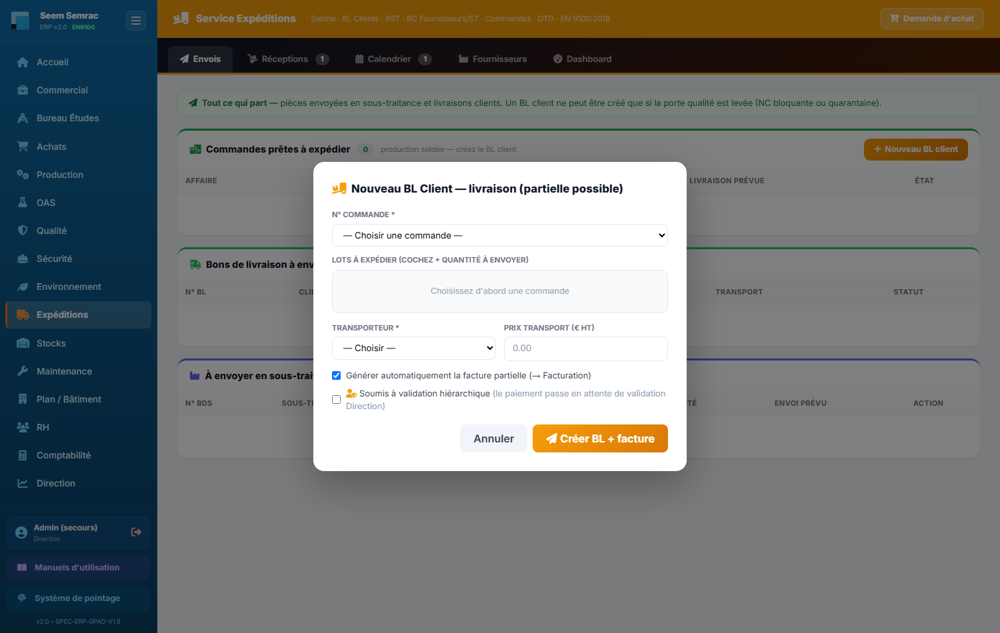
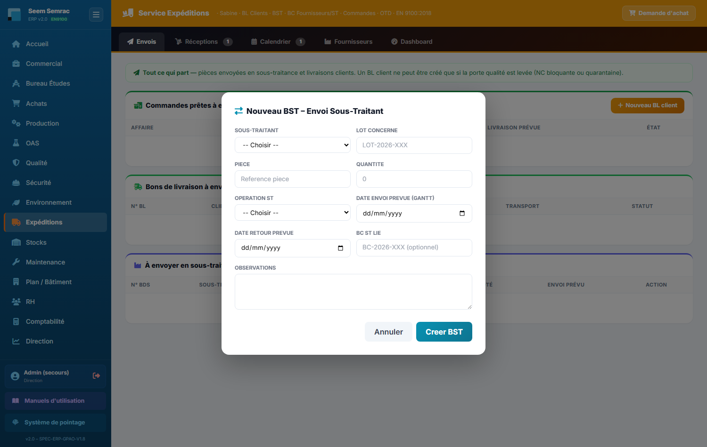

# 08 · Expéditions — parcours guidé

> Comment ça marche **étape par étape** : ce qui arrive **avant**, ce que **vous remplissez ici** (et pourquoi), et **où ça part ensuite**. Écrit pour un nouvel utilisateur.

## En bref — le rôle du service dans la chaîne

Le service **Expéditions** est le dernier maillon avant le client. En entrée, il reçoit des **commandes dont les pièces sont produites** (lots terminés à l'atelier, prêts à partir). Son travail : **faire sortir la marchandise** — soit vers le **client** (bon de livraison), soit vers un **sous-traitant** pour une opération à réaliser (bon de sous-traitance), soit **réceptionner** ce qui arrive des fournisseurs. À la sortie, chaque livraison client génère une **facture** (envoyée à la Facturation) et une **écriture de vente** (Compta), et le suivi **OTD** (livré à l'heure) alimente le tableau de bord. Une **porte qualité** peut bloquer une expédition si un lot est non conforme.

Les onglets à connaître :
- **Bons de Livraison** — créer les BL clients (partiels possibles) et les BST sous-traitants.
- **Bons de Commande** — réceptionner ce qui arrive des fournisseurs/ST, puis contrôler.
- **Commandes en cours** — voir ce qu'il reste à livrer.
- **Dashboard** — le suivi OTD (livraison à l'heure).

## Étape 1 — Livrer un client (Bon de Livraison)
**⬅️ Avant :** À l'atelier, un ou plusieurs **lots ont été produits** pour une commande. Ils sont terminés et prêts à partir. La commande apparaît dans « Commandes en cours » avec un reste à livrer.
**📝 Ici, vous :** créez le **BL client** — vous déclarez quels lots partent, en quelle quantité, et par quel transporteur.

Sur cet écran, vous renseignez :
- **N° Commande** — choisissez d'abord la commande à livrer (affichée par n° d'affaire et client). C'est **elle qui fait apparaître la liste des lots** à expédier.
- **Lots à expédier (+ quantité)** — cochez chaque lot qui part et tapez la **quantité envoyée**. Vous pouvez n'envoyer qu'une partie : c'est un **BL partiel** (le reste partira plus tard). La quantité ne peut pas dépasser le reste à livrer.
- **Transporteur** — qui emporte le colis (Chronopost, GLS… ou « Propre véhicule » pour un véhicule de l'entreprise). Obligatoire : sans transporteur, pas de BL.
- **Prix transport (€ HT)** — le coût du port si vous le connaissez ; sinon laissez vide.
- **Générer automatiquement la facture partielle** — cochée par défaut : la facture correspondant à ce qui est livré part **tout de suite** vers la Facturation. Décochez si vous ne voulez pas facturer maintenant.
- **Soumis à validation hiérarchique** — à cocher si la livraison doit être **approuvée par la Direction** avant d'être facturée (le paiement passe « en attente de validation »).

**➡️ Ensuite :** le BL est créé et la marchandise part. Si la case était cochée, une **facture partielle** est générée pour la Facturation et l'**écriture de vente** part en Compta. Le reste à livrer de la commande est mis à jour. Le tout alimente le suivi **OTD** du Dashboard.
⚠️ **Porte qualité :** si un lot est en **quarantaine** ou porte une **NC bloquante**, le BL est **refusé**. Il faut d'abord faire traiter la non-conformité côté Qualité, puis revenir créer le BL.

> 📋 Le détail de **chaque case** : [guide des formulaires](../formulaires/expeditions.md).

## Étape 2 — Envoyer chez un sous-traitant (BST)
**⬅️ Avant :** Une opération (traitement, anodisation, peinture, zingage…) ne se fait pas en interne. Un lot doit **partir chez un sous-traitant** puis revenir traité avant de poursuivre sa gamme.
**📝 Ici, vous :** créez un **BST** (bon de sous-traitance) — vous préparez l'envoi du lot vers l'entreprise qui réalisera l'opération.

Sur cet écran, vous renseignez :
- **Sous-traitant** — l'entreprise qui va traiter les pièces (ex. Zingage Express).
- **Lot concerné / Pièce / Quantité** — quel lot, quelle référence de pièce, combien de pièces partent.
- **Opération ST** — le traitement demandé (oxydation anodique, sérigraphie, zingage, peinture poudre…).
- **Date envoi prévue** — le jour prévu du départ, aligné sur le planning (Gantt). C'est **cette date** qui fera remonter le bon dans la liste « À préparer aujourd'hui ».
- **Date retour prévue** — quand vous attendez le retour des pièces traitées.
- **BC ST lié** — le n° de bon de commande sous-traitant associé, si vous en avez un.
- **Observations** — consignes libres (emballage, fragilité…).

**➡️ Ensuite :** le BST est enregistré et apparaîtra, **le jour prévu**, dans la liste « À préparer ». Une fois expédié, les pièces sont chez le sous-traitant ; au retour, le lot reprend sa gamme de production.

> 📋 Le détail de **chaque case** : [guide des formulaires](../formulaires/expeditions.md).

## Étape 3 — Réceptionner une commande fournisseur
**⬅️ Avant :** Un **fournisseur ou un sous-traitant livre** une commande (matière, pièces, retour de traitement). Elle figure dans l'onglet « Bons de Commande », liste « Commandes en attente de réception ».
**📝 Ici, vous :** enregistrez la **réception** — vous liez le BC à un bon de livraison interne et notez qui a livré.

Sur cet écran, vous renseignez :
- **N° BL interne** — laissez vide pour un numéro **automatique**, ou saisissez le vôtre.
- **N° d'affaire** — l'affaire à relier à cette réception (souvent pré-rempli).
- **Transporteur** — qui a livré (« Enlèvement direct » = récupéré sur place). Obligatoire : sans lui, la réception ne se valide pas.
- **N° réf. livraison transporteur** — le numéro de suivi ou du bon de transport.
- **Quantité reçue** — le nombre d'articles réellement reçus.

**➡️ Ensuite :** la réception est validée et le lot passe en « Commandes réceptionnées ». Vous devez **enchaîner avec le PV de contrôle** (étape suivante) avant de libérer la marchandise.

> 📋 Le détail de **chaque case** : [guide des formulaires](../formulaires/expeditions.md).

## Étape 4 — Contrôler à réception (PV de contrôle)
**⬅️ Avant :** La commande vient d'être **réceptionnée**. Avant de laisser les pièces entrer dans le flux, il faut **attester du contrôle**.
**📝 Ici, vous :** remplissez le **PV de contrôle à réception** — vous déclarez si les pièces reçues sont conformes ou non.

Sur cet écran, vous renseignez :
- **Résultat du contrôle** — « Conforme (OK) » si tout est bon, ou « Anomalie » si un défaut est constaté. Choisir « Anomalie » fait apparaître les cases ci-dessous.
- **Gravité NC** (si Anomalie) — le niveau du défaut (Mineure, Majeure, Critique, Bloquante).
- **Mettre le lot en quarantaine** (si Anomalie) — cochée par défaut : **isole le lot** pour empêcher son utilisation tant que le problème n'est pas traité.
- **Observations** — les constats, mesures et écarts relevés.
- **Contrôleur** — qui a fait le contrôle (pré-rempli « Expéditions »).

**➡️ Ensuite :** si « Conforme », la marchandise est libérée pour la suite. Si « Anomalie », une **fiche de non-conformité (NC) est créée automatiquement** et part au service **Qualité** ; le lot peut être **mis en quarantaine** — et c'est justement cette quarantaine qui **bloquera un futur BL** (voir la porte qualité de l'étape 1) tant que la NC n'est pas traitée.

> 📋 Le détail de **chaque case** : [guide des formulaires](../formulaires/expeditions.md).

## Étape 5 — Demander un achat (besoin libre)
**⬅️ Avant :** En expédition, il vous manque un **article non rattaché à une commande** (consommable d'emballage, ruban, EPI…).
**📝 Ici, vous :** créez une **Demande d'achat** — accessible via le bouton « Demande d'achat » de la bannière, dans tous les onglets.

Sur cet écran, vous renseignez :
- **Article / Désignation** — le nom de l'article dont vous avez besoin. **Seul champ obligatoire.**
- **Type** — la catégorie (Consommable, EPI / Sécurité, Outillage…).
- **Quantité** — la quantité souhaitée avec son unité.
- **Fournisseur pressenti** — un fournisseur suggéré, si vous en avez un en tête.
- **Priorité** — Normal, Urgent ou Critique.
- **Livraison souhaitée** — la date à laquelle vous aimeriez recevoir l'article.
- **Soumettre à la validation de la Direction** — à cocher pour un achat libre ou un investissement qui doit être approuvé.

**➡️ Ensuite :** la demande part au service **Achats**, qui la transforme en bon de commande. La marchandise reviendra ensuite par la **réception** (étape 3) et son **PV de contrôle** (étape 4).

> 📋 Le détail de **chaque case** : [guide des formulaires](../formulaires/expeditions.md).
