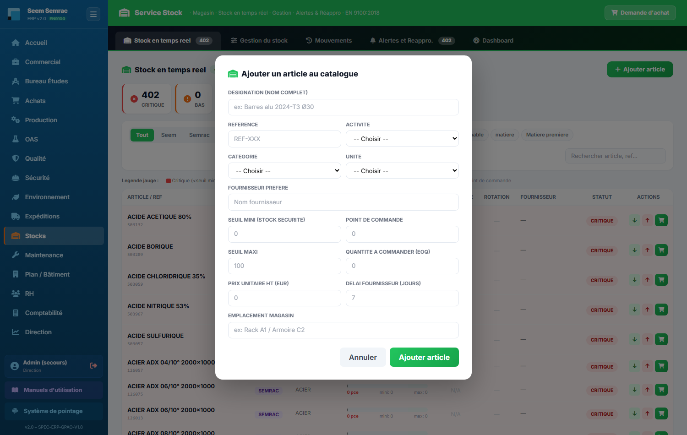
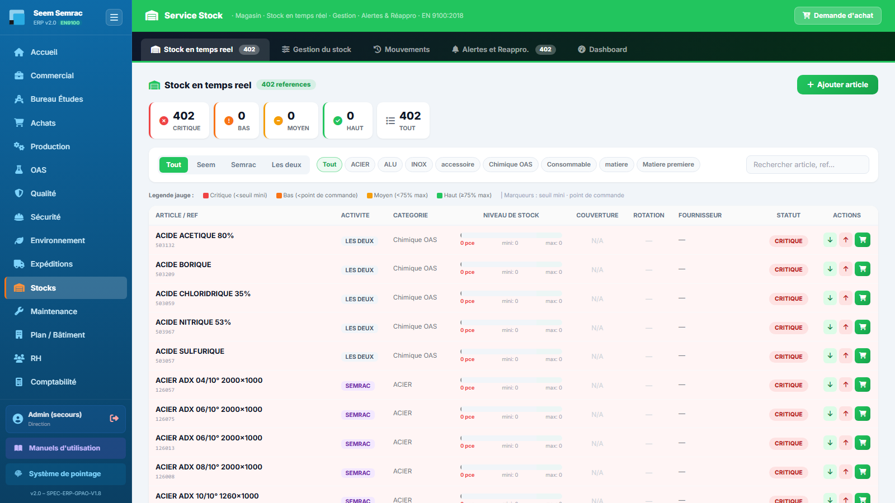
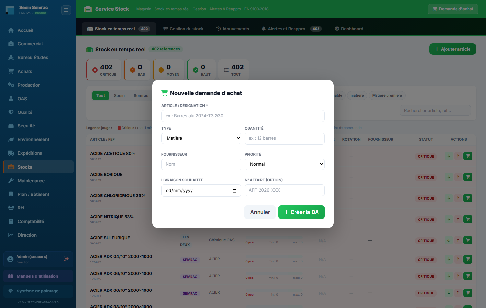

# 09 · Stock — parcours guidé

> Comment ça marche **étape par étape** : ce qui arrive **avant**, ce que **vous remplissez ici** (et pourquoi), et **où ça part ensuite**. Écrit pour un nouvel utilisateur.

## En bref — le rôle du service dans la chaîne
Le service Stock est le **magasin** de l'ERP : c'est lui qui sait, à tout instant, combien de matière et de consommables sont disponibles. En entrée, il reçoit les livraisons des fournisseurs (à la suite des commandes passées par les Achats) et les besoins de la production. En sortie, il diminue à chaque consommation en atelier, surveille les niveaux, et **déclenche les réapprovisionnements** : dès qu'un article passe sous son point de commande, le Stock émet une demande d'achat qui part vers les Achats. Le service produit donc deux choses : une **image fiable du stock en temps réel** (pour tout le monde) et des **demandes d'achat** (pour relancer les fournisseurs).

## Étape 1 — Ajouter un article au catalogue
**⬅️ Avant :** Un nouveau besoin apparaît — une matière, un consommable, un produit chimique — que l'ERP ne connaît pas encore. Avant de pouvoir suivre son stock, il faut le créer.
**📝 Ici, vous :** créez la fiche de l'article et fixez ses seuils d'alerte.

Sur cet écran, vous renseignez :
- **Designation (nom complet)** — le nom clair qui s'affichera partout dans les listes ; écrivez-le en entier.
- **Reference** — le code court (interne ou fournisseur), pratique pour retrouver l'article à la recherche.
- **Categorie** — la famille (matière première, consommable, chimique, emballage…) : elle sert à filtrer et regrouper le stock.
- **Unite** — comment on compte l'article (kg, L, pièce, bobine…) ; toutes les quantités suivront cette unité.
- **Seuil mini (stock securite)** — la réserve de sécurité : en dessous, l'article passe en critique (rouge).
- **Point de commande** — le niveau qui déclenche l'alerte « il faut recommander » (toujours au-dessus du seuil mini).
- **Seuil maxi** — le plafond à ne pas dépasser, repère haut des jauges.
- **Quantite a commander (EOQ)** — la quantité qu'on recommande d'un coup ; elle pré-remplit les futures demandes d'achat.

**➡️ Ensuite :** l'article rejoint le **catalogue** et apparaît dans l'onglet « Stock en temps réel ». Ce sont surtout les trois seuils (mini, point de commande, maxi) qui comptent : sans eux, aucune alerte de réapprovisionnement ne se déclenchera. L'article devient sélectionnable dans tous les mouvements (entrée, sortie, ajustement).

> 📋 Le détail de **chaque case** : [guide des formulaires](../formulaires/stock.md).

## Étape 2 — Saisir une entrée (réception de stock)
**⬅️ Avant :** Une livraison arrive au magasin. Le fournisseur a expédié la marchandise commandée par les Achats, avec son bon de livraison.
**📝 Ici, vous :** enregistrez la marchandise reçue pour l'ajouter au stock.

Sur cet écran (sous-onglet « Entrée stock »), vous renseignez :
- **Article** — l'article livré ; sa quantité actuelle est rappelée à côté de chaque nom.
- **Quantite recue** — ce que vous avez réellement reçu, qui vient s'ajouter au stock.
- **Date reception** — le jour de la livraison (pré-rempli à aujourd'hui, à corriger si besoin).
- **BL fournisseur** — le numéro du bon de livraison : c'est votre preuve de traçabilité.
- **DA liee** — le numéro de la demande d'achat d'origine : il relie l'entrée à la commande qui l'a déclenchée.

**➡️ Ensuite :** le stock de l'article augmente immédiatement, l'entrée est journalisée dans l'onglet « Mouvements », et si l'article était en alerte, il peut repasser au vert. Le lien BL + DA permet aux contrôles ultérieurs (qualité, Achats) de retrouver l'origine.

> 📋 Le détail de **chaque case** : [guide des formulaires](../formulaires/stock.md).

## Étape 3 — Saisir une sortie (consommation de stock)
**⬅️ Avant :** La production a besoin de matière ou d'un consommable, ou un article part au rebut / en retour. Le magasin délivre la marchandise.
**📝 Ici, vous :** enregistrez ce qui quitte le stock pour le diminuer.

Sur cet écran (sous-onglet « Sortie stock »), vous renseignez :
- **Article** — l'article qui sort ; sa quantité disponible est affichée à côté.
- **Quantite sortie** — ce qui quitte réellement le magasin, retiré du stock.
- **Reference BDT / LOT / CMD** — le document qui justifie la sortie (bon de travail, lot ou commande) : c'est lui qui rattache la consommation à une affaire.
- **Motif** — la raison : consommation production, rebut/casse, retour fournisseur, transfert inter-atelier.

**➡️ Ensuite :** le stock diminue aussitôt et la sortie est journalisée dans « Mouvements ». Reliée à un BDT ou une commande, elle alimente le **coût réel de l'affaire** côté production. Si le niveau passe sous le point de commande, une alerte de réapprovisionnement apparaît (étape 6).

> 📋 Le détail de **chaque case** : [guide des formulaires](../formulaires/stock.md).

## Étape 4 — Ajustement / Inventaire physique
**⬅️ Avant :** Vous avez compté physiquement un article dans le magasin et le nombre réel ne colle pas avec ce qu'affiche l'ERP (inventaire périodique, perte, erreur de saisie).
**📝 Ici, vous :** réalignez le stock ERP sur la quantité réellement comptée.

Sur cet écran (sous-onglet « Ajustement / Inventaire »), vous renseignez :
- **Article** — celui dont vous corrigez le stock.
- **Stock reel constate** — la quantité **totale** réellement comptée (pas l'écart) : l'ERP calcule tout seul la différence.
- **Date inventaire** — le jour du comptage (pré-rempli à aujourd'hui).
- **Motif** — inventaire périodique, écart constaté, perte/détérioration, correction d'erreur de saisie.
- **Responsable inventaire** — qui a fait le comptage, pour la traçabilité.

**➡️ Ensuite :** le stock est corrigé à la valeur constatée et l'écart est tracé dans le journal des mouvements. Ce formulaire est à préférer quand la cause de l'écart n'est pas une entrée ou une sortie claire.

> 📋 Le détail de **chaque case** : [guide des formulaires](../formulaires/stock.md).

## Étape 5 — Régler les seuils (Catalogue & seuils)
**⬅️ Avant :** L'expérience montre qu'un article se déclenche trop tôt, trop tard, ou devrait se recommander tout seul. Vous voulez ajuster son pilotage sans repasser par la fiche complète.
**📝 Ici, vous :** modifiez les seuils directement dans le tableau et activez, ou non, le réapprovisionnement automatique.

Sur cet écran (sous-onglet « Catalogue & seuils »), chaque ligne d'article laisse modifier :
- **Seuil mini** — le niveau « critique » de l'article.
- **Pt commande** — le niveau qui déclenche l'alerte de réappro (au-dessus du seuil mini).
- **Qté cmd** — la quantité à commander à chaque réappro.
- **Réappro auto** — si cochée, une demande d'achat est **créée automatiquement** dès que le stock passe sous le point de commande.

**➡️ Ensuite :** cliquez sur « Enregistrer » (icône disquette) au bout de la ligne. Les nouveaux seuils repeignent aussitôt les jauges et pilotent les alertes. Sur les articles en « Réappro auto », le Stock générera désormais les demandes d'achat sans intervention.

> 📋 Le détail de **chaque case** : [guide des formulaires](../formulaires/stock.md).

## Étape 6 — Émettre une demande d'achat (réappro)
**⬅️ Avant :** Un article est passé sous son point de commande (alerte visible dans « Alertes et Réappro. » et « Stock en temps réel »), ou vous avez un besoin ponctuel hors alerte.
**📝 Ici, vous :** demandez l'achat d'un article ; la demande partira vers les Achats.

Sur cet écran, vous renseignez :
- **Article / Désignation** — ce que vous voulez commander, décrit clairement : c'est le **seul champ obligatoire**.
- **Type** — la nature de l'achat (matière, outillage, consommable, chimique, sous-traitance) : aide les Achats à classer la demande.
- **Quantité** — combien, avec l'unité si utile.
- **Fournisseur** — le fournisseur souhaité, si vous en avez un en tête.
- **Priorité** — normal, urgent ou critique.
- **Livraison souhaitée** — la date à laquelle vous aimeriez être livré.
- **N° affaire (option)** — l'affaire liée, pour imputer l'achat au bon dossier.

**➡️ Ensuite :** une fois validée, la **demande d'achat (DA)** part immédiatement vers les **Achats** avec le statut « à traiter ». Astuce : depuis une alerte, le bouton « Créer DA » sur la ligne d'un article reprend automatiquement l'article, la quantité et le fournisseur — la DA part sans ressaisie. Côté Achats, la DA deviendra un bon de commande, puis une livraison qui reviendra au magasin en **entrée de stock** (étape 2) : la boucle est bouclée.

> 📋 Le détail de **chaque case** : [guide des formulaires](../formulaires/stock.md).
