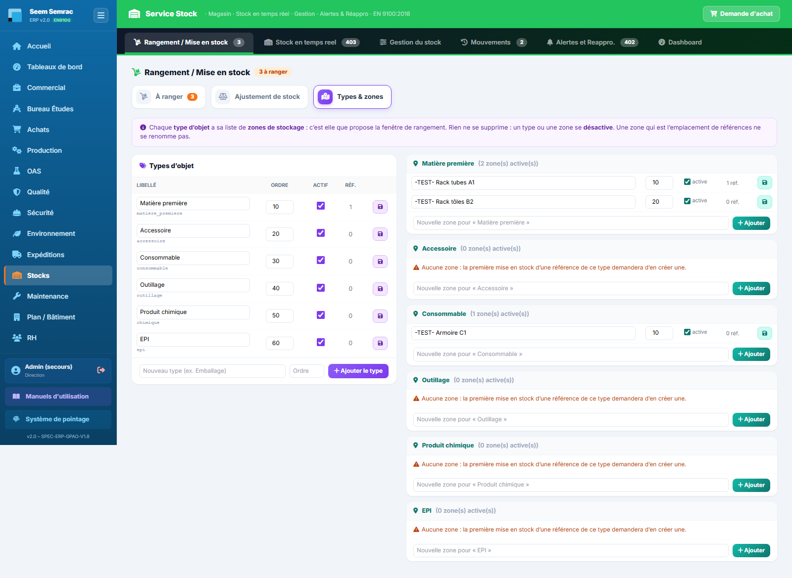
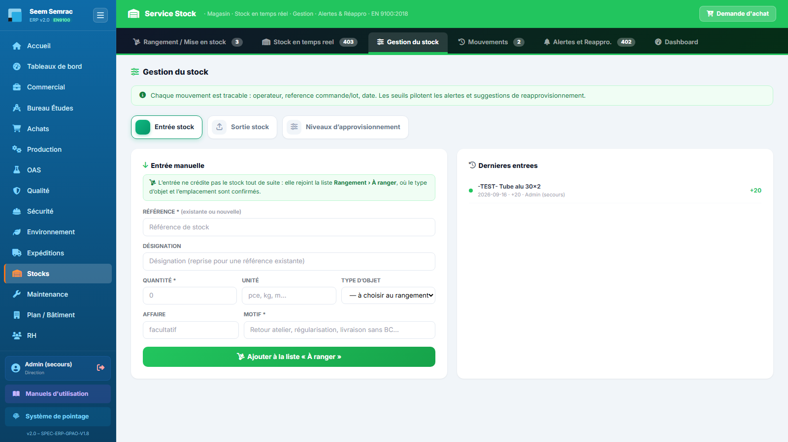
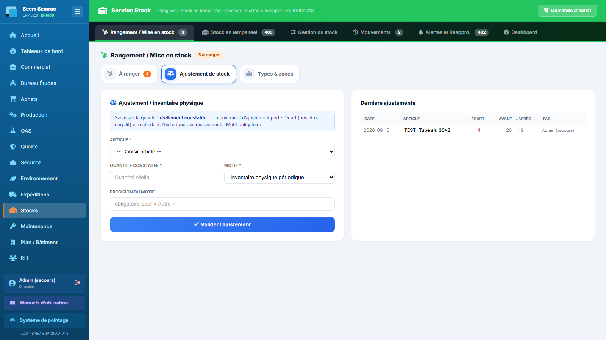
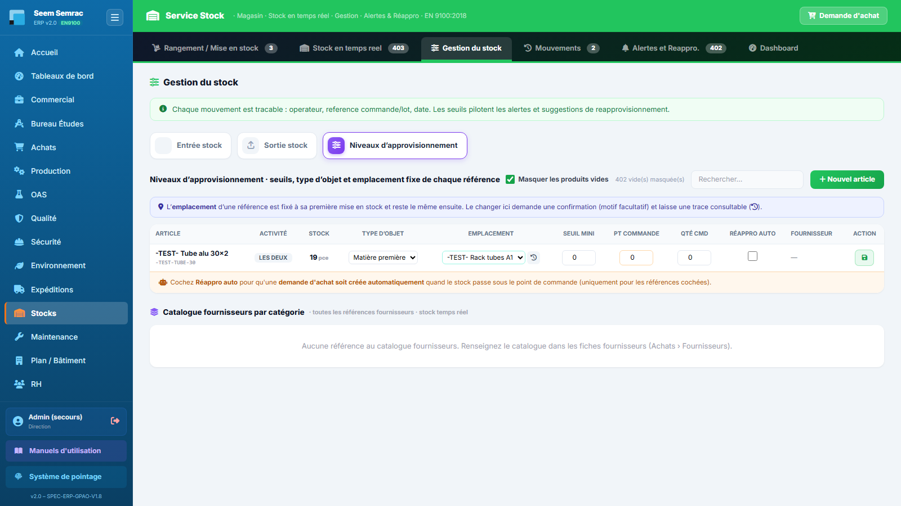

# 09 · Stock — parcours guidé

> Comment ça marche **étape par étape** : ce qui arrive **avant**, ce que **vous remplissez ici** (et pourquoi), et **où ça part ensuite**. Écrit pour un nouvel utilisateur.

## En bref — le rôle du service dans la chaîne
Le service Stock est le **magasin** de l'ERP : c'est lui qui sait, à tout instant, combien de matière et de consommables sont disponibles, et **où** ils sont rangés. En entrée, il reçoit ce que les Expéditions ont **contrôlé conforme** au PV de réception (livraisons des fournisseurs commandées par les Achats), la part d'un lot non conforme que la Qualité a **acceptée**, les pièces en trop que la Direction a **validées**, et les entrées manuelles. Tout cela arrive dans la liste **« À ranger »** : **rien n'est crédité avant le rangement**, et la matière d'une affaire n'est disponible pour les bons de travail qu'une fois rangée. En sortie, le stock diminue à chaque consommation, se corrige par inventaire, et **déclenche les réapprovisionnements** : dès qu'un article passe sous son point de commande, le Stock émet une demande d'achat vers les Achats.

## Étape 1 — Ranger ce qui arrive (Accepter l'entrée en stock)
**⬅️ Avant :** Une livraison fournisseur a été réceptionnée et son **PV de contrôle** fait aux Expéditions : les quantités conformes ont été inscrites, référence par référence, dans **Rangement / Mise en stock › À ranger**. (Autres arrivées possibles : part acceptée par la Qualité, excédent validé par la Direction, entrée manuelle — étape 3.)
**📝 Ici, vous :** rangez physiquement la marchandise et acceptez la ligne : type d'objet et zone de rangement.

Sur cet écran, vous renseignez :
- **Type d'objet** — la famille (Matière première, Accessoire, Consommable, Outillage, Produit chimique, EPI…) ; l'ERP en **propose** un, vérifiez-le. C'est lui qui donne la liste des zones.
- **Zone de rangement** — seulement pour une **nouvelle référence** (ou une référence sans emplacement) : choisissez-la dans la liste du type, elle devient son **emplacement fixe**. Une référence connue garde son emplacement, affiché verrouillé.
- **Nouvelle zone pour ce type** — si la zone n'existe pas encore (obligatoire quand le type n'a aucune zone) : elle rejoint la liste du type.

**➡️ Ensuite :** le stock de la référence est **crédité** (mouvement « Mise en stock » dans l'onglet Mouvements), la ligne passe dans « Derniers rangements ». Quand toute la matière des bons de commande d'une affaire est contrôlée et rangée, les **bons de travail de l'affaire passent « matière OK »** : la Production peut lancer. Une ligne erronée s'**annule** avec un motif (rien n'est crédité).

> 📋 Le détail de **chaque case** : [guide des formulaires](../formulaires/stock.md).

## Étape 2 — Tenir les types d'objet et les zones
**⬅️ Avant :** Le magasin a ses zones (racks, armoires, allées…) et l'ERP doit les connaître pour proposer où ranger chaque type d'objet. Au départ, **aucune zone n'existe**.
**📝 Ici, vous :** onglet **Rangement / Mise en stock › Types & zones** — vous créez les zones de chaque type, et au besoin de nouveaux types.

Sur cet écran, vous renseignez :
- **Nouvelle zone pour « type »** — le nom d'une zone, dans la carte du type ; **Ajouter**.
- **Nouveau type** — le libellé d'un type d'objet (et son ordre) ; **Ajouter le type**.
- **Nom / ordre / actif** — pour renommer, réordonner ou désactiver (disquette de la ligne).

**➡️ Ensuite :** la fenêtre de rangement propose ces zones pour les références du type. Rien ne se supprime : on **désactive**. Une zone qui est déjà l'emplacement de références ne se renomme pas (créer, déplacer, désactiver).

> 📋 Le détail de **chaque case** : [guide des formulaires](../formulaires/stock.md).

## Étape 3 — Entrée manuelle (hors réception fournisseur)
**⬅️ Avant :** De la marchandise arrive **sans passer par une réception fournisseur** : retour de l'atelier, régularisation, livraison sans bon de commande.
**📝 Ici, vous :** **Gestion du stock › Entrée stock** — vous ajoutez une ligne à la liste « À ranger ».

Sur cet écran, vous renseignez :
- **Référence** — existante ou nouvelle (la liste propose les références connues ; désignation, unité et type se remplissent pour une référence connue).
- **Quantité / Unité** — ce qui entre.
- **Type d'objet** — facultatif, sinon à choisir au rangement.
- **Affaire** — facultative.
- **Motif** — obligatoire : l'origine de l'entrée.

**➡️ Ensuite :** la ligne rejoint **Rangement › À ranger** ; le stock n'est crédité qu'au rangement (étape 1).

> 📋 Le détail de **chaque case** : [guide des formulaires](../formulaires/stock.md).

## Étape 4 — Sortir du stock
**⬅️ Avant :** La production a besoin de matière ou d'un consommable, ou un article part au rebut / en retour.
**📝 Ici, vous :** **Gestion du stock › Sortie stock** — vous enregistrez ce qui quitte le magasin.

Sur cet écran, vous renseignez :
- **Article** — l'article qui sort ; sa quantité disponible est affichée (les articles à zéro sont grisés).
- **Quantité sortie** — refusée au-delà du stock disponible.
- **Motif** (et sa précision pour « Autre »).
- **BDT / Affaire** — facultatifs ; le **BDT** est vérifié et impute la sortie à son lot et à son affaire.

**➡️ Ensuite :** après confirmation, le stock diminue et la sortie est journalisée. Reliée à un BDT, elle alimente le **coût matière réel** du lot et de l'affaire. Sous le point de commande, une alerte de réapprovisionnement apparaît (étape 7).

> 📋 Le détail de **chaque case** : [guide des formulaires](../formulaires/stock.md).

## Étape 5 — Ajustement / inventaire physique
**⬅️ Avant :** Vous avez compté physiquement un article et le nombre réel ne colle pas avec l'ERP.
**📝 Ici, vous :** **Rangement / Mise en stock › Ajustement de stock** — vous réalignez le stock sur la quantité comptée.

Sur cet écran, vous renseignez :
- **Article** — celui dont vous corrigez le stock.
- **Quantité constatée** — la quantité **totale** réellement comptée (pas l'écart).
- **Motif** — inventaire périodique, écart constaté, perte, correction d'erreur de saisie, autre (précision obligatoire).

**➡️ Ensuite :** après confirmation (« de … à …, écart … »), un mouvement d'**ajustement** portant l'écart signé est enregistré ; il apparaît dans « Derniers ajustements » et dans les Mouvements.

> 📋 Le détail de **chaque case** : [guide des formulaires](../formulaires/stock.md).

## Étape 6 — Régler les niveaux d'approvisionnement et l'emplacement
**⬅️ Avant :** Un article se déclenche trop tôt ou trop tard, devrait se recommander tout seul, ou doit changer de place dans le magasin.
**📝 Ici, vous :** **Gestion du stock › Niveaux d'approvisionnement** — vous modifiez la ligne de la référence.

Sur cet écran, chaque ligne laisse modifier :
- **Type d'objet** et **Emplacement** — le changement d'emplacement demande confirmation (motif facultatif) et est **historisé** (bouton 🕘).
- **Seuil mini / Pt commande / Qté cmd** — le pilotage du réapprovisionnement.
- **Réappro auto** — si cochée, une demande d'achat est créée automatiquement sous le point de commande (en comptant ce qui attend dans « À ranger »).

**➡️ Ensuite :** les seuils s'enregistrent avec la disquette ; type et emplacement dès le choix. Les jauges et alertes se recalculent ; le nouvel emplacement est celui que la fenêtre de rangement affichera.

> 📋 Le détail de **chaque case** : [guide des formulaires](../formulaires/stock.md).

## Étape 7 — Émettre une demande d'achat (réappro)
**⬅️ Avant :** Un article est passé sous son point de commande (alerte visible dans « Alertes et Réappro. » et « Stock en temps réel »), ou vous avez un besoin ponctuel.
**📝 Ici, vous :** demandez l'achat d'un article ; la demande partira vers les Achats.

Sur cet écran, vous renseignez :
- **Article / Désignation** — ce que vous voulez commander : **seul champ obligatoire**.
- **Type**, **Quantité**, **Fournisseur**, **Priorité**, **Livraison souhaitée**, **N° affaire**.

**➡️ Ensuite :** la **demande d'achat (DA)** part vers les **Achats** (« à traiter »). Depuis une alerte, « Créer DA » reprend article, quantité et fournisseur sans ressaisie. La DA deviendra un bon de commande, puis une livraison réceptionnée et contrôlée aux Expéditions, qui reviendra au magasin dans **« À ranger »** (étape 1) : la boucle est bouclée.

> 📋 Le détail de **chaque case** : [guide des formulaires](../formulaires/stock.md).
