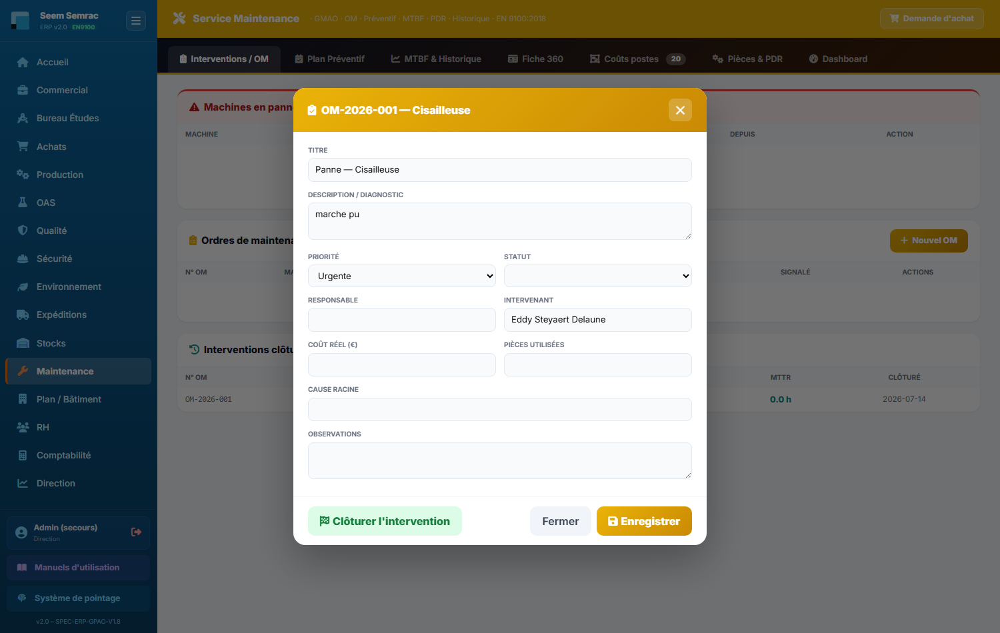

# 10 · Maintenance — parcours guidé

> Comment ça marche **étape par étape** : ce qui arrive **avant**, ce que **vous remplissez ici** (et pourquoi), et **où ça part ensuite**. Écrit pour un nouvel utilisateur.

## En bref — le rôle du service dans la chaîne
Le service Maintenance, c'est la **GMAO** de l'atelier. En entrée, il reçoit les **pannes et les besoins d'entretien** des machines : une machine tombe en panne à la production, un contrôle de routine est prévu, ou une pièce arrive en fin de vie. Le service **suit chaque intervention** de bout en bout (l'ordre de maintenance), tient à jour le **stock de pièces détachées** et calcule la **fiabilité** de chaque machine (MTBF, MTTR, disponibilité). En sortie, il **remet les machines en service** (l'atelier voit la machine repasser au vert sur le planning et le plan bâtiment) et **transmet aux Achats** les pièces à commander.

L'écran d'accueil regroupe tout : Interventions / OM, Plan Préventif, MTBF & Historique, Fiche 360, Pièces & PDR et Dashboard.

## Étape 1 — Ouvrir un ordre de maintenance (OM) sur une machine
**⬅️ Avant :** une machine est tombée en panne (déclarée à la production ou depuis la fiche machine), ou un OM a été généré automatiquement par le plan préventif. La machine passe alors en **arrêt** et apparaît en rouge au planning et sur le plan du bâtiment.
**📝 Ici, vous :** ouvrez l'OM et décrivez l'intervention — ce qui est en panne, qui répare et ce qui a été fait.

Sur cet écran, vous renseignez :
- **Titre** — un résumé court de l'intervention, pour la repérer dans la liste (ex. « Remplacement courroie broche »).
- **Description / diagnostic** — le problème constaté et ce qui a été fait ; c'est la mémoire de l'intervention.
- **Priorité** — Normale, Urgente ou Critique : indique dans quel ordre traiter les OM.
- **Statut** — Ouvert, En cours ou En attente. « En attente » signale qu'on **attend une pièce** (à commander via l'étape 3).
- **Responsable** et **Intervenant** — qui pilote et qui répare concrètement (on tape le nom, la liste des salariés est proposée).
- **Coût réel (€)**, **Pièces utilisées**, **Cause racine**, **Observations** — pour tracer le coût, ce qui a été posé, et surtout la **vraie cause** afin d'éviter que la panne revienne.

**➡️ Ensuite :** « Enregistrer » sauvegarde sans terminer. « Clôturer l'intervention » **termine l'OM** : la machine repasse **opérationnelle** (au vert au planning et au plan bâtiment) et le **temps de réparation (MTTR)** est calculé automatiquement. L'historique alimente l'onglet **MTBF & Historique** et la **Fiche 360** de la machine.

> 📋 Le détail de **chaque case** : [guide des formulaires](../formulaires/maintenance.md).

## Étape 2 — Enregistrer une pièce de rechange (PDR)
**⬅️ Avant :** vous avez identifié une pièce d'usure rattachée à une machine (une courroie, un roulement…) que vous voulez suivre en stock et anticiper au préventif.
**📝 Ici, vous :** choisissez d'abord une machine dans la liste « Machine : », puis remplissez le bloc « Ajouter une pièce de rechange » (onglet **Pièces & PDR**).

Sur cet écran, vous renseignez :
- **Machine** *(obligatoire)* — la machine à laquelle la pièce appartient ; à choisir en haut **avant** de saisir.
- **Désignation** *(obligatoire)* — le nom clair de la pièce ; sans elle, l'ajout est refusé.
- **Référence** et **Fournisseur** — la référence catalogue et qui la fournit (les fournisseurs déjà saisis sont proposés).
- **Prix unitaire (€)** — le prix d'achat, utile pour valoriser le stock et les OM.
- **Stock actuel** et **Stock mini** — combien en magasin et le seuil d'alerte en dessous duquel il faut recommander.
- **Emplacement** — où trouver la pièce dans le magasin.
- **Durée de vie conseillée (h)** et **Dernier remplacement** — le compteur d'usure : combien d'heures de fonctionnement avant remplacement, et depuis quand.

**➡️ Ensuite :** la pièce est rattachée à la machine. En renseignant « Durée de vie conseillée » et « Dernier remplacement », l'onglet **Plan Préventif** calcule tout seul les **heures restantes** avant le prochain changement — et déclenchera un OM le moment venu (retour à l'étape 1). Quand le stock passe sous le mini, vous savez qu'il faut recommander (étape 3).

> 📋 Le détail de **chaque case** : [guide des formulaires](../formulaires/maintenance.md).

## Étape 3 — Faire une demande d'achat (pièce ou fourniture)
**⬅️ Avant :** pendant une intervention il vous manque une pièce (statut « En attente » sur l'OM), ou une PDR est passée sous son stock mini. Il faut la commander.
**📝 Ici, vous :** cliquez sur « Demande d'achat » en haut à droite de l'écran Maintenance et décrivez ce que vous voulez acheter.

Sur cet écran, vous renseignez :
- **Article / Désignation** *(obligatoire)* — ce que vous voulez acheter, décrit clairement ; sans lui la demande ne part pas.
- **Type** — la catégorie (Pièce détachée, Consommable, Outillage…), pour aider les Achats à traiter.
- **Quantité** — combien, avec l'unité (ex. « 10 u »).
- **Fournisseur pressenti** — un fournisseur suggéré, si vous en avez un en tête (facultatif).
- **Priorité** et **Livraison souhaitée** — le degré d'urgence et la date voulue.
- **Soumettre cette demande à la validation de la Direction** — à cocher si l'achat (DA libre / investissement) doit d'abord être validé par la Direction.

**➡️ Ensuite :** la demande est « libre » (non rattachée à une commande) et part directement vers le **service Achats**, qui la traite (et vers la **Direction** d'abord si vous avez coché la validation). Une fois la pièce reçue et posée, vous mettez à jour la **PDR** (étape 2) et vous **clôturez l'OM** en attente (étape 1).

> 📋 Le détail de **chaque case** : [guide des formulaires](../formulaires/maintenance.md).
