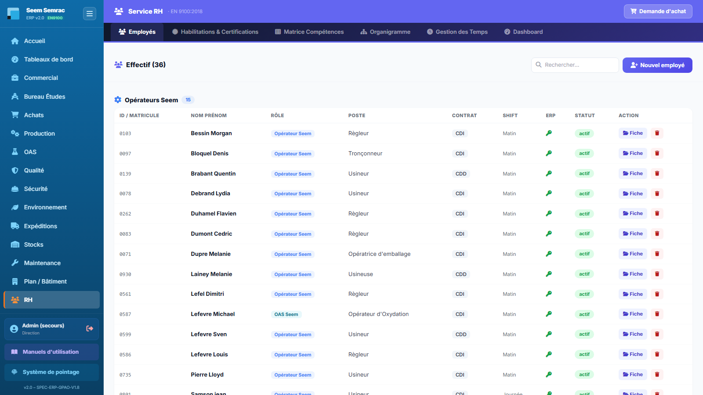
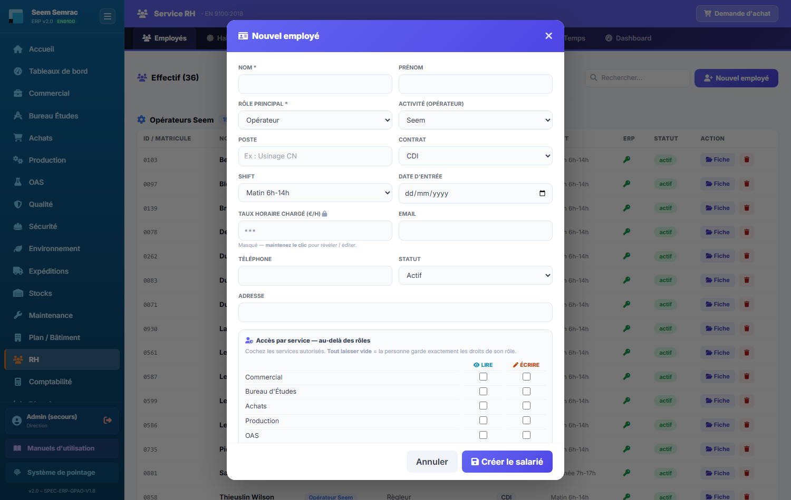
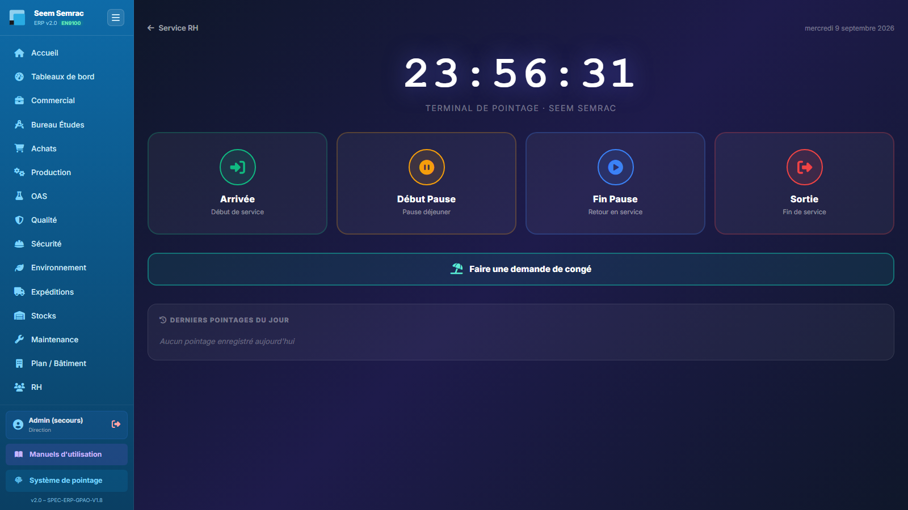
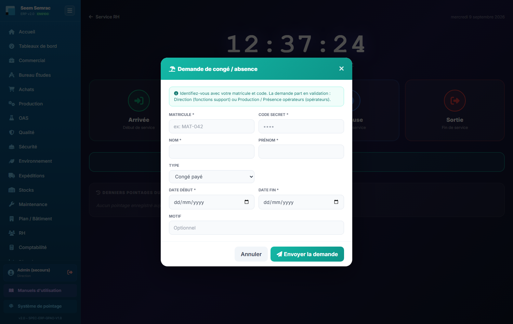

# 11 · RH — parcours guidé

> Comment ça marche **étape par étape** : ce qui arrive **avant**, ce que **vous remplissez ici** (et pourquoi), et **où ça part ensuite**. Écrit pour un nouvel utilisateur.

## En bref — le rôle du service dans la chaîne

Le service RH est le **point d'entrée du personnel** dans l'ERP. Tout commence ici : on crée la fiche d'un salarié, on lui donne un **matricule** et un **code PIN**, et c'est ce couple qui lui ouvre l'accès à toute la chaîne — se connecter, **pointer**, **solder ses bons de travail**, prendre des congés.

En entrée, RH reçoit les embauches et changements de poste (souvent validés par la Direction). En sortie, RH alimente plusieurs services : les **droits d'accès** (rôles → permissions dans tout l'ERP), le **planning** (les congés posent des absences), la **paie** (temps pointés + taux horaire chargé), la **Qualité** (habilitations critiques EN 9100, matrice des compétences) et la **Direction** (organigramme, tableau de bord RH). C'est donc un service transversal : ce qu'on saisit ici se répercute partout.

## Étape 1 — Créer un salarié (fiche employé)

**⬅️ Avant :** une embauche est décidée (ou un salarié change de poste / de rôle). Vous partez de l'onglet **Employés**, qui liste tous les salariés existants.

**📝 Ici, vous :** créez la fiche du nouveau salarié en cliquant sur « Nouvel employé » (ou « Fiche » pour modifier une fiche existante).

Sur cet écran, vous renseignez :
- **Nom** — le seul champ strictement obligatoire pour enregistrer la fiche.
- **Rôle principal** — le métier du salarié ; c'est lui qui **fixe les droits d'accès** dans tout l'ERP. Un rappel des autorisations accordées s'affiche en bas du bloc « Identifiants ERP ».
- **Accès par service** — une case **Lire** et une case **Écrire** pour chacun des 15 services. Cocher Écrire coche et verrouille Lire. Tout laisser vide = les droits du rôle s'appliquent tels quels ; dès qu'une case est cochée, ce tableau décide seul et peut aussi **retirer** un service que le rôle accordait (ex. un opérateur qui a aussi accès à la Qualité, ou un comptable à qui on ferme la RH). Sans effet sur un rôle Direction. Les nouveaux droits s'appliquent à la prochaine connexion de la personne.
- **Activité (Seem / Semrac)** — l'usine de rattachement ; n'apparaît que pour les rôles Opérateur / OAS.
- **Identifiant / Matricule** et **Code PIN** — le couple de connexion : sans lui, le salarié **ne peut ni se connecter, ni pointer, ni solder de bons**. C'est le point le plus important de la fiche.
- **Taux horaire chargé (€/h)** — coût complet salaire + charges ; sert au calcul de la **masse salariale** et de la paie.
- **Soldes congés / RTT (h)** — les compteurs de départ, réutilisés par la gestion des temps.
- **Matricule + PIN validateur** et **Soumettre à la validation de la Direction** — à la création, un bloc « Habilitation requise » demande le matricule/code d'un responsable RH ou Direction qui autorise l'embauche.

**➡️ Ensuite :** la fiche est enregistrée dans les effectifs. Le salarié apparaît dans la liste **Employés**, peut se connecter et **pointer** avec son matricule + PIN, et ses droits sont actifs dans tout l'ERP. Si la case a été cochée, la fiche part en **validation à la Direction**.

> 📋 Le détail de **chaque case** : [guide des formulaires](../formulaires/rh.md).

## Étape 2 — Déclarer une habilitation ou une certification

**⬅️ Avant :** le salarié existe (Étape 1) et vient d'obtenir un diplôme, une habilitation ou une formation qu'il faut tracer.

**📝 Ici, vous :** enregistrez l'habilitation depuis l'onglet **Habilitations & Certifications** → bouton « Ajouter » (formulaire en bas), ou le crayon pour modifier une ligne.

Sur cet écran, vous renseignez :
- **Salarié** — la personne concernée, choisie dans la liste des salariés enregistrés.
- **Type** et **Intitulé** — la nature (habilitation, diplôme, certification, formation) et son nom précis.
- **Organisme** — qui a délivré le document.
- **Date obtention** et **Date expiration** — le suivi de validité ; laissez l'expiration vide si l'habilitation est illimitée.
- **Habilitation critique (EN 9100)** — cochez si l'habilitation est essentielle à la qualité aéronautique ; elle sera signalée en rouge.
- **Notes** — remarques libres.

**➡️ Ensuite :** l'habilitation est suivie et **partagée avec la Qualité**. Les habilitations expirées ou proches de l'expiration **remontent automatiquement** dans l'onglet « Alertes » et sur le tableau de bord RH.

> 📋 Le détail de **chaque case** : [guide des formulaires](../formulaires/rh.md).

## Étape 3 — Renseigner la matrice des compétences

**⬅️ Avant :** les salariés (opérateurs) sont créés et les process de l'atelier existent. Vous voulez savoir qui sait faire quoi.

**📝 Ici, vous :** indiquez le niveau de maîtrise de chaque opérateur, dans l'onglet **Matrice Compétences** → « Matrice Production », en cliquant sur la case au croisement d'un opérateur (colonne) et d'un process (ligne).

Sur cet écran, vous renseignez :
- **Niveau de compétence** — chaque clic sur la case fait défiler le niveau : — Non formé → ★ En formation → ★★ Autonome → ★★★ Expert, puis retour à —. La sauvegarde est **automatique** ; la légende en haut rappelle la signification des étoiles.

**➡️ Ensuite :** la matrice sert à la **Production** (affecter les bons opérateurs aux process) et à la Direction pour repérer les manques de compétences et planifier les formations.

> 📋 Le détail de **chaque case** : [guide des formulaires](../formulaires/rh.md).

## Étape 4 — Construire l'organigramme (liens hiérarchiques)

**⬅️ Avant :** les salariés sont créés. Vous voulez formaliser qui dépend de qui.

**📝 Ici, vous :** définissez le responsable de chaque salarié depuis l'onglet **Organigramme** → bouton « Liens hiérarchiques ».

Sur cet écran, vous renseignez :
- **Responsable** — le supérieur hiérarchique direct, choisi dans la liste ; « Aucun (sommet) » pour la Direction en haut de la structure.

**➡️ Ensuite :** le choix est enregistré immédiatement et la **Vue organigramme** se met à jour toute seule. Cette structure éclaire les circuits de validation (congés, embauches).

> 📋 Le détail de **chaque case** : [guide des formulaires](../formulaires/rh.md).

## Étape 5 — Le salarié pointe (terminal de pointage)

**⬅️ Avant :** le salarié a une fiche avec matricule + PIN (Étape 1). Il arrive à l'atelier.

**📝 Ici, vous (le salarié) :** badgez votre arrivée, vos pauses et votre départ sur la page **Pointage** en cliquant sur l'un des 4 boutons (Arrivée, Début Pause, Fin Pause, Sortie) ; une fenêtre d'identification s'ouvre.

Sur cet écran, vous renseignez :
- **Matricule** — votre identifiant personnel.
- **Code secret** — votre code PIN. Vous pouvez valider avec la touche Entrée.

Sans identification, le pointage **n'est pas enregistré**.

**➡️ Ensuite :** les horaires alimentent la **Gestion des Temps** (sous-onglet « Journée »), servent au calcul des heures et, in fine, à la **paie** (croisés avec le taux horaire chargé). Les erreurs de badge se corrigent à l'Étape 6.

> 📋 Le détail de **chaque case** : [guide des formulaires](../formulaires/rh.md).

## Étape 6 — Corriger un pointage

**⬅️ Avant :** un badge a été oublié ou mal enregistré (badgeuse en panne, oubli), et il faut rétablir le bon horaire.

**📝 Ici, vous :** corrigez le pointage, soit via la fenêtre rapide (« Gestion des Temps » → « Journée » → bouton « Modifier » sur la ligne), soit via une demande formelle (sous-onglet « Corrections »).

Sur cet écran, vous renseignez :
- **Heure arrivée / départ corrigée** — les bons horaires.
- **Motif** — la raison de la correction ; **obligatoire**, elle est tracée et archivée.
- **Autorisation / Matricule RH + Code secret** — toute correction exige l'accord d'un responsable ; seuls les matricules **ADM001 ou ADM002** peuvent valider dans la fenêtre rapide.

**➡️ Ensuite :** le pointage corrigé remplace l'ancien dans la Gestion des Temps, avec la raison conservée pour l'audit. Les heures justes repartent vers le calcul et la paie.

> 📋 Le détail de **chaque case** : [guide des formulaires](../formulaires/rh.md).

## Étape 7 — Enregistrer une demande de congé

**⬅️ Avant :** un salarié demande une absence, soit auprès du RH, soit lui-même depuis la borne (bouton « Faire une demande de congé »).

**📝 Ici, vous :** enregistrez la demande depuis l'onglet **Gestion des Temps** → encadré « Absences & congés » → « Nouvelle demande » (côté RH).

Sur cet écran, vous renseignez :
- **Salarié** — la personne qui prend le congé ; son solde de congés s'affiche à côté du nom.
- **Type** — congé payé, RTT, maladie, sans solde, événement familial, formation, récupération.
- **Motif** — la raison (facultatif).
- **Date de début** et **Date de fin** — obligatoires ; les jours d'absence.
- **Heures** — laissez vide pour un **calcul automatique** (jours ouvrés × 7 h) ; ne remplissez que pour un cas particulier.

**➡️ Ensuite :** une fois validée, la demande **pose automatiquement les jours d'absence au planning**. Depuis la borne, la demande part en **validation** vers la Direction (fonctions support) ou vers la Production / Présence (opérateurs). Le solde de congés du salarié est décompté en conséquence.

> 📋 Le détail de **chaque case** : [guide des formulaires](../formulaires/rh.md).
