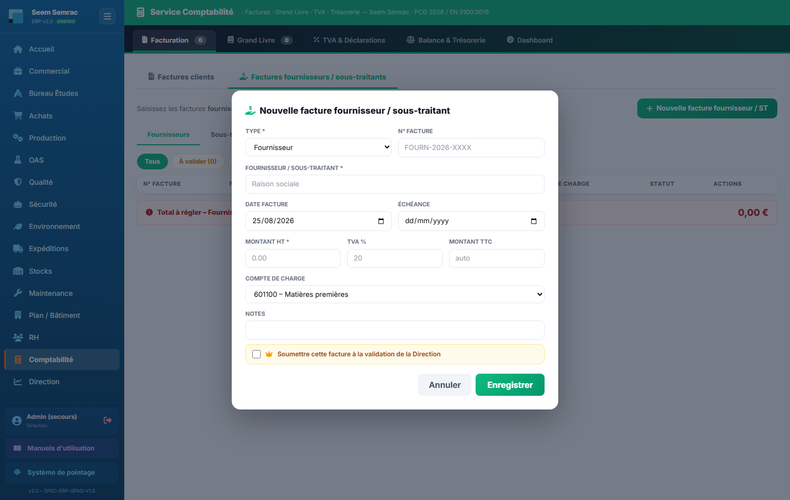

# 12 · Comptabilité — parcours guidé

> Comment ça marche **étape par étape** : ce qui arrive **avant**, ce que **vous remplissez ici** (et pourquoi), et **où ça part ensuite**. Écrit pour un nouvel utilisateur.

## En bref — le rôle du service dans la chaîne

La Comptabilité est le **point d'arrivée financier** de toute l'entreprise. Elle reçoit en entrée les livraisons et prestations réalisées par la Production et le Commercial (qu'il faut **facturer aux clients**), ainsi que les factures reçues des **fournisseurs et sous-traitants** (qu'il faut régler). À partir de ces éléments, le service produit les **factures clients**, enregistre les **factures fournisseurs**, et — sans saisie manuelle — alimente le **Grand Livre** : chaque facture génère automatiquement son écriture comptable. En sortie, la Comptabilité transmet à l'expert-comptable / Sage le fichier **FEC**, suit la **TVA**, la **trésorerie**, et fournit à la Direction les **coûts et marges**. Les temps pointés par les opérateurs remontent seuls ici pour nourrir le calcul des coûts de revient.

Voici l'écran d'accueil du service :

Les onglets suivent ce flux : **Facturation** (clients + fournisseurs), **Grand Livre** (écritures et export FEC), **TVA & Déclarations**, **Balance & Trésorerie**, et le **Dashboard** d'indicateurs.

## Étape 1 — Facturer un client

**⬅️ Avant :** Le Commercial a pris une commande, la Production l'a réalisée et livrée (BL émis). Il faut maintenant réclamer le paiement au client.
**📝 Ici, vous :** créez la facture à envoyer au client, dans l'onglet « Facturation » › « Factures clients » › bouton « Créer facture ».

Sur cet écran, vous renseignez :
- **Client** — le client à facturer, choisi dans la liste. C'est lui qui recevra la facture et devra la payer.
- **N° Affaire** — le numéro de la commande concernée, pour relier la facture au travail réalisé.
- **Date facture** et **Date d'échéance** — le jour d'émission et la date limite de paiement : c'est l'échéance qui déclenchera plus tard un impayé si le client ne règle pas.
- **Désignation / Prestations** — ce que vous facturez (prestations ou références livrées), tel qu'il apparaîtra sur le PDF.
- **Montant HT (€)** — le montant hors taxes. La **TVA 20 %** et le **TTC** se calculent tout seuls : n'y touchez pas.
- **Mode de paiement** et **Notes internes** — comment le client règle, et les remarques reprises sur le PDF.

**➡️ Ensuite :** la facture est enregistrée, un **PDF** est généré à envoyer au client, et une **écriture de vente (VTE)** part automatiquement dans le **Grand Livre**. L'échéance alimente le suivi de trésorerie et, si elle est dépassée, remonte comme impayé.

> 📋 Le détail de **chaque case** : [guide des formulaires](../formulaires/compta.md).

## Étape 2 — Enregistrer une facture fournisseur / sous-traitant

**⬅️ Avant :** Un fournisseur a livré de la matière ou un sous-traitant a réalisé une opération, et l'entreprise reçoit sa facture par courrier ou e-mail. Il faut la saisir pour la payer et l'imputer en comptabilité.
**📝 Ici, vous :** enregistrez cette facture reçue, dans l'onglet « Facturation » › « Factures fournisseurs / sous-traitants » › bouton « Nouvelle facture fournisseur / ST ».

Sur cet écran, vous renseignez :
- **Type** — précisez s'il s'agit d'un **Fournisseur** ou d'un **Sous-traitant** : ça oriente le suivi et l'imputation.
- **N° Facture** — le numéro imprimé sur la facture reçue, pour la retrouver et éviter les doublons.
- **Fournisseur / Sous-traitant** — la raison sociale de l'entreprise émettrice (obligatoire).
- **Date facture** et **Échéance** — la date d'émission et la date limite avant laquelle vous devez payer (l'échéance nourrit la trésorerie prévisionnelle).
- **Montant HT** — le hors taxes (obligatoire) ; le **TTC** se calcule seul à partir du HT et du **TVA %**.
- **Compte de charge** — range la dépense dans la bonne catégorie (matières, sous-traitance, énergie…), ce qui prépare l'écriture d'achat.
- **Soumettre cette facture à la validation de la Direction** — si vous cochez, la facture part en **validation Direction** avant d'être payée.

**➡️ Ensuite :** la facture est enregistrée comme dette à payer. Une **écriture d'achat (ACH)** est portée au Grand Livre, et si la case a été cochée, la Direction reçoit la demande de validation avant règlement.

> 📋 Le détail de **chaque case** : [guide des formulaires](../formulaires/compta.md).

## Étape 3 — Consulter le Grand Livre et exporter le FEC

**⬅️ Avant :** Les factures clients (VTE) et fournisseurs (ACH) ont été saisies aux étapes 1 et 2. Chacune a généré **automatiquement** son écriture comptable ; les livraisons (BL) aussi. Le Grand Livre est donc déjà rempli sans saisie manuelle.
**📝 Ici, vous :** recherchez, filtrez et **exportez** les écritures, dans l'onglet « Grand Livre ».

Sur cet écran, vous utilisez :
- **Rechercher compte / libellé** — tapez un numéro de compte ou un mot du libellé pour ne voir que les lignes voulues.
- **Boutons de journaux** (Tous, VTE, ACH, BQ, OD, SAL) — filtrent le tableau par type d'écriture.
- **Année d'exercice** — l'année dont vous voulez sortir les écritures, utilisée par l'export.
- **Export FEC (Sage)** — génère le **Fichier des Écritures Comptables** normalisé.

**➡️ Ensuite :** le fichier FEC part chez **l'expert-comptable / dans Sage** pour la clôture et les déclarations. L'export est réservé aux rôles comptable / direction.

> 📋 Le détail de **chaque case** : [guide des formulaires](../formulaires/compta.md).

## Étape 4 — Régler et affiner les taux horaires opérateurs

**⬅️ Avant :** Les salaires ou les charges sociales ont évolué, ou vous préparez un chiffrage fiable. Ces taux servent de socle à tous les calculs de coûts.
**📝 Ici, vous :** ajustez le taux brut et les charges de chaque opérateur, sur la page « Taux horaires opérateurs » (menu Finances & Coûts), directement dans le tableau, puis « Enregistrer ».

Sur cet écran, vous renseignez :
- **Taux brut (€/h)** — le salaire horaire de l'opérateur avant charges.
- **Charges (%)** — le pourcentage de charges sociales (généralement 45 %).

Le **Taux chargé**, le **Coût journée** et le **Coût annuel** se recalculent tout seuls.

**➡️ Ensuite :** ces taux alimentent directement le calcul du **coût de revient** (étape 5) et les marges vues par la Direction. Une erreur ici fausse tous les chiffrages : pensez à « Enregistrer ».

> 📋 Le détail de **chaque case** : [guide des formulaires](../formulaires/compta.md).

## Étape 5 — Simuler un coût de revient (aide au chiffrage)

**⬅️ Avant :** Le Bureau d'Études ou le Commercial doit chiffrer une pièce avant de faire une offre de prix. Les taux horaires (étape 4) sont à jour.
**📝 Ici, vous :** estimez le coût de revient et le prix de vente suggéré, depuis la page « Coûts de revient » (menu Finances & Coûts) › bouton « Simuler CR ».

Sur cet écran, vous renseignez :
- **Activité** (Seem / Semrac) et **Référence pièce** — le contexte de la pièce simulée.
- **Quantité** — le nombre de pièces de la commande (100 par défaut).
- **Opération / Temps (min) / Taux MO / Coût machine / Matière** — une ligne de gamme par étape de fabrication ; cliquez « Ajouter une opération » pour en ajouter.
- **Frais généraux (%)** et **Coefficient de vente** — les frais ajoutés et le multiplicateur qui transforme le coût en prix de vente.

**➡️ Ensuite :** « Calculer CR » affiche le coût de revient et le prix de vente suggéré, qui servent à préparer l'**offre de prix** côté Commercial. C'est une simulation : **rien n'est enregistré** en base.

> 📋 Le détail de **chaque case** : [guide des formulaires](../formulaires/compta.md).

## Étape 6 — Consulter les imputations des temps

**⬅️ Avant :** Les opérateurs ont soldé leurs bons de travail (BDT) en Production. Les temps pointés remontent **automatiquement** ici.
**📝 Ici, vous :** consultez les temps imputés d'une journée, sur la page « Imputations des temps » (menu Finances & Coûts).

Sur cet écran, vous utilisez :
- **Date** — la journée à afficher (aujourd'hui par défaut).
- **Valider tout** — valide les pointages de la journée affichée.
- **Exporter** — génère un fichier des imputations (base de la paie et des coûts réels).

**➡️ Ensuite :** les temps validés alimentent les **coûts réels** par affaire et l'export vers la paie (Silae). Cette page ne saisit rien : elle ne fait que consulter, valider et exporter ce que la Production a pointé.

> 📋 Le détail de **chaque case** : [guide des formulaires](../formulaires/compta.md).
