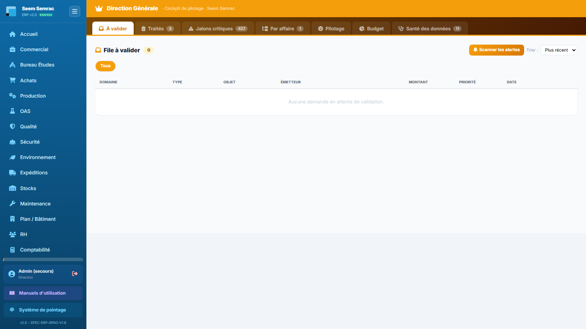

# 13 · Direction — parcours guidé

> Comment ça marche **étape par étape** : ce qui arrive **avant**, ce que **vous remplissez ici** (et pourquoi), et **où ça part ensuite**. Écrit pour un nouvel utilisateur.

## En bref — le rôle du service dans la chaîne

Le service **Direction** est le **cockpit de pilotage** de l'ERP : il ne fabrique rien lui-même, il **arbitre** et **surveille**. Les informations arrivent des autres services — une dépense proposée par les Achats, une facture à payer côté Compta, un congé demandé au RH, une non-conformité bloquante côté Qualité — et remontent ici dès qu'elles ont besoin de l'accord de la Direction. Le service produit des **décisions** (valider / refuser) et une **vision d'ensemble** (jalons critiques, KPIs, budget, santé des données). Une fois la décision prise, elle **repart** vers le service concerné : un paiement autorisé, un congé posé au planning, une demande débloquée ou classée.

La plupart des écrans sont des **tableaux de chiffres** que vous consultez sans rien saisir. Les seuls moments où vous agissez sont réunis ci-dessous, dans l'onglet **« À valider »**.

## Étape 1 — Scanner les alertes (alimenter la file)

**⬅️ Avant :** partout dans l'ERP, des situations à risque apparaissent — commandes en retard, factures impayées, non-conformités bloquantes, stocks critiques, marges trop faibles. Personne ne les a encore remontées à la Direction.

**📝 Ici, vous :** cliquez sur **« Scanner les alertes »** (en haut à droite de l'onglet « À valider ») pour que l'outil détecte tout seul ces problèmes et les ajoute à la file.

Sur cet écran, vous renseignez :
- **Scanner les alertes** — un simple bouton, aucune saisie. Le clic lance la détection ; à la fin, un message vous dit combien d'alertes ont été ajoutées.

**➡️ Ensuite :** les problèmes détectés deviennent des **lignes dans la file « À valider »** (juste en dessous). Les alertes déjà présentes ne sont pas ajoutées en double, donc vous pouvez relancer le scan aussi souvent que vous voulez. C'est le point de départ du travail d'arbitrage.

> 📋 Le détail de **chaque case** : [guide des formulaires](../formulaires/direction.md).

## Étape 2 — Trier et filtrer la file à valider

**⬅️ Avant :** la file « À valider » contient maintenant des demandes venues de plusieurs services, mélangées et dans le désordre.

**📝 Ici, vous :** réorganisez la liste pour traiter d'abord ce qui compte, avant de décider.

Sur cet écran, vous renseignez :
- **Trier** — liste déroulante en haut à droite du bloc. « Plus récent » met les demandes les plus fraîches en haut ; « Montant ↓ » remonte les plus grosses dépenses. Utile pour arbitrer d'abord les gros enjeux.
- **Service** — la rangée de pastilles (Tous, Compta, RH, Qualité, Sécurité, Achats, Commercial) au-dessus du tableau. Cliquez une pastille pour ne voir que les demandes de ce service ; « Tous » réaffiche l'ensemble. Seuls les services ayant au moins une demande en attente apparaissent.

**➡️ Ensuite :** rien n'est enregistré à cette étape — vous ne faites qu'organiser l'affichage. Vous êtes prêt à prendre les décisions de l'étape suivante, ligne par ligne.

> 📋 Le détail de **chaque case** : [guide des formulaires](../formulaires/direction.md).

## Étape 3 — Décider sur une demande à valider

**⬅️ Avant :** une demande attend l'accord de la Direction — une dépense, une décision d'un service. Elle est dans la file, triée et filtrée comme vous le souhaitez.

**📝 Ici, vous :** tranchez chaque ligne du tableau « File à valider » à l'aide des deux boutons de la colonne de droite.

Sur cet écran, vous renseignez :
- **Décision** — bouton **vert (coche)** pour valider, bouton **rouge (croix)** pour refuser. Valider ne demande aucune autre saisie.
- **Motif du refus** — une petite fenêtre s'ouvre **seulement si vous refusez** : écrivez pourquoi. Ce motif sert de trace au service concerné, il est **obligatoire** pour refuser (si vous le laissez vide ou annulez la fenêtre, le refus n'est pas enregistré).

**➡️ Ensuite :** la décision repart aussitôt vers le **service d'origine** : la demande validée est débloquée et suit son cours, la demande refusée revient au service avec votre motif. La ligne quitte la file.

> 📋 Le détail de **chaque case** : [guide des formulaires](../formulaires/direction.md).

## Étape 4 — Autoriser un paiement de facture

**⬅️ Avant :** la Compta a enregistré une facture fournisseur ou client, et son paiement attend le feu vert de la Direction. Elle apparaît dans le bloc « Paiements de factures » de l'onglet « À valider ».

**📝 Ici, vous :** autorisez ou refusez le paiement, sur chaque carte du bloc.

Sur cet écran, vous renseignez :
- **Décision** — bouton **« Valider »** pour autoriser le paiement, **croix rouge** pour le refuser. Aucune autre saisie n'est demandée.

**➡️ Ensuite :** la décision est enregistrée **immédiatement au clic**, sans écran de confirmation. Un paiement validé est autorisé côté Compta et peut être réglé ; un refus le bloque.

> 📋 Le détail de **chaque case** : [guide des formulaires](../formulaires/direction.md).

## Étape 5 — Décider sur un congé (fonctions support)

**⬅️ Avant :** un salarié des fonctions support a déposé une demande de congé au RH ; elle remonte à la Direction dans le bloc « Congés fonctions support » de l'onglet « À valider ».

**📝 Ici, vous :** accordez ou refusez le congé sur chaque carte.

Sur cet écran, vous renseignez :
- **Décision** — bouton **« Valider »** pour accorder le congé, **croix rouge** pour le refuser.

**➡️ Ensuite :** quand vous validez, les **jours de congé sont posés automatiquement au planning** (un message vous indique combien) — le RH et le planning prennent le relais. Un refus renvoie la demande au salarié.

> 📋 Le détail de **chaque case** : [guide des formulaires](../formulaires/direction.md).

## Étape 6 — Surveiller (jalons, pilotage, budget, santé des données)

**⬅️ Avant :** les décisions sont prises. Il reste à garder l'œil sur la marche générale de l'entreprise.

**📝 Ici, vous :** parcourez les onglets de **suivi** — il n'y a rien à remplir, seulement à lire et à réagir.

Sur ces écrans, vous consultez :
- **Jalons critiques** — retards de commandes, impayés, NC bloquantes, ruptures de stock. Ce qui exige votre attention en priorité.
- **Par affaire** — la vue 360° d'une affaire (avancement, coût, marge, documents liés).
- **Pilotage** — les KPIs de l'entreprise, comparés à leurs cibles (`kpi_objectifs`).
- **Budget** — le suivi budgétaire.
- **Santé des données** — un score de complétude (DICT) qui signale les informations manquantes à corriger.

**➡️ Ensuite :** ces écrans ne créent aucun document. Ce que vous y repérez vous ramène en général à l'onglet **« À valider »** (via le bouton « Scanner les alertes » de l'étape 1) pour matérialiser une décision, ou vers le service concerné pour corriger.

> 📋 Le détail de **chaque case** : [guide des formulaires](../formulaires/direction.md).
