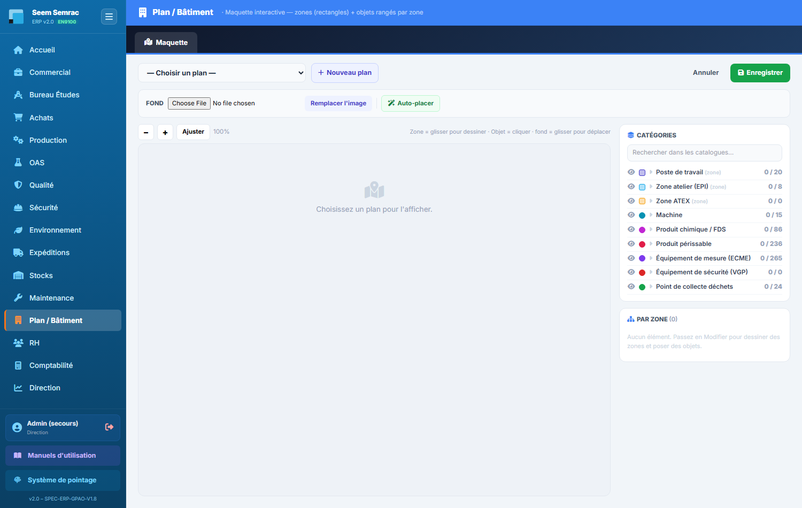
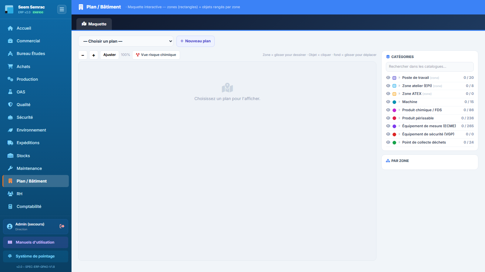

# 14 · Plan / Bâtiment — parcours guidé

> Comment ça marche **étape par étape** : ce qui arrive **avant**, ce que **vous remplissez ici** (et pourquoi), et **où ça part ensuite**. Écrit pour un nouvel utilisateur.

## En bref — le rôle du service dans la chaîne
Le service « Plan / Bâtiment » est la **maquette « BIM » de l'usine** : une vue interactive où l'on pose, sur le plan réel du site, des **zones** (rectangles : atelier, bureau, stock, zone ATEX…) et des **objets** (machines, produits périssables, produits chimiques, extincteurs…). Chaque repère peut être **relié à une fiche existante de l'ERP** (une machine, une zone ATEX du module Sécurité, un produit chimique, une vérification VGP…). En entrée, le service part d'une simple image du plan (PNG/JPG) et des fiches déjà créées dans les autres modules (Machines, Sécurité, Chimie, Périssables). En sortie, il produit une carte vivante du bâtiment : les repères se **colorent selon leur état** (une machine en panne apparaît en rouge) et servent de **points d'entrée** (deep-links) vers les fiches des modules concernés. C'est donc un outil de visualisation et de navigation transverse, pas un module de saisie de données métier.

## Étape 1 — Créer un nouveau plan
**⬅️ Avant :** Vous avez sous la main l'image du plan réel du bâtiment ou de l'atelier à cartographier (fournie par le BE ou la maintenance). Rien n'existe encore dans le service.
**📝 Ici, vous :** créez la « toile » qui portera vos zones et vos objets, en lui donnant un nom.

Sur cet écran, vous renseignez :
- **Nom du plan** — le nom qui identifiera ce plan dans la liste (choisissez-le clair, par exemple « Atelier SEEM — rez-de-chaussée »). C'est le seul champ, et il est obligatoire : sans nom, rien n'est créé.

**➡️ Ensuite :** le plan est créé et **automatiquement sélectionné**. Il est vide pour l'instant : passez en mode « Modifier » pour charger son image de fond, puis dessiner les zones.

> 📋 Le détail de **chaque case** : [guide des formulaires](../formulaires/plans.md).

## Étape 2 — Charger l'image de fond
**⬅️ Avant :** Le plan est créé et sélectionné. Vous avez cliqué sur « Modifier » : la barre grise « Fond » est apparue.
**📝 Ici, vous :** déposez sous la maquette l'image du plan réel, pour que zones et objets se positionnent sur un fond concret.

Sur cet écran, vous renseignez :
- **Fond (choisir un fichier)** — l'image du plan à afficher, aux formats PNG, JPG, JPEG, WEBP, GIF ou SVG. Ce doit être une **image, jamais un PDF**. Après avoir choisi le fichier, cliquez « Remplacer l'image » pour lancer l'envoi (sinon rien ne se passe).

**➡️ Ensuite :** l'image s'affiche derrière la maquette. Vous pouvez alors dessiner des zones et poser des objets par-dessus, en vous repérant sur le plan réel. La même action sert plus tard à remplacer un fond devenu obsolète.

> 📋 Le détail de **chaque case** : [guide des formulaires](../formulaires/plans.md).

## Étape 3 — Renseigner une zone ou un objet (fiche d'un élément)
**⬅️ Avant :** Le fond est chargé et vous êtes en mode « Modifier ». Vous venez de dessiner une zone (rectangle), de poser un objet dedans, ou vous avez cliqué sur un repère existant : le panneau « Élément » s'est ouvert à droite.
**📝 Ici, vous :** décrivez le repère — son type, son nom, sa couleur — et surtout vous le **reliez à une vraie fiche de l'ERP** pour qu'il devienne vivant.

Sur cet écran, vous renseignez :
- **Catégorie** — le type du repère. Les cinq premières catégories et « Zone ATEX » sont des **zones** (rectangles) ; les autres (**Poste de travail**, Produit périssable, Chimie/FDS, Sécurité…) sont des **objets** (points) posés dans une zone. Ce choix conditionne tout le reste. 💡 **Poste** : en **passant la souris sur l'icône** d'un poste, une bulle affiche ses **process contenus**, ses **machines**, son **taux horaire (€/h)** et son **OPEX théorique (€/an)** — les stats principales du poste d'un coup d'œil.
- **Élément lié (base)** — le cœur du service : relie le repère à une fiche réelle de l'ERP (une machine, une zone ATEX, un produit chimique, une vérification…). Tapez pour rechercher puis **choisissez bien dans la liste** proposée ; la liste dépend de la catégorie. C'est ce lien qui fait remonter l'état live (panne = rouge) et le deep-link vers le module concerné.
- **Libellé** — le nom affiché sur le repère ; s'il est vide et qu'un élément est relié, le nom de la fiche est repris automatiquement.
- **Couleur** — la couleur du repère sur le plan (une couleur par défaut est proposée selon la catégorie).
- **Zone** (pour un objet, information affichée) — indique automatiquement dans quel rectangle l'objet se trouve ; pour la changer, déplacez le repère dans une autre zone.
- **Notes** — un commentaire libre (précision, remarque).

**➡️ Ensuite :** cliquez « Appliquer », puis le bouton vert « Enregistrer » en haut pour sauvegarder la maquette. **« Appliquer » seul n'enregistre pas.** Une fois enregistré, le repère apparaît sur le plan, coloré selon son état, et permet de rebondir vers la fiche du module lié.

> 📋 Le détail de **chaque case** : [guide des formulaires](../formulaires/plans.md).

## Étape 4 — Créer une zone ATEX depuis le plan
**⬅️ Avant :** Dans la fiche d'un élément de catégorie « Zone ATEX », vous cherchez une zone à relier mais elle **n'existe pas encore** dans le module Sécurité. Vous cliquez « Créer dans l'ERP (Sécurité) » : un encadré de saisie apparaît.
**📝 Ici, vous :** créez la zone à risque d'explosion directement depuis le plan, sans quitter l'écran, pour la relier aussitôt au repère.

Sur cet écran, vous renseignez :
- **Nom de la zone ATEX** — le nom de la zone à risque d'explosion (obligatoire ; sans lui, la création est refusée).
- **Type de zone (0/1/2/20/21/22)** — le classement réglementaire : 0/1/2 pour les gaz, 20/21/22 pour les poussières.
- **Localisation** — où se situe la zone dans le bâtiment.

**➡️ Ensuite :** la zone est **enregistrée dans le module Sécurité** et automatiquement reliée au repère. Pensez ensuite à « Enregistrer » le plan pour figer la maquette.

> 📋 Le détail de **chaque case** : [guide des formulaires](../formulaires/plans.md).

## Étape 5 — Créer une vérification (VGP / sécurité) depuis le plan
**⬅️ Avant :** Dans la fiche d'un élément de catégorie « Sécurité (extincteur…) », l'équipement à contrôler n'a pas encore de vérification enregistrée. Vous cliquez « Créer dans l'ERP (Sécurité) » : un encadré de saisie apparaît.
**📝 Ici, vous :** créez la vérification périodique (extincteur, levage, appareil sous pression…) depuis le plan, pour la relier au repère « Sécurité ».

Sur cet écran, vous renseignez :
- **Équipement** — le nom de l'équipement à vérifier, par exemple « Extincteur hall A » (obligatoire ; sans lui, la création est refusée).
- **Type de vérification** — la nature du contrôle périodique (Incendie/extincteur, Levage, Électrique, ESP sous pression, Portes/portails, Racks, Ventilation, ATEX).
- **Organisme de contrôle** — le nom de l'organisme qui réalise la vérification (ex. APAVE).

**➡️ Ensuite :** la vérification **apparaît dans le module Sécurité** et est reliée au repère. Enregistrez ensuite le plan. Le repère devient un point d'entrée vers le suivi des VGP de cet équipement.

> 📋 Le détail de **chaque case** : [guide des formulaires](../formulaires/plans.md).
