# Production

**Pour qui :** Programmation / opérateurs

Planification et suivi de la fabrication : planning Gantt des BDT (bons de travail) et BDS (sous-traitance), présence des opérateurs, lots.

En haut à droite du bandeau, deux boutons ouverts depuis **n'importe quel onglet** : **« Demande d'achat »** et **« PV de non-conformité »** (rouge). Ils sont réservés aux personnes qui ont l'**écriture sur la Production** et se signent avec le **matricule + code PIN** (voir les procédures ci-dessous).

## Les onglets
- **Planning Gantt BDT** — **Le seul planning de l'atelier.** Files « BDT à classer » et « BST à planifier » **au-dessus** du Gantt, puis un Gantt par poste, puis le bloc « Affectation des ressources aux postes » (opérateurs du jour par créneau). BDT/BDS prioritaires encadrés rouge. Bouton « Agrandir le planning ».
- **Planning Gantt BST** — Planning de la sous-traitance (vue de 21 jours). Chaque carte « BST à planifier » indique « **Dispo le …** » quand l'étape précédente du lot fixe un jour au plus tôt.
- **Présence opérateurs** — Programmation des présences sur **4 créneaux** (Matin · Journée · Après-midi · Soirée) ou absent, par un **menu** au clic sur la case, et congés des opérateurs. Les **horaires** de chaque créneau suivent la **cadence usine** du site et du jour ; un créneau fermé ce jour-là est grisé et refusé. Pilote qui est affectable dans le planning.
- **Commandes & Lots** — Vue des commandes à faire, découpées en lots et BDT. Le lot d'une **pièce mère** est suivi de ses **sous-lots** en retrait (un par composant, dans l'ordre de fabrication), eux-mêmes suivis de leurs sous-sous-lots (voir « Fabriquer une pièce mère » plus bas).
- **Process Ateliers** — Référentiel des postes, machines et process. **Seul le process machine porte un coût horaire** (« Taux horaire machine »), saisi à la main ; machines et postes n'en ont plus. 3ᵉ volet **« Cadence usine »** : cadence de chaque site (Bas / Moyen / Haut) et modèles d'horaires de l'usine.
- **Dashboards** — Programmation et production.

> Il n'y a **plus de page « Affectation » séparée** ni de sous-navigation « Programmation | Affectation » : tout se fait sur le planning unique.

## Procédures
### Affecter et solder un BDT
1. Ouvrir **/production/service** (onglet **Planning Gantt BDT**) — c'est le seul planning.
2. Dans « **BDT à classer** » (au-dessus du planning), **glisser** une carte sur le poste voulu, ou sur une sous-case **Matin / Journée / Après-midi / Soirée** pour affecter l'opérateur du créneau. Le **chemin critique** s'applique à la pose (voir ci-dessous).
3. Quand l'opération démarre : **double-clic** sur la barre (ou clic droit → **Reçu**) → matricule + code PIN. Peuvent recevoir : un **opérateur**, ou une personne qui **écrit en Production** (chef d'atelier) — celle qui reçoit devient la personne qui réalise le bon (« Reçu par »), et c'est son coût horaire qui compte.
4. À la fin : clic droit → **Solder le BDT** → heure de fin réelle, résultat, observations, puis **matricule + code PIN**. La fenêtre rappelle **« Reçu par »** et dit qui peut solder : **l'opérateur qui a reçu ce BDT**, ou **une personne habilitée à écrire en Production** (qui peut solder le bon reçu par un autre). Tout autre matricule est refusé avec ce message. Le bouton « Solder » se grise pendant l'envoi (un seul clic suffit) ; en cas de refus, le PIN est effacé et le message du serveur s'affiche tel quel. Un résultat « Non-conformité » crée une NC pour la Qualité.

> **La matrice de compétences ne bloque plus le soldage** (15/09/2026). Elle refusait tout le monde (« n'est pas habilité(e) à solder … (matrice de compétences) ») : la matrice RH enregistre l'identifiant du process, le contrôle le comparait au nom de l'opération. Désormais, si l'opérateur qui a reçu le bon n'a pas de niveau pour ce process, le soldage est **enregistré** et une notification orange invite à mettre la matrice à jour (RH › Compétences).

### Faire une demande d'achat depuis la Production
Réservé aux personnes qui ont l'**écriture sur la Production**. La demande part aux **Achats** (onglet Demandes d'achat), au nom de la personne qui signe.
1. Bandeau du service → **« Demande d'achat »** : le **formulaire complet** s'ouvre tout de suite (le curseur est sur le matricule).
2. **Qui fait la demande ?** : matricule + code PIN.
3. **Nature de l'achat** : Matière · Accessoire · **Machine (OPEX)** — pour « Machine », choisir la **machine concernée** : le prix ira sur l'OPEX de cette machine à la réception, et le poste se remplit tout seul.
4. **Article / désignation** (obligatoire), **Référence**, **Quantité** (obligatoire, virgule acceptée) et **Unité**, puis au besoin **Affaire**, **Poste concerné**, **Priorité**, **Livraison souhaitée** (pas dans le passé) et **Fournisseur suggéré**.
5. **« Envoyer aux Achats »** → « Demande d'achat DA-2026-012 envoyée aux Achats. ». Une erreur s'affiche **dans la fenêtre**, le champ en cause en rouge (PIN incorrect : le PIN est effacé ; matricule sans écriture Production : « Seules les personnes habilitées à écrire en Production peuvent faire une demande d'achat depuis la Production. »).

> Changement du 15/09/2026 : il n'y a plus d'étape « Identifier » ni de limite « poste de l'affectation du jour » (qui refusait tout le monde quand le planning du jour n'était pas saisi). En contrepartie, un **opérateur sans écriture Production** ne peut plus faire de demande d'achat : il la fait saisir par son chef d'atelier.

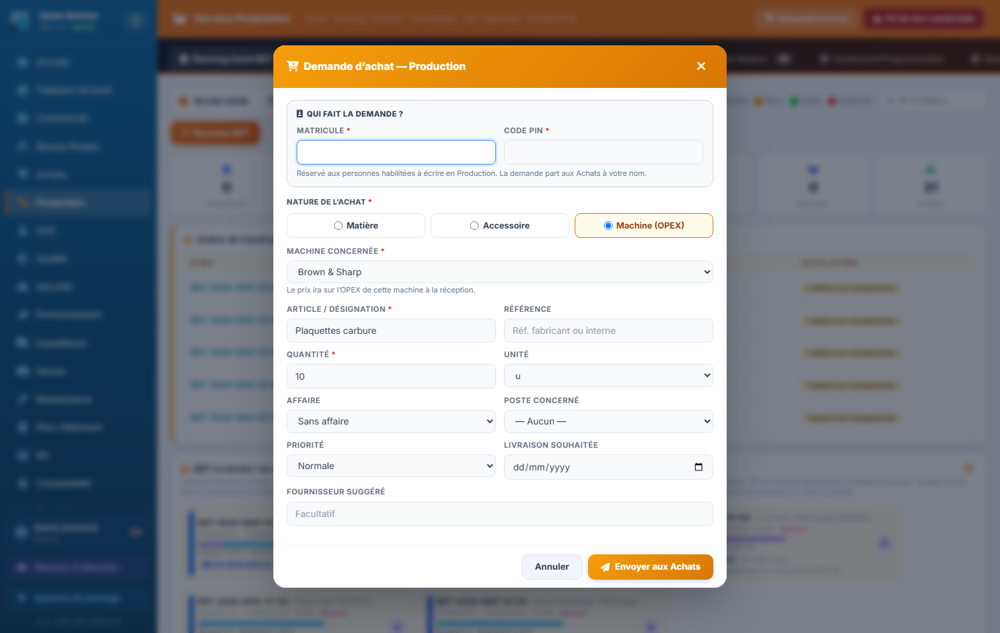

### Émettre un PV de non-conformité depuis la Production
Réservé aux personnes qui ont l'**écriture sur la Production**. La NC arrive dans **Qualité › Non-Conformités** (catégorie « Production », statut « Ouvert »), à votre nom, avec un numéro **NC-2026-…**. Le rattachement à une affaire est **facultatif**.
1. Bandeau du service → **« PV de non-conformité »** (bouton rouge, juste à côté de « Demande d'achat »).
2. **Qui émet le PV ?** : matricule + code PIN.
3. **Constat** : date du constat (aujourd'hui par défaut, jamais dans le futur), type de NC (Interne / Client / Fournisseur), **entité** (Seem / Semrac, obligatoire), gravité (Majeure par défaut). Une gravité **Critique** ou **Bloquante** rattachée à une affaire **bloque l'expédition** de cette affaire tant que la Qualité n'a pas clos la NC.
4. **Rattachement (facultatif)** : affaire, puis lot et BDT (listes filtrées par l'affaire ; choisir un BDT complète le lot et le code pièce), code article / pièce, désignation, quantité concernée (pièces), poste de détection. L'ERP vérifie que le lot et le BDT appartiennent bien à l'affaire.
5. **Défaut** : nature de la NC, imputation (service responsable), **description du défaut** (obligatoire), nature de la cause, cause présumée, action immédiate, traitement proposé — mêmes listes que le formulaire de la Qualité.
6. Case **« Mettre en quarantaine »** au besoin (il faut désigner un lot, un BDT, un code article ou une désignation) : le lot est isolé et son expédition bloquée jusqu'à la décision de la Qualité.
7. **« Émettre le PV »** → « PV de non-conformité NC-2026-… émis : il est dans la liste des NC de la Qualité ». Action immédiate « Rebut » : le rebut est aussi inscrit au registre des déchets (Sécurité).

### Régler la cadence usine (horaires de l'usine)
Les horaires de l'usine dépendent de la **cadence** de chaque site — **Bas**, **Moyen** ou **Haut** —, modifiable **à tout moment**. Elle pilote la présence, le planning et RH › Gestion des temps. Le **dimanche est toujours fermé** ; le samedi suit la cadence. Écriture réservée à l'**écriture Production**.
1. Onglet **Process Ateliers** → bouton **« Cadence usine »**. Une carte par site : cadence en vigueur, depuis quand et par qui, motif, **semaine type**, et « **Changement prévu** » pour une cadence à venir.
2. **Changer la cadence** d'un site : bouton **« Changer la cadence »** → **À partir du** (demain par défaut) → niveau (celui en vigueur à cette date est grisé ; l'aperçu de la semaine type s'affiche) → motif facultatif → **« Passer Seem en cadence Haut à partir du … »**. Une date d'effet **aujourd'hui ou passée** affiche un avertissement puis demande une confirmation : toute la journée passe dans la nouvelle cadence, heures déjà travaillées comprises.
3. **Modifier un modèle d'horaires** : pastille du niveau → changer les heures d'une case (HH:MM) ou cliquer la **croix** pour fermer le créneau ce jour-là (« +1j » = finit le lendemain) → **Enregistrer** (seules les cases surlignées partent ; « Annuler les modifications » les abandonne). Refusé : heure mal écrite, début = fin, plus de 16 h, dimanche ouvert, créneau du samedi qui finit le lendemain, Journée incohérente.
4. **Historique** en bas : À partir du · Décidé le · Site · Cadence · Par · Motif.

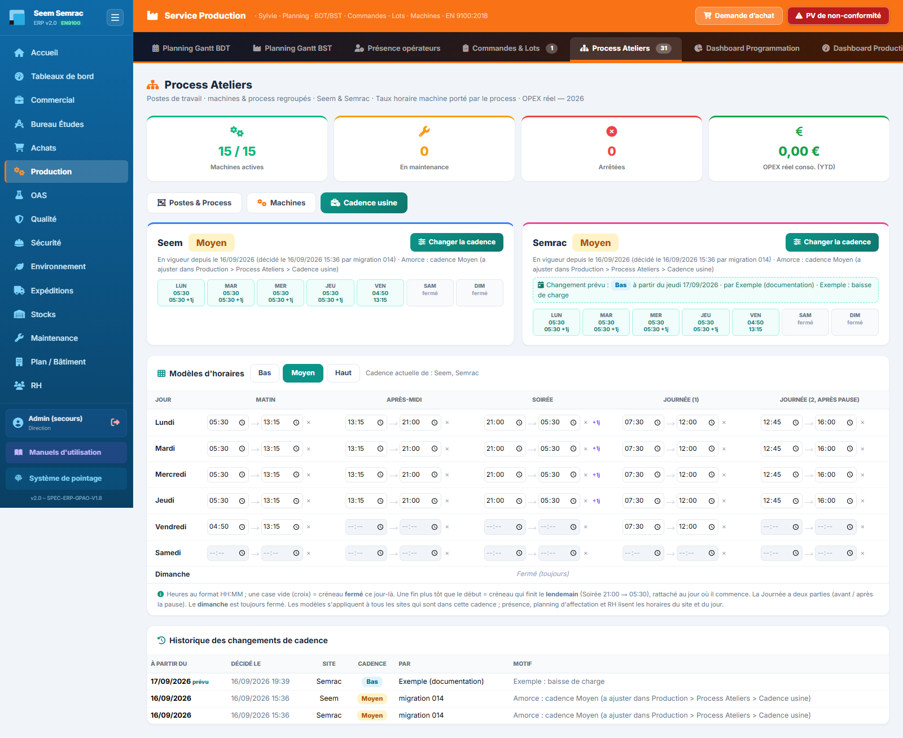
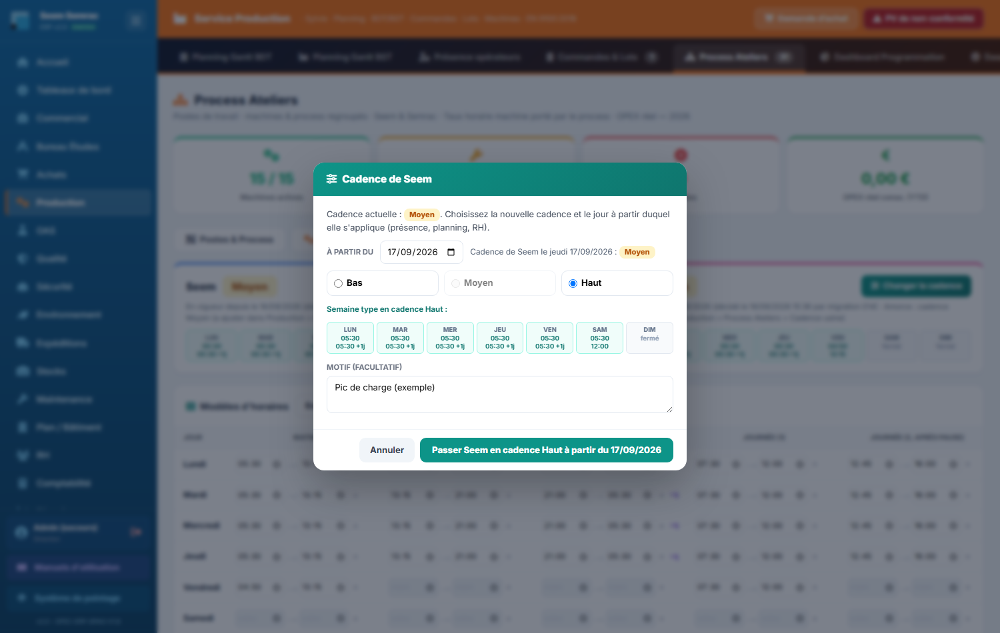

> **Modèles de départ** (16/09/2026). **Bas** : lun → mer Matin 05:30-13:15, Après-midi 13:15-21:00, Soirée 21:00-05:30, Journée 07:30-12:00 + 12:45-16:00 ; jeu Matin 04:30-13:15, Journée 07:30-12:30 ; ven, sam, dim fermés. **Moyen** : lun → jeu comme Bas ; ven Matin 04:50-13:15, Journée 07:30-12:00 ; sam, dim fermés. **Haut** : lun → ven trois équipes + Journée 07:30-12:00 + 12:45-16:45 ; sam Matin 05:30-12:00 ; dim fermé. ⚠ Haut jeudi et vendredi : Après-midi et Soirée reprennent les horaires du lundi (à vérifier). Les deux sites démarrent en **Moyen**. Les modèles ne sont pas historisés : les modifier change aussi les heures recalculées pour le passé.

### Programmer la présence des opérateurs
1. Onglet **Présence opérateurs** → **Planning de présence** (grille opérateurs × 7 jours, ‹ › pour changer de semaine).
2. **Cliquer une case** : un menu s'ouvre — **Matin · Journée · Après-midi · Soirée · Absent · Effacer** (le créneau en place est coché), chaque créneau avec **ses horaires du jour** pour le site de l'opérateur (cadence usine). Un créneau **fermé** ce jour-là est grisé « fermé · cadence Moyen » et ne se choisit pas ; s'il est forcé, le serveur refuse : « Créneau « Matin » fermé en cadence Moyen ce jour (samedi 19/09/2026, site Seem) : … ». Un choix = **un seul** enregistrement. S'il échoue, la case revient à la dernière valeur enregistrée et un message rouge donne la raison. **Effacer** vide vraiment la case (« Non programmé »). Au clavier : Entrée ouvre le menu, flèches pour choisir, Échap pour refermer.
3. **Semaine entière** : « **Programmer la semaine** » → créneau (ou Effacer), jours, opérateurs cochés → « Appliquer à la semaine ». Les jours où ce créneau est fermé sont **sautés** (« N cases non programmées : créneau fermé ce jour-là… »). Le message final compte les cases enregistrées **et les échecs**.
4. Une semaine **jamais lue** a ses cases **verrouillées** (« … » pendant la lecture, « ? » + bouton « Réessayer » si elle a échoué) : on ne peut pas écraser une présence qu'on ne voit pas. Les absences RH (cadenas) ne se modifient pas ici.
5. **Congés des opérateurs** : vue « Demandes de congés à traiter » → **Approuver** (pose les absences, renvoie au pool les BDT de la période, décompte le solde) ou ✕. Réservé aux congés d'**opérateurs** ; **personne ne valide son propre congé** ; un congé déjà traité est refusé. Si un effet n'a pas pu se faire, un message orange le dit.

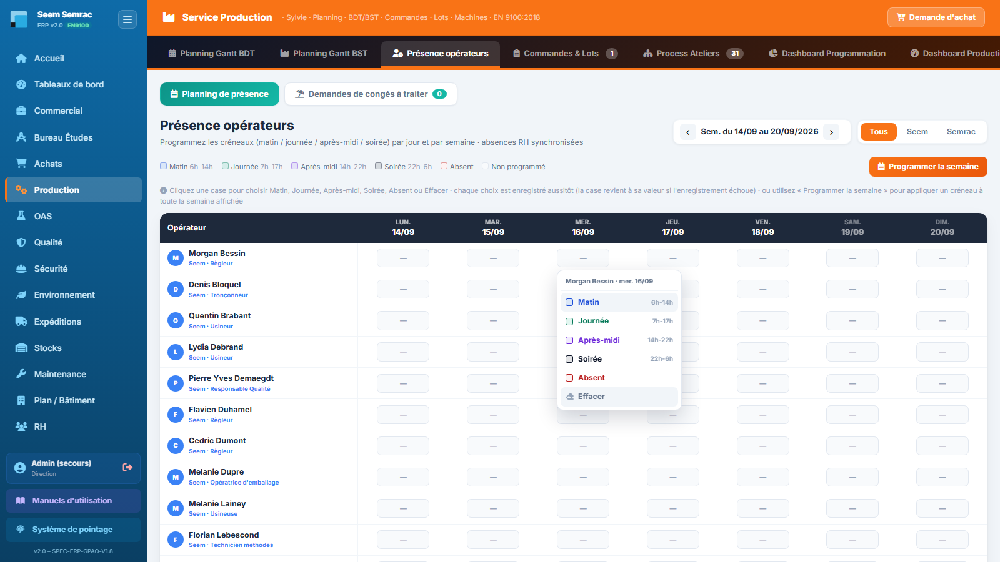
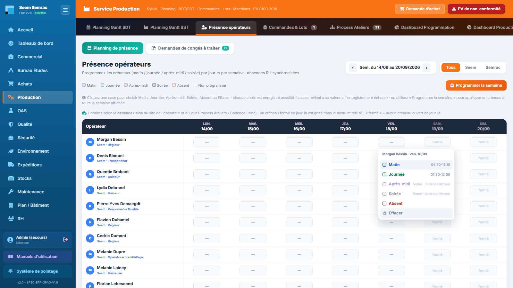

> Une case **« fermé »** = aucun créneau ouvert ce jour-là (dimanche, samedi hors Haut…). Une case en **pointillés rouges** porte un créneau enregistré avant un changement de cadence qui l'a fermé : à corriger à la main.

### Fabriquer une pièce mère : lot, sous-lots et sous-sous-lots
Une **pièce mère** (assemblage) est décrite au BE par une nomenclature mère dont les composants sont rangés **dans l'ordre de fabrication, du haut vers le bas**. À l'acceptation de l'offre, l'ERP crée :
- le **lot de la mère** (`LOT-2026-0001-01`), qui porte les étapes propres de la mère (l'assemblage) ;
- **un sous-lot par composant**, dans cet ordre : `LOT-2026-0001-01.01` (1ᵉʳ composant), `LOT-2026-0001-01.02` (2ᵉ)… — quantité = quantité du composant × quantité du lot (arrondie à l'unité supérieure) ;
- si un composant est lui-même une mère, **ses** composants deviennent des **sous-sous-lots** (`LOT-2026-0001-01.02.01`…), jusqu'à 5 niveaux ;
- pour chaque sous-lot : ses **BDT / BDS** (`BDT-2026-0001-01.02-01`…), sa **préparation technique** et ses **besoins matière / accessoires** (les demandes d'achat de toute la pièce sont regroupées par référence).

**Programmer** : un sous-lot se programme **comme n'importe quel lot**, dès que la **matière de l'affaire est en stock** (contrôlée et rangée) — pas d'autre condition. Dans la goulotte « BDT à classer », les cartes d'une pièce mère arrivent **dans l'ordre de fabrication** : les sous-lots d'abord, du haut vers le bas, puis l'assemblage de la mère ; chaque carte de sous-lot porte la pastille **« Sous-lot 01.02 »** (ou « Sous-sous-lot 01.02.01 »).

**Vigilance, jamais blocage** : tant qu'un sous-lot n'est pas terminé, les BDT d'assemblage de la mère portent le badge orange **« Sous-lots en cours »** (carte et barre du planning) et apparaissent dans « programmables mais pas encore lançables » avec « sous-lots non terminés (1/2) : LOT-…-01.02 ». Vous pouvez **programmer** l'assemblage ; il se **réalise** une fois les sous-ensembles fabriqués.

**Suivre** : onglet **Commandes & Lots › Lots** — la mère, puis ses sous-lots en retrait (pastille « n° rang », badge « n sous-lots ») ; l'avancement d'une mère couvre **toute l'arborescence** (« avec ses sous-lots · assemblage seul x % »). La fiche d'une **commande** présente ses lots dans l'ordre de fabrication, lu de haut en bas (01.01 → 01.02.01 → 01.02 → 01). La **fiche du lot** de la mère montre la section **« Sous-lots (ordre de fabrication) »**, une 2ᵉ barre « Avancement de l'arbre » et le bandeau de vigilance ; celle d'un sous-lot rappelle « Sous-lot n° 2 de LOT-… ». L'**OF imprimé** de la mère liste les « Sous-ensembles à assembler » (rang, sous-lot, pièce, quantité, état, visa) avant ses étapes.

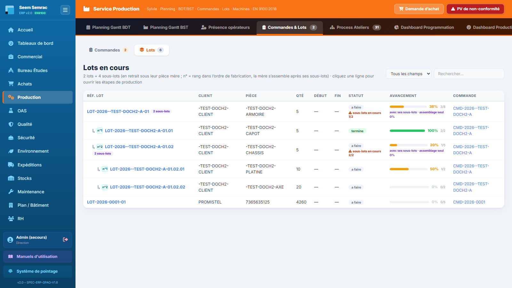
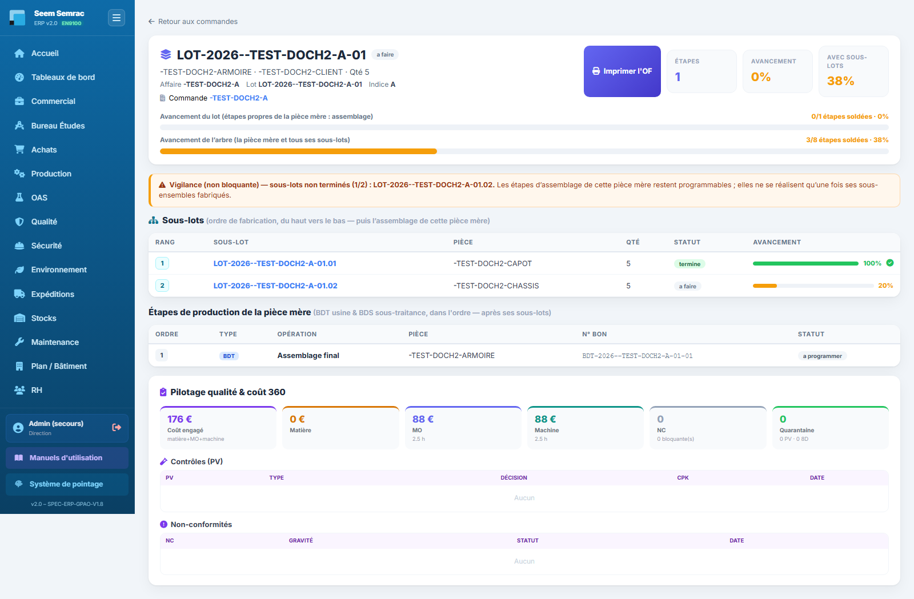

> Un sous-lot est un **sous-ensemble interne** : il ne se libère pas et ne s'expédie pas seul. La Qualité libère — et les Expéditions livrent — le **lot de la mère**, une fois **tout son arbre** terminé.

### Créer les sous-lots d'une affaire lancée avant le 18/09/2026
Les pièces mères lancées **avant** la gestion des sous-lots n'ont qu'un lot (celui de la mère). Sur la fiche de ce lot, un bandeau jaune le signale :
1. Ouvrir la fiche du lot de la mère (Commandes & Lots › Lots → clic sur la ligne).
2. Bandeau « Pièce mère : N composant(s) sur N sans sous-lot… » → **« Créer les sous-lots »**.
3. Une fenêtre liste le plan **dans l'ordre de fabrication** (« n°2 · LOT-…-01.02 — pièce × quantité (à créer) » ou « … (existe) ») → **« Créer les sous-lots »**.
4. L'ERP crée les sous-lots, leurs BDT/BDS, les préparations techniques et les demandes d'achat manquantes (repérées `-SL01`), puis recharge la fiche : « n sous-lot(s) créé(s) · n BDT · … ». Si le stock couvre déjà les nouveaux besoins, les nouveaux BDT sont tout de suite programmables.

> Rejouable sans risque : rien n'est créé deux fois. Refusé sur un lot déjà libéré, expédié, livré ou annulé ; sur un lot **terminé**, une confirmation est demandée. Un composant **sans révision validée** au BE est nommé dans le bandeau : faites-la valider, puis recommencez. Si le bandeau dit « la base doit être mise à jour (script cloud-14…) », prévenez l'administrateur.

### Voir l'étape d'un BDT (focus)
Cliquer une carte BDT ou BST **isole son étape** : seul le poste (ou le sous-traitant) qui peut la prendre reste affiché, encadré de **l'étape précédente et de l'étape suivante** — gammes BDT et BDS confondues. Recliquer sort du focus.

### Voir le réglage et la réalisation d'un BDT
Chaque BDT distingue son **réglage** (fixe, fait une seule fois) de sa **réalisation** : durée = réglage + réalisation.
- **Carte de la goulotte** : mini-barre hachurée (réglage) | bleue (réalisation) et « Réglage 0,5 h · Réalisation 3,5 h » — « réglage non renseigné » s'il est inconnu ; pastille « M2 · 2/3 » sur un morceau.
- **Barre du Gantt** : segment hachuré en tête, fin marquée d'un trait ; libellé « 8h · 0,5 + 3,5 h ».
- **Infobulle, réception, soldage** : lignes Réglage / Réalisation.
- **Nouveau BDT** : champ facultatif « dont réglage (h) ».

### Le planning suit la cadence usine
- **Axe du jour** : de la première équipe du jour à la première équipe du lendemain (5 h → 5 h quand la Soirée travaille, trait à minuit). La nuit appartient au jour où la Soirée commence : un BDT posé à 2 h s'affiche sur la vue de la **veille**, et une pose après minuit est enregistrée au **lendemain**.
- **Hachures grises** = aucune équipe du **site du poste** ne travaille. Bandeau au-dessus du Gantt : « Cadence usine du jeudi 17/09 : Moyen (Seem) · Bas (Semrac) · plage ouverte 04:30 → 05:30 (+1j) ». Jour fermé : grille 5 h–23 h toute hachurée, « Fermé ce jour ».
- **Poser sur une heure fermée est refusé** (trait de visée rouge « · fermé ») : « Le poste Usinage Stama est fermé à cette heure (samedi 19/09 à 10h) en cadence Moyen (Seem) : posez le BDT sur un créneau ouvert — prochain : lundi 21/09 à 5h30. »
- **Heures ouvrées** : réglage et durée ne comptent que les heures travaillées du site (pauses, nuits, jours fermés sautés ; dimanche toujours, samedi selon la cadence). Exemple en Bas : posé jeudi 12h45 avec 1 h de réglage → étape suivante au plus tôt **lundi 6 h**.
- **Barre** : largeur = durée. Icône **pause** = le travail traverse une fermeture (fin prévue dans l'info-bulle) ; **flèche** = se poursuit après la vue du jour ; **lune** = posé sur une heure fermée (ancienne donnée).
- Sans cadence (base pas à jour) : grille 5 h–23 h, bandeau « Horaires par défaut du planning (5h → 23h) … jouez cloud-12 ».

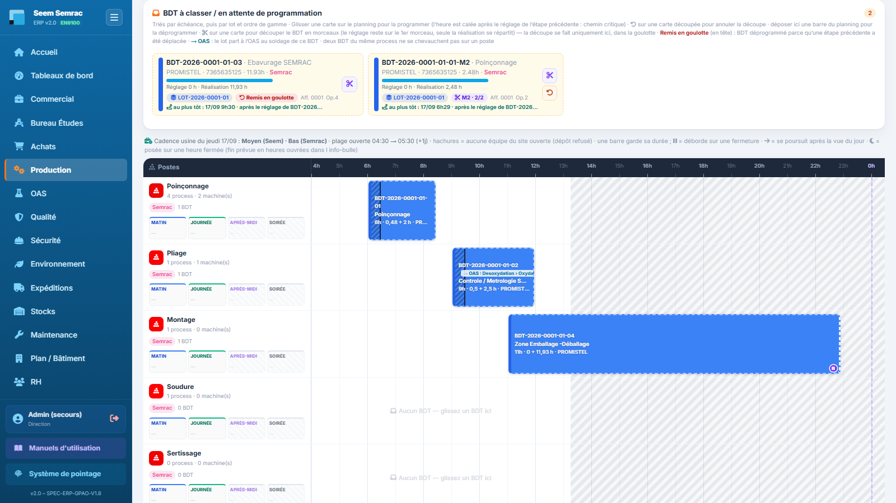

### Même process, même poste : pas de chevauchement
Deux BDT de **process différents** peuvent se chevaucher sur un poste ; deux BDT du **même process**, non : « Le poste Usinage Stama porte déjà un BDT du même process (BDT-…) de 08:00 à 11:00 : décalez la pose ou choisissez un autre process du poste. » (la barre en place est soulignée). Un BDT reçu occupe le poste, un BDT soldé le libère. Les morceaux d'un BDT découpé s'enchaînent.

### Déplacer une étape : les suivantes incohérentes reviennent en goulotte
1. Déplacer une barre (ou planifier un BST) qui rendrait incohérentes des étapes suivantes **déjà posées** ouvre **avant tout enregistrement** la fenêtre **« Remettre en goulotte »** : « Déplacer BDT-… remettra dans la goulotte l'étape suivante : · BDT-… — … au plus tôt … ».
2. **« Déplacer et remettre en goulotte »** : le BDT est déplacé, les étapes listées sont déprogrammées et reviennent **en tête de la goulotte** avec le badge rouge **« Remis en goulotte »** ; à reprogrammer. **« Annuler »** : rien ne bouge.
3. Une étape **déjà reçue** n'est jamais déprogrammée : elle est seulement signalée (« Étape déjà reçue » · « Déplacer quand même »). Une étape déjà incohérente avant le déplacement reste dans « Enchaînements à revoir ».

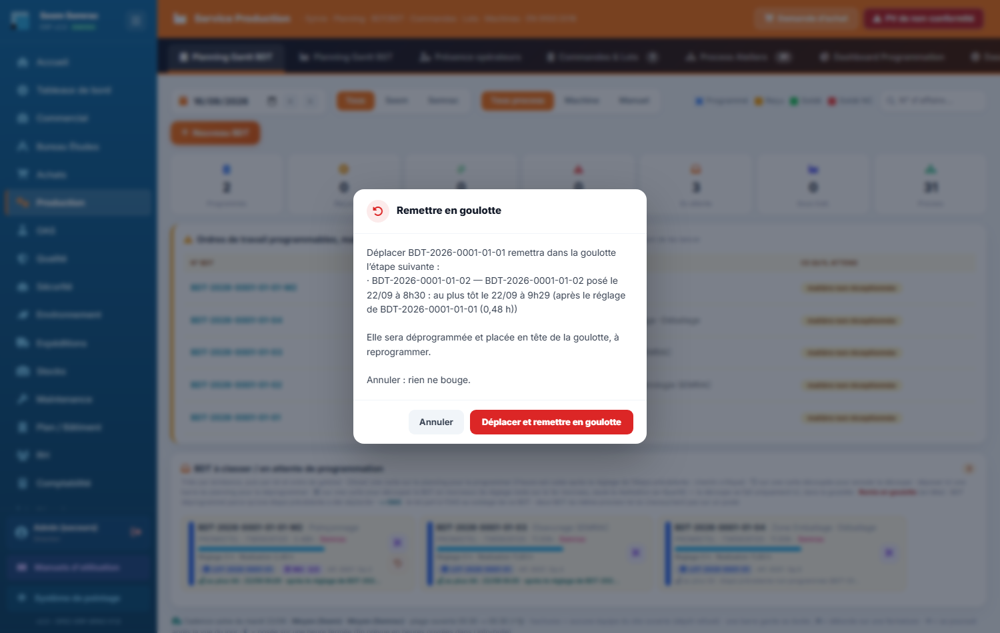

### Le badge « → OAS »
L'OAS n'a pas de BDT ni de goulotte : le BDT **qui précède** le traitement de surface porte un badge cyan **« → OAS : Desoxydation › Oxydation Incolore »** (process OAS suivants de la gamme ; « → OAS » seul si introuvable), sur sa carte et sur sa barre. Le service OAS voit le lot dans **« Lots à venir »** avec la fin prévue de ce BDT.

### Chemin critique : l'étape suivante démarre après le réglage de la précédente
Deux étapes consécutives d'un lot peuvent se chevaucher, mais l'étape d'après ne commence qu'après le **réglage** de l'étape d'avant (début + réglage). Cas particuliers : étape précédente soldée ou en goulotte → rien ; reçue → son début réel (au jour de la réception) ; posée sans heure → comptée à 6 h ; porteur du réglage en goulotte mais morceaux posés → pas avant le plus tôt des morceaux ; OAS entre les deux ou étape suivante sous-traitée → **fin complète** ; étape précédente sous-traitée → jour de retour, à la première équipe du jour. **Heures ouvrées** de la cadence usine (sans cadence : grille 5 h–23 h, report au lendemain).
- Au glisser, une **zone rouge hachurée** montre la partie de journée interdite (« au plus tôt 9h30 · après le réglage de … »).
- Posé trop tôt le bon jour → **calé** à l'au plus tôt (« Calé à 9h30 (chemin critique) ») ; un jour avant → **refusé**. Posé au clic, sans heure → le BDT garde son heure, sinon 6 h.
- Déplacer une étape ne décale **jamais** les suivantes : celles qui deviennent incohérentes sont **remises en goulotte** après confirmation (voir plus haut) ; celles déjà reçues ou déjà incohérentes restent signalées (carte rouge **« Enchaînements à revoir »** + pastille rouge sur la barre).
- BST : « **Dispo le …** » sur la carte ; un jour antérieur est refusé (aucun BC créé).

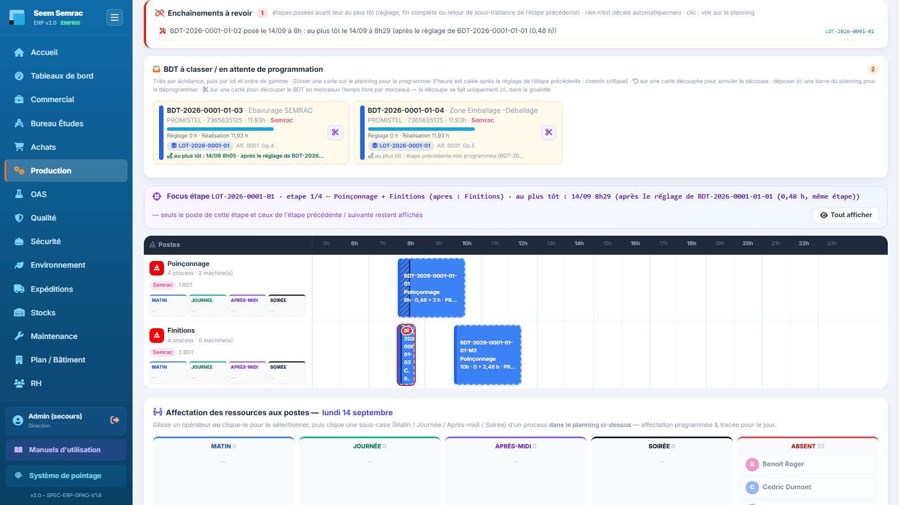

### Découper un BDT en plusieurs morceaux
Utile pour réaliser une opération en plusieurs fois (plusieurs créneaux, postes ou jours). La découpe se fait **uniquement dans la goulotte** « BDT à classer ». **Seule la réalisation se découpe** : le réglage reste sur le morceau 1.
1. Dans la goulotte, cliquer le bouton **ciseaux** de la carte du BDT. La fenêtre décompose la durée : « Durée D h = Réglage R h + Réalisation V h ».
2. Le champ **Réglage** est verrouillé s'il est connu (ou porté par un autre morceau), saisissable s'il est inconnu (BDT d'origine seulement ; « Utiliser … h » recopie une proposition incertaine de la gamme). Lecture en échec → « Relire le réglage ».
3. La **jauge** montre tout le temps de réalisation à répartir (« Temps de réalisation à répartir : V h ») : un **segment coloré et numéroté par morceau**, proportionnel au temps alloué ; le libre en **gris** (« reste à répartir X h ») ; un dépassement en **orange rayé** (« +X h au-delà du temps prévu », repère « ▲ prévu V h ») ; « tout le temps est réparti » en vert. Le **réglage** est à part, bloc **hachuré** fixe « Réglage R h · morceau 1 ». La jauge reste visible en haut quand on fait défiler les morceaux. V = 0 → « aucun temps de réalisation à répartir » (curseurs sur 0–8 h).
4. Une ligne par morceau (couleur de son segment) : **curseur** de 0 à V (quart d'heure à la souris, aimanté sur la valeur qui complète exactement V ; clavier : flèches ± 0,25 h, Page ± 1 h, Début 0, Fin V), **champ en heures** au centième (synchronisé), **part en %**, corbeille. Ouverture : 2 morceaux à V/2. Rien ne bloque pendant le glissement (dépassement possible, signalé). Le morceau 1 peut ne porter que le réglage ; les autres doivent avoir du temps.
5. Aides : **« Répartir également »** (parts égales au centième, le dernier prend le reste), **« Mettre le reste sur le dernier morceau »**, **« + Ajouter un morceau »** (12 au maximum, reçoit le reste s'il y en a), corbeille (2 au minimum) ; ajouter ou retirer un morceau ne touche pas aux temps des autres.
6. **« Découper »** (actif quand chaque morceau a du temps, morceau 1 à 0 permis s'il porte le réglage) : somme = V → découpe directe ; somme ≠ V → confirmation « Le temps réparti (X h) diffère du temps de réalisation prévu (V h) : découper quand même ? ». Le BDT d'origine devient le morceau 1 (réglage compris) et garde son numéro ; les suivants **-M2**, **-M3**… ont un réglage 0. Tous restent dans la goulotte. Fenêtre ouverte sur un BDT modifié entre-temps → « Page périmée ».

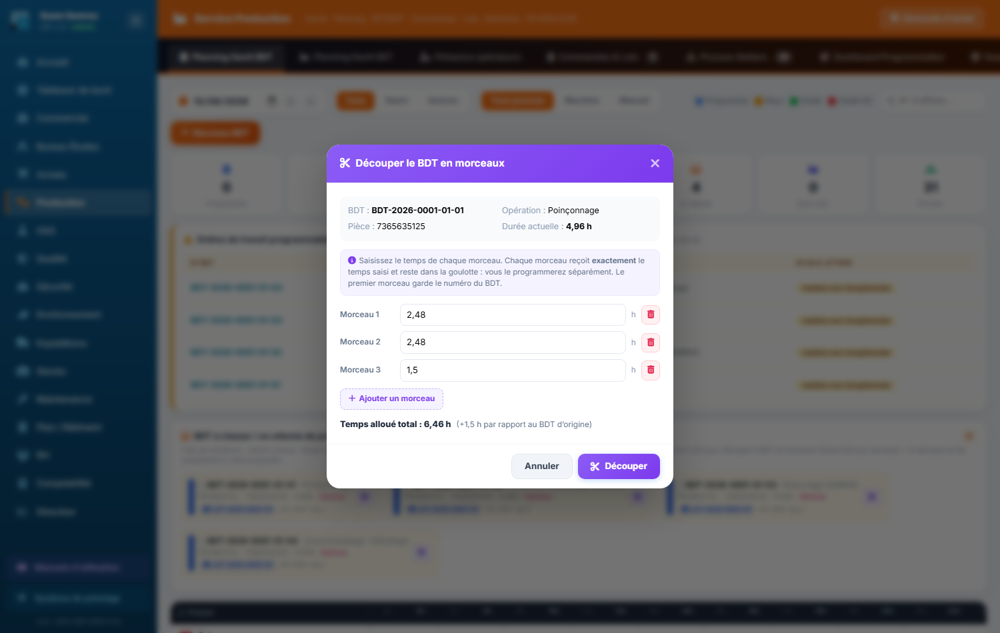

### Annuler une découpe
Bouton **« Annuler la découpe »** (flèche orange) sur la carte d'un morceau → confirmation listant les morceaux → le BDT d'origine retrouve **sa durée d'avant la découpe** (ou la somme pour une découpe ancienne), réglage compté une fois. Refusé si un morceau est posé, reçu, soldé, affecté, sous-traité, annulé ou déjà utilisé (historique, NC, sortie de stock, cotes). Relançable sans risque après une coupure.

> Un BDT **posé sur le planning** ne se découpe pas : le déprogrammer d'abord (clic droit → « Déprogrammer », ou glisser la barre dans la goulotte). Un BDT reçu, soldé, annulé ou sous-traité ne se découpe pas non plus.

### Saisir le taux horaire machine d'un process
Depuis le 14/09/2026, le coût horaire se saisit **sur le process**, et seulement sur un process **machine**. Une machine ou un poste n'ont plus de taux (le champ « Coût machine (€/h) » a disparu).
1. Onglet **Process Ateliers** → volet **Postes & Process** → déplier le poste (flèche).
2. Chaque process affiche une pastille : **« X €/h »** (taux saisi), **« taux à saisir »** (process machine sans taux : son temps machine compte 0 €), **« coût RH »** (process manuel).
3. **Crayon** du process → **Type** (Machine / Manuel / OAS) → **Taux horaire machine (€/h HT)** → **Enregistrer**. Vide = « taux à saisir ».
4. Pour un process **manuel**, pas de taux : une note rappelle que le temps homme est valorisé au **coût chargé RH** des opérateurs (fiche salarié, service RH), avec la moyenne du site.
5. Les process de la machine **OAS** (Surtec 650, Désoxydation, Oxydation noire, Oxydation incolore, Lavage) sont de **type OAS** (activité « OAS ») depuis le 16/09/2026, sans taux : un traitement de surface est chiffré au prix.

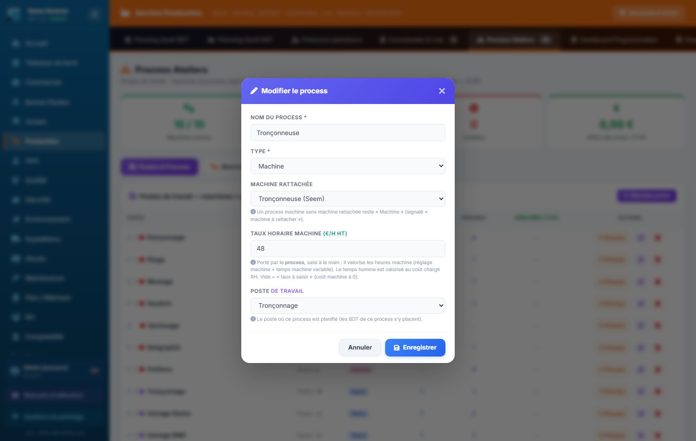

> **Taux de départ** : chaque process machine a reçu l'ancien coût horaire de sa machine — souvent **35 €/h**, l'ancienne valeur par défaut. À vérifier un par un.

### Comment se calcule le coût d'une étape
| Temps de la gamme | Homme | Machine | Compté |
|---|---|---|---|
| Réglage homme (ROP) | ✔ | — | une fois par lot |
| Réglage machine (RGM) | ✔ | ✔ | une fois par lot |
| Temps homme variable (MO) | ✔ | — | par pièce |
| Temps machine variable (Mach) | — | ✔ | par pièce |

Heures homme × coût chargé RH + heures machine × taux horaire machine du process (process machine seulement).
**Exemple** (lot de 10 pièces, machine à 60 €/h, coût chargé 35 €/h) : réglage homme 0,5 h + réglage machine 1 h + 0,1 h × 10 en homme + 0,2 h × 10 en machine → **2,5 h homme** (87,50 €) et **3 h machine** (180 €) = **267,50 €** le lot, 26,75 € la pièce.

---
> Détails techniques : `docs/technique/06-modules/production.md`. Droits d'accès : `docs/fiches-poste/`.
