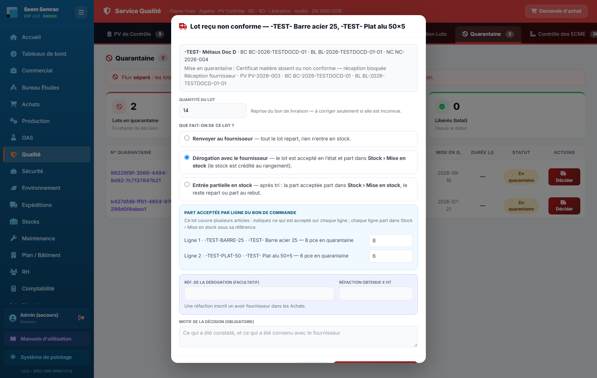

# Qualité

**Pour qui :** Qualiticien(ne)

Maîtrise de la conformité : PV de contrôle, non-conformités, 8D, libération de lots, capabilité, dérogations, périssables.

## Les onglets
- **PV de Contrôle** — Procès-verbaux de contrôle.
- **Non-Conformités** — Déclaration et suivi des NC (interne, fournisseur, client, procédé).
- **Rapports 8D** — Résolution structurée (D1→D8).
- **Libération Lots** — Décision de libération / quarantaine.
- **Quarantaine** — Objets isolés en attente de décision. C’est ici qu’on décide du sort d’un lot reçu non conforme d’un fournisseur (bouton **« Décider »**).
- **Plan de contrôle** — Plans EN9100.
- **Audit Conformité** — Module d'audits **SMI QSE + SI** (voir « Audits de conformité » plus bas).
- **Capabilité** — Cp/Cpk via écart réduit.
- **ECME** — Équipements de contrôle.
- **Produits Périssables** — Suivi des dates de péremption.
- **Dérogations** — Dérogations liées aux NC.
- **Référentiels** — Vocabulaire QHSE.
- **Dashboard Qualité** — Indicateurs qualité.

## Procédures
### Déclarer une non-conformité
1. Onglet **Non-Conformités**, « Nouvelle NC ».
2. Renseigner **type** (interne/fournisseur/client/procédé), **détecteur**, **gravité**, **lot/référence**, **catégorie**, **entité**.
3. Enregistrer. Une NC critique/bloquante **bloque les BL** du lot (porte qualité) et peut remonter en validation Direction.

> Depuis le 15/09/2026, « Nouvelle NC » est **réservée à l'écriture Qualité** (le bouton reste visible, l'envoi est refusé pour les autres). Une NC au statut **« Soldé »** est close : elle ne bloque plus l'expédition.

### Les NC émises depuis la Production
Un chef d'atelier (écriture Production) émet un **PV de non-conformité** depuis le bandeau de la Production (matricule + code PIN), rattaché ou non à une affaire. La NC arrive dans **Non-Conformités** : catégorie **Production**, statut **Ouvert**, numéro NC-2026-… sur le compteur habituel, **détecteur** = nom de l'émetteur, description complétée de la cause présumée, du traitement proposé et de « PV de non-conformité émis en Production par X ». Case « quarantaine » cochée → NC en statut quarantaine et objet dans l'onglet **Quarantaine** ; action immédiate « Rebut » → registre des déchets. ⚠ Ré-enregistrer la NC depuis la fenêtre d'édition remplace le détecteur (liste Opérateur / Contrôleur…) et le statut « quarantaine » : le nom de l'émetteur reste dans la description.

### Traiter un retour client
1. Sur une NC de **type client**, cliquer **« Retour »**.
2. Renseigner **n° facture/affaire**, **lot**, **nb de pièces NC**.
3. Saisir le **prix de vente unitaire** (→ montant de l'avoir) et/ou le **coût de revient** (→ commande prioritaire).
4. Choisir : **Refuser** · **Faire un avoir** (part dans Commercial › Avoirs) · **Commande prioritaire** (part dans Commercial › Commandes P).

### PV de réception fournisseur : qui le signe
Le PV de contrôle d’une livraison fournisseur se fait aux **Expéditions** (onglet Réceptions › « PV à faire »), par un **contrôleur choisi dans la liste des salariés ayant l’écriture sur les Expéditions**. ⚠ Depuis le 14/09/2026, un compte **Qualité** ne peut plus le signer : si c’est votre rôle, faites cocher « Écrire » sur les Expéditions dans votre fiche (RH › Employés) **en gardant cochés vos autres services** (Qualité, Sécurité…), sinon vous les perdez. Le détail du contrôle (quantités prévues et reçues ligne par ligne, reliquats, observations, certificat matière, contrôleur) est conservé avec le PV.

### Décider du sort d’un lot reçu non conforme (fournisseur)
1. Depuis le 15/09/2026, le PV de contrôle réception (Expéditions › Réceptions) saisit la **quantité reçue de chaque ligne** : il crée **une NC fournisseur par ligne à problème** (type « Fournisseur », détecteur « Réception » ; **quantitative** — nature « Logistique - Quantité » — pour un écart de quantité, **qualitative** — nature « À requalifier », à préciser — quand une observation est écrite, ou les deux) et met en **quarantaine chaque ligne avec observation** (motif « Ligne n · réf · désignation — écart ») ; certificat matière absent → NC « Logistique - Certificats » et **toute la réception** en quarantaine. Un simple écart de quantité ne crée **pas** de quarantaine ; les lignes conformes sont déjà parties dans Stock › Mise en stock. Les pièces en **excédent** attendent la Direction (acceptables seulement après votre décision si leur lot est en quarantaine).
2. Onglet **Quarantaine**, sur la ligne du lot, cliquer le bouton rouge **« Décider »**. Les quarantaines internes (lots de production) gardent le bouton **« Statuer »**.
3. La fenêtre rappelle le **fournisseur**, le **n° de bon de commande**, le **n° de BL**, la **NC** et le **motif de mise en quarantaine**. La quantité vient du bon de livraison : ne la corriger que si elle est inconnue.
4. Choisir ce qu’on fait du lot :
   - **Renvoyer au fournisseur** — tout le lot repart, rien n’entre en stock ;
   - **Dérogation avec le fournisseur** — le lot est accepté en l’état et part dans **Stock › Mise en stock** (crédité au rangement) ; on peut noter la **référence de la dérogation** et une **réfaction obtenue (€ HT)**, qui crée un avoir ;
   - **Entrée partielle en stock** — saisir la **quantité acceptée** (elle part dans Stock › Mise en stock) et dire si le reste **repart chez le fournisseur** ou **part au rebut chez nous** (le rebut est inscrit au registre des déchets, service Environnement).
   - Lot sur **plusieurs articles** : bloc **« Part acceptée par ligne du bon de commande »** — pré-rempli en dérogation, à saisir ligne par ligne en entrée partielle (la quantité acceptée = somme des lignes).
5. Pour un renvoi ou une entrée partielle, choisir la **compensation** : **Avoir** (inscrit automatiquement dans Achats › Avoirs fournisseurs, montant pré-rempli au prix unitaire du bon de commande, modifiable) ou **Remplacement** (le fournisseur relivre : le bon de commande rouvre sa réception de la quantité non acceptée).
6. Saisir le **motif** (obligatoire, 3 caractères minimum), puis **« Enregistrer la décision »**. Elle est enregistrée avec l’auteur et la date.

> **Une décision ne se prend qu’une fois** : un second clic est refusé.
> **Bon de commande à plusieurs articles** : chaque ligne acceptée part dans Stock › Mise en stock sous sa référence. Une entrée partielle sans la part de chaque ligne (ou dont la somme ne fait pas la quantité acceptée) est **refusée sans consommer la décision**. La matière redevient disponible pour la Production quand elle est **rangée**.

> Après décision, la ligne affiche ce qui a été fait (**Renvoyé au fournisseur**, **Dérogation fournisseur**, **Entrée partielle 6/10**) et ce qui reste à faire (**Retour à expédier**, **Avoir réclamé (Achats)**, **Remplacement attendu**).
> Si la matière est **renvoyée sans remplacement**, un message prévient qu’elle manque à l’affaire et qu’il faut **repasser commande** : la porte matière n’est pas ouverte.

## Audits de conformité (SMI QSE + SI)

Onglet **Audit Conformité** : programme d'audit interne **intégré** — Qualité (ISO 9001 / EN 9100), Sécurité (ISO 45001), Environnement (ISO 14001), Sécurité de l'information (ISO 27001). 4 sous-onglets : **Programme**, **Constats & plans d'action**, **Grilles**, **Référentiels**.

- **Programme** — l'**ordonnancement** annuel (planning par trimestre), toutes catégories réunies mais **séparées en sections** (Audits de processus / Poste & flash / Procédés spéciaux). **Sélecteur d'exercice** + **« Reconduire pour AAAA+1 »**. Chaque ligne : **✎ Modifier**, **✔ Réaliser** (fiche d'évaluation), **📄 Rapport** *(seulement une fois soldé)*, **🗑 Supprimer**.
- **Réaliser un audit** : cliquer **✔ Réaliser** → fiche agrandie ; pour chaque question, cocher **Conforme / Non conforme / Axe** + preuve (les questions **AUTO** sont pré-remplies depuis l'ERP). Puis **Enregistrer (réalisé)** (modifiable) ou **Solder l'audit** (clôture → le rapport PDF devient téléchargeable).
- **Constats & plans d'action** — chaque écart → **NC (détecteur « Audit »)** → cycle 8D → clôture.
- **Grilles** — questionnaires réutilisables (reprises **verbatim du classeur Excel** : contrôle final, soudure, emballage, informatique). Chaque question a un **mode** (Auto/Assisté/Manuel) + **sonde ERP** ; boutons ✎ / × / « + question » — **non figées**.
- **Référentiels** — thèmes A–K, T1–T9 + grilles clause-par-clause (9001, EN 9100, 45001, 14001, 27001).

> La **Conformité vive** (surveillance auto-observée : ECME/habilitations/DUER/FDS/VGP/bains/NC…) et le **tableau de bord des audits** sont dans le **Dashboard Qualité**.

---
> Détails techniques : `docs/technique/06-modules/qualite.md` + `docs/CHANGELOG.md`. Droits d'accès : `docs/fiches-poste/`.
