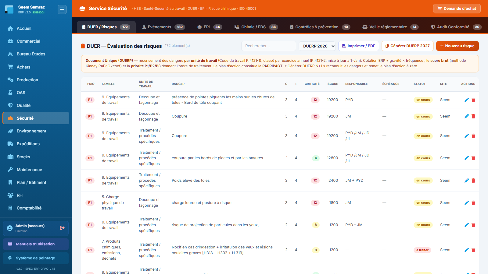

# Sécurité (HSE)

**Pour qui :** Responsable HSE / QSE

Santé-Sécurité au travail : DUER, accidents, EPI, risque chimique (FDS + cotation SEIRICH), vérifications réglementaires (VGP), formations.

> **L'environnement a son propre service** désormais : déchets, rejets, ATEX, ISO 14001 et RSE sont dans **Environnement** (voir `environnement.md`).

## Les onglets
- **DUER / Risques** — Document unique d'évaluation des risques (cotation gravité×fréquence).
- **Événements** — Accidents, presqu'accidents, soins.
- **EPI** — Dotations et matrice EPI × zone.
- **Chimie / FDS** — Inventaire chimique + fiches de données de sécurité (export PDF) + **Risque chimique (SEIRICH)** + **Exposition par situation de travail** : cote chaque produit *là où et comme il est utilisé* sur **3 axes** (Santé, Incendie-Explosion avec alerte **ATEX**, Environnement) → niveau Faible/Moyen/Élevé + matrice produits × unités de travail. Boutons **« → Action »** (créer une action corrective), **« Rapport SEIRICH »** (PDF d'évaluation) et **« Export SEIRICH »** (tableur à recopier dans le logiciel INRS). L'icône **⧉** sur chaque produit ouvre sa **fiche 360** : danger, cotation SEIRICH, FDS, **péremption** (lots) et **stock** réunis sur une seule page, avec un **PDF fiche produit**.
- **Contrôles & prévention** — VGP, formations, plans de prévention.
- **Conformité** — Matrice de conformité **SST** (l'environnemental est dans Environnement).
- **Référentiels** — Zones, secteurs.
- **Tableau de bord** — Indicateurs HSE.

## Procédures
### Mettre à jour la matrice EPI par zone
1. Onglet **EPI**, bloc « EPI obligatoires par zone ».
2. Cliquer **« Modifier la matrice »**, cocher/décocher les cases (EPI × zone Z1–Z7).
3. Cliquer **« Sauvegarder »** (rien n'est enregistré avant).

---
> Détails techniques : `docs/technique/06-modules/securite.md`. Droits d'accès : `docs/fiches-poste/`.
