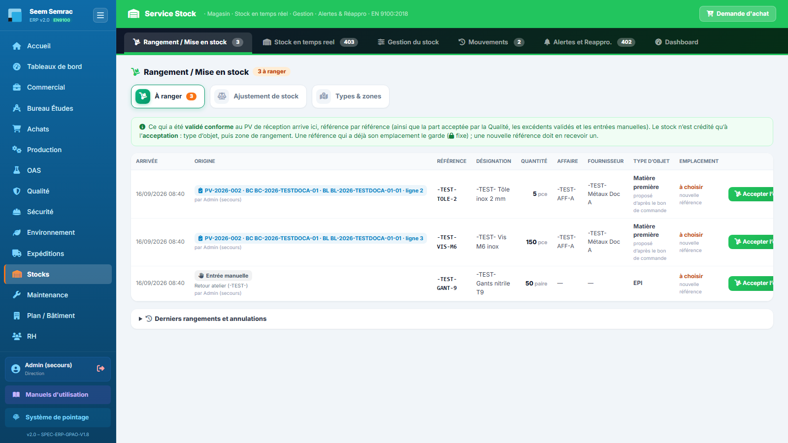
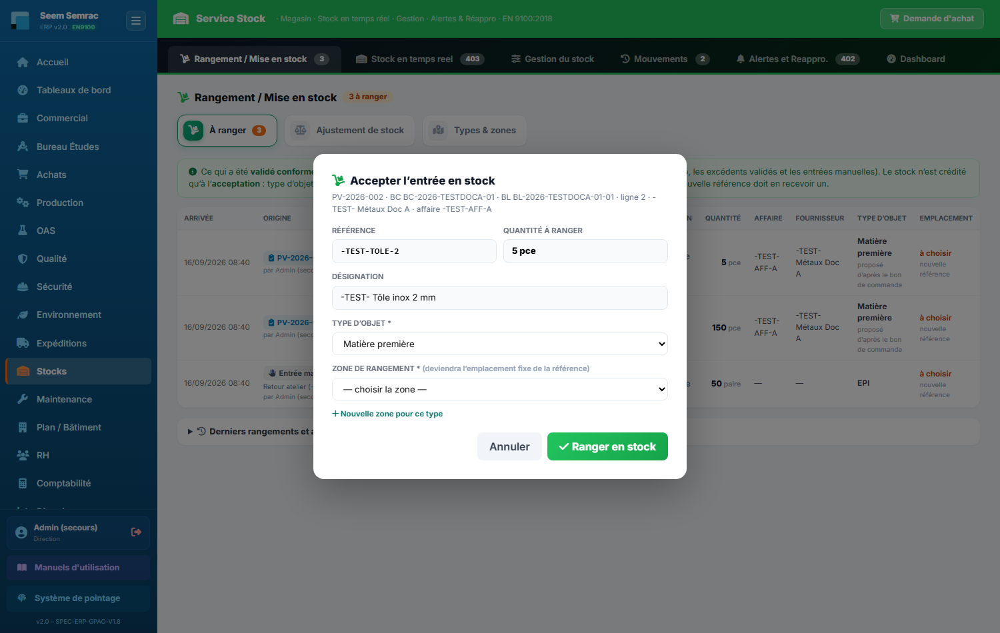

# Stocks

**Pour qui :** Magasinier(ère) — écriture Stock : Direction, Achats, Logistique

Le magasin : **rangement** de ce qui arrive, niveaux en temps réel, sorties et inventaires, emplacement fixe de chaque référence, mouvements, alertes de réapprovisionnement. **Rien n'entre en stock sans être rangé.**

## Les onglets
- **Rangement / Mise en stock** (onglet ouvert par défaut) — la liste **« À ranger »** : lignes conformes des PV de réception, part acceptée par la Qualité, excédents validés par la Direction, entrées manuelles. Sous-onglets **Ajustement de stock** (inventaire) et **Types & zones**.
- **Stock en temps réel** — niveaux, emplacement, statut ; case **« Masquer les produits vides »** (cochée par défaut, mémorisée sur le poste).
- **Gestion du stock** — **Entrée stock** (entrée manuelle → liste à ranger), **Sortie stock** (sortie réelle), **Niveaux d'approvisionnement** (seuils, réappro auto, type d'objet et emplacement fixe de chaque référence).
- **Mouvements** — journal : Mise en stock, ajustement d'inventaire, BDT, réceptions…
- **Alertes et Réappro.** — articles sous le seuil, création de DA.
- **Dashboard** — indicateurs stock.

## Procédures
### Accepter une entrée en stock (ranger)
1. Onglet **Rangement / Mise en stock**, sous-onglet **À ranger** : bouton **« Accepter l'entrée en stock »** sur la ligne.
2. Vérifier la référence et la quantité (lecture), choisir ou confirmer le **type d'objet** (proposé par l'ERP).
3. **Emplacement** : verrouillé si la référence en a déjà un ; sinon choisir la **zone de rangement** dans la liste du type (elle devient l'**emplacement fixe**), ou **« Nouvelle zone pour ce type »** — obligatoire si le type n'a encore aucune zone.
4. **« Ranger en stock »** : le stock est crédité (mouvement « Mise en stock »). Si toute la matière des bons de commande d'une affaire est contrôlée et rangée, les **BDT passent « matière OK »**.

> Une ligne erronée s'**annule** (bouton gris, motif obligatoire) ; rien n'est crédité. Réservé à l'écriture Stock : le contrôleur du PV, la Qualité et la Direction remplissent la liste sans ce droit.

### Faire un inventaire (ajustement)
1. **Rangement / Mise en stock › Ajustement de stock**.
2. Article, **quantité réellement constatée** (pas l'écart), motif (précision obligatoire pour « Autre »).
3. **« Valider l'ajustement »** puis confirmer : le mouvement porte l'écart signé.

### Entrée manuelle / sortie
- **Gestion du stock › Entrée stock** : référence (existante ou nouvelle), quantité, motif obligatoire → la ligne rejoint **À ranger** (rien n'est crédité avant le rangement).
- **Gestion du stock › Sortie stock** : article, quantité (refusée au-delà du stock), motif, BDT et affaire facultatifs (un BDT impute la sortie à son lot) → confirmer.

### Gérer les types d'objet et les zones
1. **Rangement / Mise en stock › Types & zones**.
2. Ajouter une zone dans la carte du type (« Nouvelle zone pour … » → **Ajouter**), ou un type (« Ajouter le type »).
3. Modifier libellé / ordre / actif puis la disquette. Rien ne se supprime : on **désactive**. Une zone qui est l'emplacement de références ne se renomme pas.

### Changer l'emplacement fixe d'une référence
1. **Gestion du stock › Niveaux d'approvisionnement** (décocher « Masquer les produits vides » si la référence est à zéro).
2. Colonne **Type d'objet** si besoin, puis colonne **Emplacement** : choisir la nouvelle zone, confirmer (motif facultatif).
3. Le bouton 🕘 montre l'**historique des emplacements** (qui, quand, avant, après, motif).

### Consulter les alertes de réappro
1. Onglet **Alertes et Réappro.** : la liste des articles sous le point de commande.
2. **« Créer DA »** sur la ligne → la demande part chez les Achats. Le réappro automatique compte ce qui attend dans **À ranger**.

---
> Détails techniques : `docs/technique/06-modules/stock.md`. Droits d'accès : `docs/fiches-poste/`.
